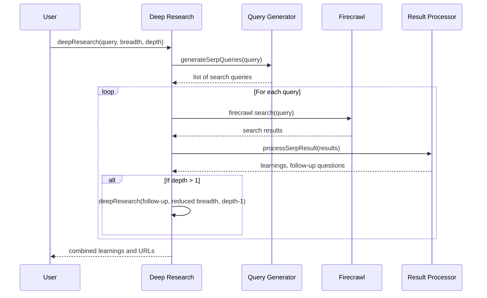
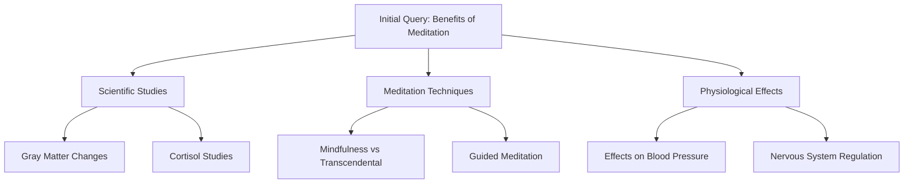

# Chapter 1: Deep Research Process

Welcome to the deep-research project! This chapter introduces you to the core concept that powers this entire application: the Deep Research Process.

## What Problem Does It Solve?

Have you ever needed to research a complex topic and found yourself opening dozens of browser tabs, following link after link, taking notes along the way? The Deep Research Process automates this exact workflow, but with the systematic thoroughness of a professional researcher.

Imagine you want to learn about "the impact of artificial intelligence on healthcare." Normally, you'd:
1. Search for this phrase
2. Read some articles
3. Discover new terms like "AI diagnostics" or "machine learning in radiology"
4. Search for those new terms
5. Continue this cycle until you feel satisfied with your research

This manual process is exactly what the Deep Research Process automates - but at scale and with the precision of an AI-powered system.

## The Detective Analogy

Think of the Deep Research Process as a detective investigating a case:

1. The detective receives a case (your research query)
2. They identify several leads to follow (initial search queries)
3. For each lead, they gather evidence (search results)
4. The evidence reveals new leads (follow-up questions)
5. The detective follows these new leads, going deeper into the investigation
6. Finally, they compile all the evidence into a comprehensive case report

## Key Concepts

Let's break down the essential concepts of the Deep Research Process:

### 1. Query
This is the initial question or topic you want to research (e.g., "benefits of meditation").

### 2. Breadth
How many different search directions to explore at each step. Think of this as the number of "branches" in your research tree. Higher breadth means more comprehensive research but takes longer.

### 3. Depth
How many levels deep to go in the research tree. A depth of 1 means just the initial searches, while a depth of 3 means it will find information, use that to create new searches, and then use those results for a third level of searches.

### 4. Learnings
These are the key insights extracted from search results. They represent the actual knowledge gained from the research.

### 5. Research Tree
The entire structure of your research, where each node is a search query and its results, branching out into more specific queries.

## How It Works

Let's explore a simple example. Imagine we want to research "benefits of meditation for stress reduction."

### Step 1: Initialize the Research

We start by defining our query and setting parameters:

```javascript
const { learnings, visitedUrls } = await deepResearch({
  query: "benefits of meditation for stress reduction",
  breadth: 3,
  depth: 2
});
```

This tells our system to research meditation and stress reduction, exploring 3 different directions at each step, and going 2 levels deep.

### Step 2: Generate Initial Search Queries

The system analyzes our query and generates several search engine queries:

```javascript
// Example queries that might be generated:
// 1. "scientific studies on meditation and stress reduction"
// 2. "different meditation techniques for stress management"
// 3. "physiological effects of meditation on cortisol levels"
```

Each query explores a different aspect of our research topic.

### Step 3: Execute Searches and Extract Learnings

For each generated query, the system:
1. Searches the web using the FirecrawlApp
2. Processes the search results
3. Extracts key learnings

```javascript
// Example learnings from the first search:
// 1. "A 2019 meta-analysis found meditation programs reduced anxiety by 5.4 points"
// 2. "Regular meditation reduces cortisol levels by up to 20% after 8 weeks"
// 3. "MRI studies show meditation increases gray matter in stress regulation areas"
```

### Step 4: Recursive Exploration

For each set of learnings, if we haven't reached our depth limit, the system:
1. Generates new, more specific search queries based on these learnings
2. Repeats the search and learning extraction process

```javascript
// Example second-level query generated from previous learnings:
// "meditation effects on gray matter density in prefrontal cortex"
```

### Step 5: Synthesis

Finally, after reaching our depth limit, the system:
1. Collects all learnings from all research levels
2. Synthesizes them into a comprehensive answer or report

```javascript
const answer = await writeFinalAnswer({
  prompt: "benefits of meditation for stress reduction",
  learnings: learnings
});
```

## Under the Hood

Let's look at how the Deep Research Process is implemented internally:



### Core Function: deepResearch

The heart of the process is the `deepResearch` function:

```javascript
export async function deepResearch({
  query, breadth, depth, learnings = [], visitedUrls = []
}) {
  // Generate search queries based on the user query
  const serpQueries = await generateSerpQueries({
    query, learnings, numQueries: breadth
  });
  
  // Process each query concurrently (with limits)
  const results = await Promise.all(serpQueries.map(serpQuery => 
    // ... search and process results ...
  ));

  return {
    learnings: [...new Set(results.flatMap(r => r.learnings))],
    visitedUrls: [...new Set(results.flatMap(r => r.visitedUrls))],
  };
}
```

This function orchestrates the entire research process. It takes your query, breadth, and depth parameters, then:
1. Generates SERP queries based on your research question
2. Executes each query (with a concurrency limit to avoid overwhelming APIs)
3. Processes the results to extract learnings
4. Makes recursive calls for deeper exploration
5. Combines all results for the final output

### Query Generation

To create tailored search queries, the system uses AI:

```javascript
async function generateSerpQueries({ query, numQueries = 3, learnings }) {
  // Use AI to generate search queries based on the user query
  const res = await generateObject({
    model: getModel(),
    prompt: `Given the following prompt... generate a list of SERP queries...`,
    // ...schema definition...
  });
  
  return res.object.queries.slice(0, numQueries);
}
```

This function uses an AI model to create smart search queries. If previous learnings exist, it uses them to generate more focused and specific queries.

### Processing Results

After getting search results, the system extracts key insights:

```javascript
async function processSerpResult({
  query, result, numLearnings = 3
}) {
  // Extract content from search results
  const contents = compact(result.data.map(item => item.markdown));
  
  // Use AI to extract learnings and follow-up questions
  const res = await generateObject({
    model: getModel(),
    prompt: `Given these contents... generate learnings...`,
    // ...schema definition...
  });
  
  return res.object;
}
```

This function uses AI to distill the most important information from search results and generate smart follow-up questions.

## The Recursive Tree Structure

What makes this process powerful is its recursive nature. It creates a tree where:

- The root is your initial query
- Level 1 nodes are the initial search queries
- Level 2 nodes are follow-up queries based on level 1 results
- And so on until reaching your specified depth



Each node represents a search query and its results, with the tree expanding both in breadth (covering different aspects) and depth (exploring topics in greater detail).

## Conclusion

The Deep Research Process is the intelligent engine that powers the deep-research project. By mimicking how a thorough human researcher would explore a topic - starting broad, identifying key concepts, and diving deeper - it automates comprehensive research on virtually any topic.

In this chapter, we've explored:
- The core concepts behind the Deep Research Process
- How it works through a practical example
- The key components and functions that power the process

Now that you understand the core research methodology, let's see how it's exposed to the outside world in the next chapter: [Web API Interface](02_web_api_interface_.md).

---

Generated by [AI Codebase Knowledge Builder](https://github.com/The-Pocket/Tutorial-Codebase-Knowledge)