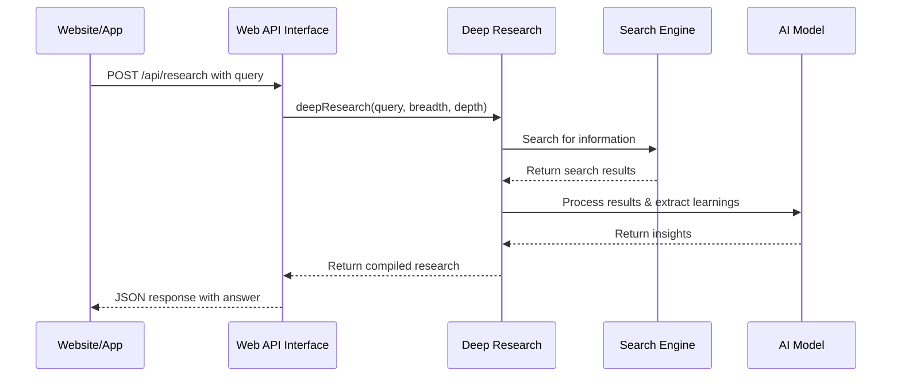

# Chapter 2: Web API Interface

In [Deep Research Process](01_deep_research_process_.md), we discovered the powerful research engine that drives our project. Now let's explore how we can share this capability with the world through the web!

## What Problem Does It Solve?

Imagine you've built an incredible research tool (which we have!), but it only works on your computer. How would someone else use it? What if a friend wants to integrate it into their website? Or a company wants to add it to their customer dashboard?

The Web API Interface solves this problem by acting as a **receptionist** for our research system. Just like a receptionist at a library:
- It receives requests from visitors
- Passes these requests to the research team
- Delivers the completed research back to the visitor

This makes our deep research capabilities available to any application that can make web requests!

## A Simple Use Case

Let's say you're building a student help website and want to add an "Auto-Research" button. When a student clicks this button with their homework question, you want to return comprehensive research.

With our Web API, you can:
1. Send the student's question to our API
2. Let our system do the deep research
3. Receive back a well-researched answer to display

All without implementing complex research logic in your own application!

## Key Concepts

Let's break down the essential concepts of our Web API:

### 1. REST API

Our interface follows REST (Representational State Transfer) principles - a standard way for web services to communicate. Think of it like a restaurant menu - there are specific "dishes" (endpoints) you can order, each with clear expectations.

### 2. Endpoint

An endpoint is a specific URL where you can send your request. Our main endpoint is `/api/research` - the doorway to our research capabilities.

### 3. Request Structure

When making a request to our API, you need to provide:
- **query**: What you want to research (required)
- **depth**: How deep to go in the research tree (optional, default: 3)
- **breadth**: How many directions to explore at each level (optional, default: 3)

### 4. Response Structure

After processing, our API returns:
- **answer**: A synthesized response to the query
- **learnings**: Individual facts and insights discovered
- **visitedUrls**: Sources used during research

## How to Use the Web API

Let's see how to use our API for the student help website example:

### Step 1: Set Up the API Request

Here's how to prepare a request using JavaScript:

```javascript
const researchQuestion = "What caused the Great Depression?";

const requestOptions = {
  method: 'POST',
  headers: { 'Content-Type': 'application/json' },
  body: JSON.stringify({
    query: researchQuestion,
    depth: 2,
    breadth: 3
  })
};
```

This prepares a request asking about the Great Depression. We're using depth 2 (two levels of research) and breadth 3 (three search directions at each level).

### Step 2: Send the Request and Handle the Response

Now, let's send our request and process the results:

```javascript
fetch('https://your-api-domain.com/api/research', requestOptions)
  .then(response => response.json())
  .then(data => {
    if (data.success) {
      // Display the answer to the student
      document.getElementById('result').innerHTML = data.answer;
      
      // Optionally show sources
      showSources(data.visitedUrls);
    } else {
      showError(data.error);
    }
  });
```

This code sends our request to the API endpoint and handles the response, displaying the researched answer to the student if successful.

### Step 3: Display Additional Information (Optional)

You might want to show the individual learnings as bullet points:

```javascript
function showLearnings(learnings) {
  const listItems = learnings.map(fact => `<li>${fact}</li>`).join('');
  document.getElementById('key-facts').innerHTML = 
    `<h3>Key Facts</h3><ul>${listItems}</ul>`;
}
```

This function creates a nicely formatted list of key facts discovered during research.

## Under the Hood: How It Works

Let's peek behind the curtain to see how our Web API Interface operates:



When a client makes a request:
1. The Web API receives the query and parameters
2. It calls the [Deep Research Process](01_deep_research_process_.md)
3. The research process finds and processes information
4. The API formats the results and sends them back

### Core Implementation

Let's look at the key parts of the implementation from our `src/api.ts` file:

#### Setting Up the Express Server

```javascript
import express from 'express';
import cors from 'cors';

const app = express();
const port = process.env.PORT || 3051;

// Middleware
app.use(cors());
app.use(express.json());
```

This code:
1. Creates an Express web server
2. Enables CORS (so websites on different domains can use our API)
3. Sets up JSON parsing (so we can read request data)

#### Creating the Research Endpoint

```javascript
app.post('/api/research', async (req, res) => {
  try {
    const { query, depth = 3, breadth = 3 } = req.body;

    if (!query) {
      return res.status(400).json({ error: 'Query is required' });
    }
    
    // Call the deep research process
    const { learnings, visitedUrls } = await deepResearch({
      query, breadth, depth,
    });
    // ... more code follows
```

This code:
1. Creates an endpoint at `/api/research` that accepts POST requests
2. Extracts the query and parameters from the request body
3. Validates that a query was provided
4. Calls the deep research function to do the actual work

#### Processing and Returning Results

```javascript
    // Generate a final answer from the learnings
    const answer = await writeFinalAnswer({
      prompt: query,
      learnings,
    });

    // Return everything to the client
    return res.json({
      success: true,
      answer,
      learnings,
      visitedUrls,
    });
  } catch (error) {
    // Handle errors
    return res.status(500).json({ error: 'Research failed' });
  }
});
```

This code:
1. Uses the collected learnings to synthesize a final answer
2. Packages everything into a JSON response
3. Sends it back to the client
4. Includes error handling for when things go wrong

#### Starting the Server

```javascript
app.listen(port, () => {
  console.log(`Deep Research API running on port ${port}`);
});
```

This starts our server on the specified port, making it ready to receive requests.

## Using the API in Different Languages

Since our API uses standard HTTP, you can access it from any programming language:

### Python Example

```python
import requests

response = requests.post('https://your-api-domain.com/api/research', 
    json={
        'query': 'What caused the Great Depression?',
        'depth': 2,
        'breadth': 3
    })

if response.status_code == 200:
    data = response.json()
    print(f"Answer: {data['answer']}")
```

### cURL Example (Command Line)

```bash
curl -X POST https://your-api-domain.com/api/research \
  -H "Content-Type: application/json" \
  -d '{"query":"What caused the Great Depression?"}'
```

## Error Handling

Our API includes robust error handling:

```javascript
catch (error) {
  console.error('Error in research API:', error);
  return res.status(500).json({
    error: 'An error occurred during research',
    message: error instanceof Error ? error.message : String(error),
  });
}
```

This catches any errors, logs them for debugging, and returns a helpful error message to the client.

## Conclusion

The Web API Interface transforms our research capability into a service that any application can use. By following REST principles and providing clear documentation, we've made it simple for developers to integrate deep research into their own projects.

In this chapter, we've learned:
- Why a web API makes our research tool more accessible
- How to structure requests to our API
- How to handle responses and display results
- How the API is implemented under the hood

With just a few lines of code, any application can now tap into powerful research capabilities!

In the next chapter, we'll explore another way to access our research tool: through the [CLI Interface](03_cli_interface_.md), which brings the power of deep research to the command line.

---

Generated by [AI Codebase Knowledge Builder](https://github.com/The-Pocket/Tutorial-Codebase-Knowledge)