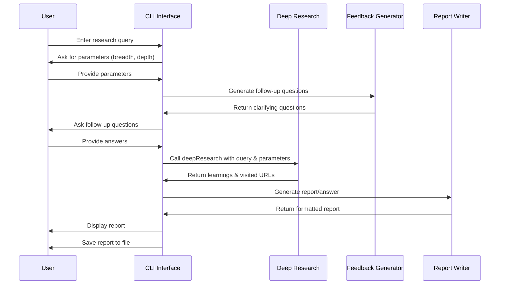

# Chapter 3: CLI Interface

In [Chapter 2: Web API Interface](02_web_api_interface_.md), we explored how to access our deep research capabilities through web requests. Now, let's discover another way to harness this power - directly from your computer's terminal!

## Why a Command-Line Interface?

Imagine you want to research a topic but don't want to create a web application or make API calls. Maybe you're writing a paper and just want quick access to research from your computer. The CLI Interface solves this by providing a simple conversation-like experience right in your terminal.

Think of it as having a research assistant sitting next to you, asking you what you want to know, and then going off to gather information while you wait.

## A Simple Use Case

Let's say you're writing a college paper on climate change solutions and need comprehensive research. Instead of opening dozens of browser tabs, you can:

1. Open your terminal
2. Run the deep-research command
3. Answer a few questions about what you want to research
4. Receive a complete research report right in your terminal

Let's see how this works in practice!

## Key Concepts

Before diving into code, let's understand a few key concepts:

### 1. Interactive Prompting

The CLI uses a question-and-answer format to collect your research parameters. It feels like a conversation, making it easy for anyone to use.

### 2. Research Parameters

Just like with the Web API, you can customize:
- **Breadth**: How many different directions to explore
- **Depth**: How many levels deep to search

### 3. Output Formats

The CLI can generate:
- A **Report**: A comprehensive document covering all aspects of your topic
- An **Answer**: A specific response to a focused question

## Using the CLI Interface

Let's walk through a real example of using the CLI to research climate change solutions:

### Step 1: Start the CLI Tool

```bash
node dist/run.js
```

This command starts the deep-research CLI interface. You'll immediately be greeted with a prompt.

### Step 2: Enter Your Research Topic

```
What would you like to research? Effective solutions to climate change
```

Just type your research topic after the prompt and press Enter.

### Step 3: Configure Your Research Parameters

```
Enter research breadth (recommended 2-10, default 4): 3
Enter research depth (recommended 1-5, default 2): 2
```

These questions let you control how wide (breadth) and how deep your research will go. Higher numbers mean more comprehensive research but take longer to complete.

### Step 4: Choose Output Format

```
Do you want to generate a long report or a specific answer? (report/answer, default report): report
```

For a comprehensive paper, choose "report". For a specific question, choose "answer".

### Step 5: Answer Follow-up Questions

```
To better understand your research needs, please answer these follow-up questions:

What specific aspects of climate change solutions are you most interested in?
Your answer: Renewable energy technologies and policy approaches

Are you interested in solutions for a particular region or globally?
Your answer: Global with focus on developing nations
```

These clarifying questions help the system understand exactly what you're looking for, similar to how a research assistant might ask questions to refine your request.

### Step 6: Wait for Research to Complete

The system will now conduct deep research, showing progress messages:

```
Starting research...

Researching query 1 of 3: Renewable energy implementation in developing countries
Researching query 2 of 3: Policy frameworks for climate change mitigation
Researching query 3 of 3: Cost-effective climate solutions for developing nations
```

### Step 7: Review the Results

Once complete, you'll see:

```
Learnings:

1. Solar microgrids have proven effective in rural India, increasing energy access by 45% in deployed regions
2. Feed-in tariffs have accelerated renewable adoption in 67% of developing nations that implemented them
...

Visited URLs (24):
https://www.example.com/renewable-energy-developing-nations
https://www.example.org/climate-policy-frameworks
...

Writing final report...

Final Report:

# Effective Climate Change Solutions for Developing Nations

## Executive Summary
This report examines sustainable and cost-effective climate change solutions...

...

Report has been saved to report.md
```

The report is displayed in your terminal and also saved as a file for your reference.

## How It Works Under the Hood

Let's look at what happens when you use the CLI interface:



When you interact with the CLI:
1. It collects your research parameters and preferences
2. Generates clarifying questions to refine the search
3. Calls the [Deep Research Process](01_deep_research_process_.md) with all the collected information
4. Takes the research results and formats them into a report or answer
5. Displays the results and saves them to a file

## Code Walkthrough

Let's look at how the CLI is implemented in the `src/run.ts` file:

### Setting Up the Interface

```javascript
import * as readline from 'readline';

// Create readline interface for terminal interaction
const rl = readline.createInterface({
  input: process.stdin,
  output: process.stdout,
});

// Helper function to get user input
function askQuestion(query: string): Promise<string> {
  return new Promise(resolve => {
    rl.question(query, answer => {
      resolve(answer);
    });
  });
}
```

This code sets up the basic interaction between you and the terminal. The `askQuestion` function shows a prompt and waits for your input.

### Collecting Research Parameters

```javascript
async function run() {
  // Get initial query
  const initialQuery = await askQuestion('What would you like to research? ');

  // Get breath and depth parameters
  const breadth = parseInt(
    await askQuestion('Enter research breadth (recommended 2-10, default 4): '),
    10,
  ) || 4;
  const depth = parseInt(
    await askQuestion('Enter research depth (recommended 1-5, default 2): '),
    10,
  ) || 2;
```

This part asks for your research topic and parameters. It provides default values (4 for breadth, 2 for depth) if you just press Enter.

### Determining Output Format

```javascript
  const isReport = (await askQuestion(
    'Do you want to generate a long report or a specific answer? (report/answer, default report): '
  )) !== 'answer';
```

This question lets you choose between a detailed report or a focused answer, with "report" as the default option.

### Generating and Asking Follow-up Questions

```javascript
  let combinedQuery = initialQuery;
  if (isReport) {
    log(`Creating research plan...`);

    // Generate follow-up questions
    const followUpQuestions = await generateFeedback({
      query: initialQuery,
    });

    // Collect answers to follow-up questions
    const answers = [];
    for (const question of followUpQuestions) {
      const answer = await askQuestion(`\n${question}\nYour answer: `);
      answers.push(answer);
    }
```

For report mode, the system generates clarifying questions using the [Feedback Generation](08_feedback_generation_.md) module, then collects your answers to refine the research.

### Performing the Research

```javascript
  log('\nStarting research...\n');

  const { learnings, visitedUrls } = await deepResearch({
    query: combinedQuery,
    breadth,
    depth,
  });
```

This is where the CLI calls the main [Deep Research Process](01_deep_research_process_.md) with all the information collected. The process returns the key learnings and sources used.

### Generating and Saving the Output

```javascript
  if (isReport) {
    const report = await writeFinalReport({
      prompt: combinedQuery,
      learnings,
      visitedUrls,
    });

    await fs.writeFile('report.md', report, 'utf-8');
    console.log(`\n\nFinal Report:\n\n${report}`);
    console.log('\nReport has been saved to report.md');
  } else {
    // Similar code for answer format
  }
```

Finally, depending on your choice, the CLI generates either a comprehensive report or a focused answer. It displays the result in the terminal and saves it to a file for later reference.

## Customizing Your Research Experience

The CLI interface offers several ways to customize your research:

### 1. Adjusting Research Breadth

The breadth parameter controls how many different directions your research explores at each step. For a focused topic, use a lower number (2-3). For a broad overview, use a higher number (5-10).

### 2. Setting Research Depth

The depth parameter determines how many levels of follow-up research to perform. A depth of 1 is quick but superficial, while a depth of 3-5 provides much more thorough research.

### 3. Choosing Output Format

- **Report**: Choose this for comprehensive coverage of a topic, perfect for papers, articles, or learning about a new subject.
- **Answer**: Choose this when you have a specific question that needs a direct answer.

### 4. Answering Follow-up Questions

The more detailed your answers to follow-up questions, the more tailored your research will be. Think of these questions as a conversation with a research assistant who's trying to understand exactly what you need.

## Conclusion

The CLI Interface brings the power of deep, AI-assisted research right to your terminal. It provides a friendly, conversation-like experience for anyone who wants to quickly access comprehensive research without building a web application or writing complex code.

In this chapter, we've learned:
- How to start and use the CLI Interface
- How to configure research parameters for different needs
- How to choose between report and answer formats
- How the CLI works internally to manage the research process

The CLI Interface is perfect for students, researchers, writers, or anyone who regularly needs to gather information on diverse topics.

In the next chapter, [SERP Query Generation](04_serp_query_generation_.md), we'll dive deeper into how the system generates smart search queries - the first step in the research process.

---

Generated by [AI Codebase Knowledge Builder](https://github.com/The-Pocket/Tutorial-Codebase-Knowledge)