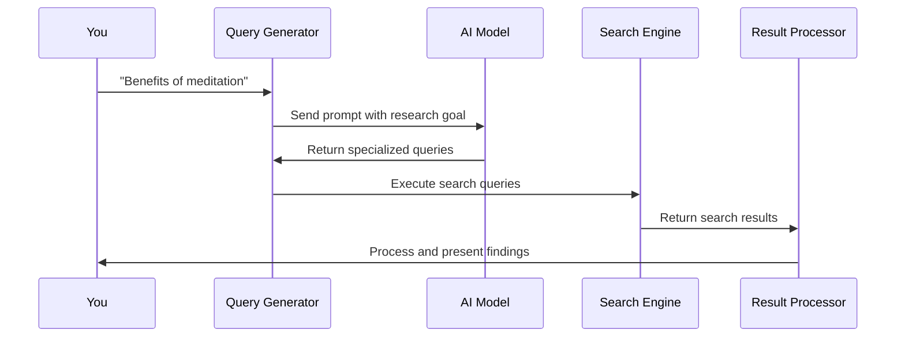
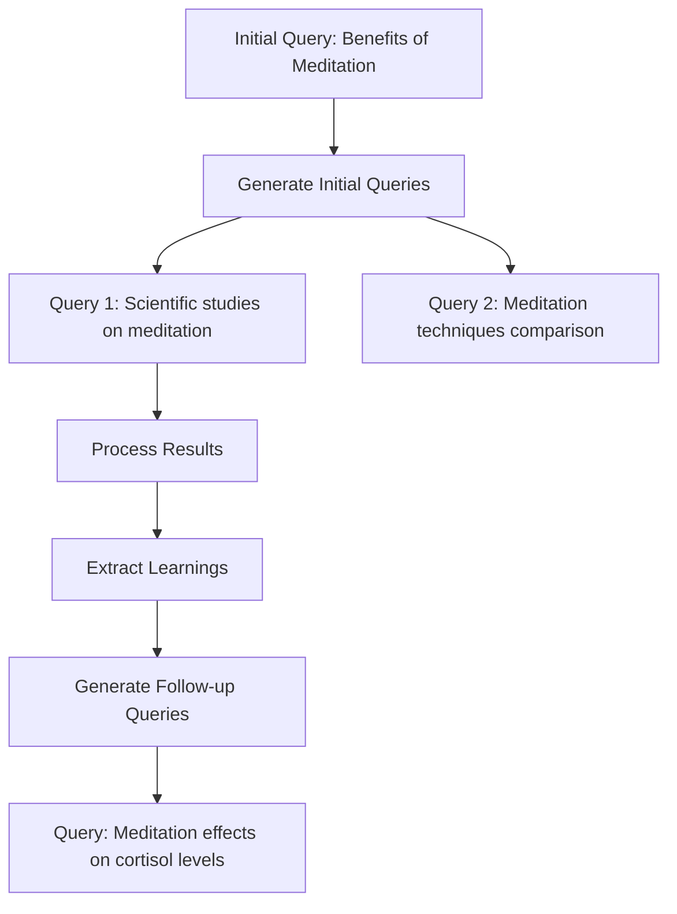

# Chapter 4: SERP Query Generation

In [Chapter 3: CLI Interface](03_cli_interface_.md), we explored how to interact with our deep research tool through the command line. Now, let's dive into one of the most crucial parts of the research process: generating effective search queries.

## The Translator in Your Research Team

Imagine you're trying to research a complex topic like "How artificial intelligence impacts healthcare." If you just type this exact phrase into a search engine, you'll get some results - but will they cover all the important aspects of this broad topic?

SERP Query Generation solves this problem by acting as a **translator** between your research goals and the search engine. SERP stands for "Search Engine Results Page" - the list of results you get when you search for something online.

Think of it like having a research assistant who takes your general question and breaks it down into several specific, targeted questions that search engines can better understand.

## A Simple Example

Let's walk through a concrete example to see how this works:

You give deep-research this request:
```
"Benefits of meditation for stress reduction"
```

The SERP Query Generator might transform this into multiple specific queries like:
```
1. "scientific studies proving meditation reduces cortisol levels"
2. "different meditation techniques effectiveness for anxiety comparison"
3. "long-term effects of daily meditation on stress hormones research"
```

Each of these queries targets a different aspect of your topic, helping you get comprehensive research results.

## Key Concepts

Let's break down the important concepts in SERP Query Generation:

### 1. Query Diversity
Different queries help explore various aspects of a topic. This is like looking at a mountain from multiple angles to get a complete picture.

### 2. Search Engine Optimization
Queries are crafted to work well with how search engines function. This means using specific terms, including keywords, and formulating questions that will return high-quality results.

### 3. Research Goals
Each generated query has a specific research goal - a particular aspect of the topic it aims to explore.

### 4. Follow-up Direction
The system also considers how each query might lead to new research directions based on the results it finds.

## How to Use SERP Query Generation

Here's how you might use this feature in your code:

```javascript
// Generate search queries based on a research topic
const queries = await generateSerpQueries({
  query: "Benefits of meditation",
  numQueries: 3
});
```

This function takes your general research topic and returns an array of specific search queries. The `numQueries` parameter lets you control how many different search directions to explore.

The result might look like:

```javascript
[
  {
    query: "scientific evidence meditation benefits stress reduction",
    researchGoal: "Find peer-reviewed studies on meditation's effects on stress"
  },
  {
    query: "meditation types comparison anxiety depression",
    researchGoal: "Compare effectiveness of different meditation styles"
  },
  // ...more queries
]
```

Each returned query includes both the search string and a research goal explaining what this query aims to discover.

## Using Previous Learnings to Generate Better Queries

As research progresses, we can use what we've already learned to create more focused queries:

```javascript
// Generate follow-up queries based on initial findings
const followUpQueries = await generateSerpQueries({
  query: "Benefits of meditation",
  numQueries: 2,
  learnings: [
    "Mindfulness meditation reduces cortisol levels by 20% in 8 weeks",
    "Regular meditation increases gray matter in the prefrontal cortex"
  ]
});
```

By passing previous `learnings`, the system can generate more specific, targeted queries that dig deeper into the topic. This is like a detective following new leads based on initial evidence.

## How It Works Under the Hood

When you call the query generation function, here's what happens:



1. You provide a research topic
2. The Query Generator creates a prompt for the AI model
3. The AI model analyzes the topic and generates targeted search queries
4. These queries are executed against search engines
5. The results are processed and returned to you

Let's look at the code that makes this happen:

## Inside the Query Generator

Here's a simplified version of the query generation function from `src/deep-research.ts`:

```javascript
async function generateSerpQueries({
  query,
  numQueries = 3,
  learnings,
}) {
  const res = await generateObject({
    model: getModel(),
    system: systemPrompt(),
    prompt: `Given the prompt: "${query}", generate ${numQueries} SERP queries.
             ${learnings ? `Use these previous learnings: ${learnings.join('\n')}` : ''}`,
    schema: z.object({
      queries: z.array(
        z.object({
          query: z.string(),
          researchGoal: z.string()
        })
      )
    }),
  });
  
  return res.object.queries.slice(0, numQueries);
}
```

This function:
1. Takes your research question and optional previous learnings
2. Crafts a prompt for the AI model
3. Defines a schema for the expected response (an array of query objects)
4. Returns the generated queries, limited to the requested number

### The AI Prompt Structure

The prompt sent to the AI model is carefully designed to generate effective queries:

```javascript
`Given the following prompt from the user, generate a list of SERP queries 
to research the topic. Return a maximum of ${numQueries} queries, but 
feel free to return less if the original prompt is clear. Make sure 
each query is unique and not similar to each other: 

<prompt>${query}</prompt>

${learnings ? `Here are some learnings from previous research, 
use them to generate more specific queries: ${learnings.join('\n')}` : ''}`
```

This prompt:
- Clearly states what we want (SERP queries)
- Includes the user's original research question
- Emphasizes the importance of diversity in queries
- Optionally incorporates previous learnings to refine the search

### Query Output Structure

Each generated query includes two key components:

1. **Query**: The actual search string to send to a search engine
2. **ResearchGoal**: An explanation of what this query aims to discover and potential follow-up directions

This structure helps both the system and the user understand the purpose of each query.

## Real-World Application

Let's see how this works in the context of our [Deep Research Process](01_deep_research_process_.md):

```javascript
export async function deepResearch({
  query,
  breadth,
  depth,
  learnings = [],
}) {
  // Generate search queries based on the user query
  const serpQueries = await generateSerpQueries({
    query,
    numQueries: breadth,
    learnings,
  });
  
  // ... rest of research process
}
```

The query generation is the first step in the research process. The number of queries generated is determined by the `breadth` parameter, allowing users to control how wide their research net is cast.

## Iterative Query Refinement

What makes SERP Query Generation truly powerful is how it evolves throughout the research process:



As the system processes search results, it extracts learnings which feed back into the query generation process. This creates a virtuous cycle where each round of search queries becomes more focused and effective.

In the [deep-research.ts](https://github.com/mendableai/deep-research/blob/main/src/deep-research.ts) file, this recursive refinement happens inside the `deepResearch` function:

```javascript
if (newDepth > 0) {
  const nextQuery = `
    Previous research goal: ${serpQuery.researchGoal}
    Follow-up research directions: ${newLearnings.followUpQuestions.join('\n')}
  `;

  return deepResearch({
    query: nextQuery,
    breadth: newBreadth,
    depth: newDepth,
    learnings: allLearnings,
    // ... other parameters
  });
}
```

This code shows how we construct a new research query based on:
1. The previous research goal
2. Follow-up questions identified from search results
3. Learnings gathered so far

## Practical Tips for Using SERP Query Generation

When working with the SERP Query Generation feature, keep these tips in mind:

1. **Be specific in your initial query**: The more focused your initial request, the better the generated queries will be.

2. **Adjust the number of queries**: More queries (higher breadth) means more comprehensive research but takes longer.

3. **Let the process run through multiple depth levels**: This allows the query generation to refine itself based on initial findings.

4. **Review the generated queries**: Sometimes you might want to manually adjust or filter the queries to better match your research goals.

## Conclusion

SERP Query Generation is like having a team of research assistants who know exactly what questions to ask to get the most comprehensive information on your topic. It transforms your general research goal into precise, targeted search queries that uncover different aspects of your topic.

By generating diverse and specific queries, and then refining those queries based on what it learns, the system can explore a topic much more thoroughly than a simple search ever could.

In the next chapter, [Search Result Processing](05_search_result_processing_.md), we'll explore what happens after these queries are sent to search engines - how the system extracts meaningful insights from the flood of information returned by each search.

---

Generated by [AI Codebase Knowledge Builder](https://github.com/The-Pocket/Tutorial-Codebase-Knowledge)