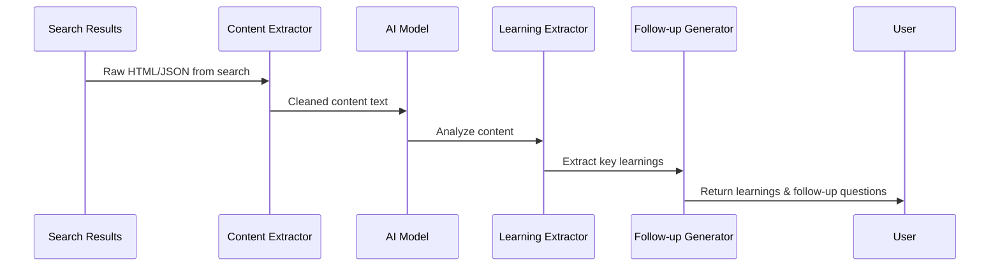

# Chapter 5: Search Result Processing

In [Chapter 4: SERP Query Generation](04_serp_query_generation_.md), we learned how to create effective search queries to explore our research topic. Now, we'll explore what happens after we get those search results back - how do we turn a flood of information into useful knowledge?

## Finding Gold in the Digital River

Imagine you're panning for gold in a river. You scoop up a pan full of river mud and gravel, then carefully wash away the dirt to reveal shiny gold nuggets. Search Result Processing works exactly the same way! 

When our system searches the web, it gets back pages of text - some useful, some not. The Search Result Processing component sifts through all this content to find the valuable "nuggets" of information that actually answer our research question.

## A Simple Example

Let's say we're researching "benefits of meditation" and one of our searches returns several web pages with content like this:

```
Meditation has been practiced for thousands of years. Modern research has 
found that regular meditation can reduce stress hormones by up to 30% 
after 8 weeks of practice. Users report improved sleep quality and reduced 
anxiety. A 2020 study in the Journal of Neuroscience found that meditation 
increases gray matter in areas related to focus and attention.
```

Our Search Result Processing would extract specific learnings like:
```
1. Regular meditation reduces stress hormones by up to 30% after 8 weeks
2. Meditation increases gray matter in areas related to focus (2020 study)
```

It might also suggest follow-up questions:
```
1. What specific meditation techniques are most effective for stress reduction?
2. How does meditation affect sleep patterns?
```

## Key Concepts

Let's break down the essential concepts of Search Result Processing:

### 1. Content Extraction
Before we can analyze search results, we need to extract the main content from web pages, removing navigation, ads, and other irrelevant elements.

### 2. Information Density
We want to extract information that is specific, fact-based, and information-rich. "Meditation is good for you" is less valuable than "Daily meditation for 20 minutes reduces cortisol by 20%."

### 3. Follow-up Questions
As we learn new information, we identify new questions to explore, creating a branching research path.

### 4. Credibility Assessment
We prioritize information that appears reliable and specific over vague claims.

## How to Use Search Result Processing

Here's how you might use this feature in your code:

```javascript
// Process search results for a query
const processedResults = await processSerpResult({
  query: "benefits of meditation",
  result: searchResults,
  numLearnings: 3
});
```

This function takes your search query and the raw search results, then returns extracted learnings and follow-up questions. The `numLearnings` parameter lets you control how many key points to extract.

The result would look something like:

```javascript
{
  learnings: [
    "Regular meditation reduces cortisol levels by up to 30% after 8 weeks",
    "A 2020 study found meditation increases gray matter in brain areas related to focus",
    "Mindfulness meditation improved sleep quality in 85% of insomnia patients"
  ],
  followUpQuestions: [
    "What meditation techniques are most effective for stress reduction?",
    "How does meditation compare to other stress-reduction methods?",
    "Are there any negative side effects of long-term meditation practice?"
  ]
}
```

## Processing Results with Context

If you have specific research goals, you can include them in the processing:

```javascript
// Process with a specific research goal
const processedResults = await processSerpResult({
  query: "meditation techniques for beginners",
  result: searchResults,
  researchGoal: "Find accessible meditation methods for stress reduction"
});
```

By including the research goal, the system better understands what information is most relevant to extract.

## Under the Hood: How It Works

When you process search results, here's what happens step by step:



1. The system receives raw search results (HTML pages or structured data)
2. It extracts and cleans the main content, removing clutter
3. The AI model analyzes this content to identify key information
4. The Learning Extractor pulls out specific, valuable facts
5. The Follow-up Generator identifies new questions to explore
6. The processed results are returned to you

Let's look at the code that makes this happen:

## Inside the Result Processor

Here's a simplified version of the search result processing function:

```javascript
async function processSerpResult({
  query,
  result,
  numLearnings = 3,
  numFollowUpQuestions = 3,
}) {
  // Extract content from search results
  const contents = compact(result.data.map(item => item.markdown));
  
  // Generate learnings and follow-up questions using AI
  const res = await generateObject({
    model: getModel(),
    prompt: `Given these contents from a search for "${query}", 
             generate key learnings and follow-up questions...`,
    schema: z.object({
      learnings: z.array(z.string()),
      followUpQuestions: z.array(z.string())
    }),
  });
  
  return res.object;
}
```

This function:
1. Takes the search query and raw results
2. Extracts the content from each search result
3. Uses AI to analyze the content and extract valuable information
4. Returns both the learnings and suggested follow-up questions

### The AI Prompt Structure

The actual prompt sent to the AI model is carefully designed to extract high-quality information:

```javascript
`Given the following contents from a SERP search for the query "${query}", 
generate a list of learnings. Make each learning unique, concise, and 
information-dense. Include exact metrics, numbers, or dates when available.
The learnings will be used to research the topic further.`
```

This prompt instructs the AI to focus on specific, factual information rather than general statements, making the extracted learnings more valuable for research.

### Schema Definition

The result structure is defined using a schema:

```javascript
schema: z.object({
  learnings: z.array(z.string())
    .describe(`List of learnings, max of ${numLearnings}`),
  followUpQuestions: z.array(z.string())
    .describe(`List of follow-up questions, max of ${numFollowUpQuestions}`)
})
```

This ensures that the AI returns results in a consistent format that our system can process.

## How This Fits in the Research Process

In the context of [Deep Research Process](01_deep_research_process_.md), the search result processing happens after each search query is executed:

```javascript
export async function deepResearch({
  query,
  breadth,
  depth,
  // ...other parameters
}) {
  // Generate search queries
  const serpQueries = await generateSerpQueries({/*...*/});
  
  // For each query...
  const results = await Promise.all(
    serpQueries.map(serpQuery => 
      limit(async () => {
        // Execute the search
        const result = await firecrawl.search(serpQuery.query);
        
        // Process the results to extract learnings
        const newLearnings = await processSerpResult({
          query: serpQuery.query,
          result,
          numFollowUpQuestions: newBreadth,
        });
        
        // Use these learnings for deeper research if needed
        // ...
      })
    )
  );
  
  // Combine all learnings
  return {
    learnings: [...new Set(results.flatMap(r => r.learnings))],
    visitedUrls: [...new Set(results.flatMap(r => r.visitedUrls))],
  };
}
```

This shows how each search query's results are processed, and how the extracted learnings feed into further research at deeper levels.

## A Gold Mining Operation

To better understand the whole process, imagine a gold mining operation:

1. **Prospecting** (SERP Query Generation): Decide where to look for gold
2. **Excavation** (Search Engine): Dig up earth that might contain gold
3. **Processing** (Search Result Processing): Sift through dirt to find gold nuggets
4. **Refining** (Research Synthesis): Combine gold nuggets into valuable items

The Search Result Processing is that critical step where raw material (search results) is transformed into valuable resources (specific facts and insights).

## Practical Tips for Effective Result Processing

To get the most out of Search Result Processing:

1. **Use specific queries**: More specific search queries lead to more focused results that are easier to process.

2. **Balance quantity and quality**: Requesting too many learnings might include less valuable information; too few might miss important points.

3. **Examine follow-up questions**: These often reveal interesting aspects of your topic you hadn't considered.

4. **Iterate**: The best research comes from multiple rounds of searching, processing, and following up on new questions.

## Conclusion

Search Result Processing is the intelligence center of our research system - the part that transforms raw information into actual knowledge. By carefully extracting specific, factual information and identifying new research directions, it mimics the way a skilled researcher reads and analyzes sources.

Without this component, we'd be drowning in pages of text. With it, we get precise, valuable insights that directly answer our research questions and point us to new avenues to explore.

In the next chapter, [FirecrawlApp Integration](06_firecrawlapp_integration_.md), we'll explore how our system connects to search engines to retrieve the raw content that our Search Result Processing component will analyze.

---

Generated by [AI Codebase Knowledge Builder](https://github.com/The-Pocket/Tutorial-Codebase-Knowledge)