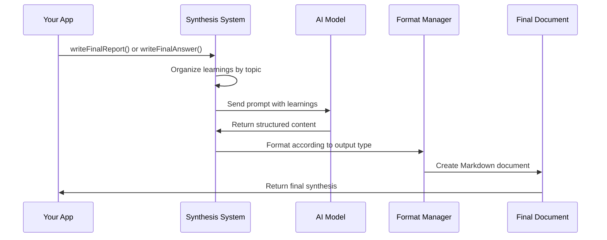

# Chapter 7: Research Result Synthesis

In [Chapter 6: FirecrawlApp Integration](06_firecrawlapp_integration_.md), we learned how to retrieve information from the web. Now, let's explore how to transform all that raw information into something valuable and coherent.

## From Scattered Facts to Coherent Knowledge

Imagine you've spent hours researching a topic. You've collected dozens of facts, statistics, and insights from different sources. But now you're staring at pages of disconnected notes, wondering how to turn them into a clear, organized report or a simple answer.

Research Result Synthesis solves this problem. Like a skilled chef who takes various ingredients and creates a delicious meal, this component takes all the separate pieces of information (our "ingredients") and combines them into a polished final product (our "meal").

## A Simple Example

Let's say you're researching electric vehicles for a school project. Your deep-research system has collected these learnings:

```
- Tesla Model 3 has a range of up to 358 miles on a single charge
- Electric vehicles produce 50% less greenhouse gas emissions over their lifetime compared to gas cars
- The average cost of charging an EV is $5.27 per 100 miles compared to $11.29 for gas
- Global EV sales increased by 43% in 2020 despite the pandemic
- China remains the world's largest EV market with 1.3 million vehicles sold in 2020
```

Now you need to turn these scattered facts into either:
1. A comprehensive report on the state of electric vehicles, or
2. A direct answer to a specific question like "Are electric vehicles better for the environment?"

Research Result Synthesis can do both!

## Key Concepts

Let's break down the important concepts in Research Result Synthesis:

### 1. Report Synthesis
Creates a comprehensive, structured document that covers multiple aspects of a topic. Perfect for in-depth research papers or when you need to learn about a subject thoroughly.

### 2. Answer Synthesis
Produces a concise, focused response to a specific question. Ideal when you need a direct answer rather than a complete overview.

### 3. Learning Integration
The process of weaving separate facts into a coherent narrative, connecting related information and organizing it logically.

### 4. Source Attribution
Including references to where information came from, ensuring your research is credible and verifiable.

## How to Use Research Result Synthesis

Let's see how to use both synthesis methods in your code:

### Creating a Comprehensive Report

```javascript
// After collecting research learnings
const report = await writeFinalReport({
  prompt: "The current state of electric vehicles",
  learnings: learnings,  // Array of facts from research
  visitedUrls: urls      // Sources where facts were found
});
```

This function takes your research topic, the learnings collected during research, and the sources used. It returns a complete Markdown report that organizes all the information into a cohesive document.

The result might look like:

```markdown
# The Current State of Electric Vehicles

## Introduction
Electric vehicles (EVs) have seen remarkable growth in recent years...

## Performance and Range
Modern EVs like the Tesla Model 3 can travel up to 358 miles on a single charge...

## Environmental Impact
Research shows that EVs produce 50% less greenhouse gas emissions...

## Economic Considerations
The average cost of charging an EV is $5.27 per 100 miles...

## Global Market Trends
Global EV sales increased by 43% in 2020 despite the pandemic...

## Sources
- https://example.com/ev-statistics
- https://example.org/tesla-specs
```

### Getting a Specific Answer

```javascript
// For a direct answer to a specific question
const answer = await writeFinalAnswer({
  prompt: "Are electric vehicles better for the environment?",
  learnings: learnings  // Array of facts from research
});
```

This function focuses on answering a specific question rather than creating a comprehensive report. It returns a concise answer based on the research.

The result might be:

```
Yes, electric vehicles are better for the environment as they produce 50% less 
greenhouse gas emissions over their lifetime compared to conventional 
gasoline-powered vehicles.
```

## Under the Hood: How It Works

When you call these synthesis functions, here's what happens behind the scenes:



1. Your application calls the synthesis function with the prompt and learnings
2. The system organizes the learnings by topic and relevance
3. It creates a prompt for the AI model, including all the learnings
4. The AI model generates structured content based on the learnings
5. The content is formatted according to the output type (report or answer)
6. The final document is returned to your application

Let's look at the key parts of the implementation:

## Inside the Synthesis Functions

Here's the code for the report synthesis function:

```javascript
export async function writeFinalReport({
  prompt,
  learnings,
  visitedUrls,
}) {
  // Format learnings for the AI prompt
  const learningsString = learnings
    .map(learning => `<learning>\n${learning}\n</learning>`)
    .join('\n');

  // Generate the report using AI
  const res = await generateObject({
    model: getModel(),
    system: systemPrompt(),
    prompt: trimPrompt(
      `Given the following prompt from the user, write a final report...
      <prompt>${prompt}</prompt>
      
      Here are all the learnings from previous research:
      <learnings>\n${learningsString}\n</learnings>`
    ),
    schema: z.object({
      reportMarkdown: z.string().describe('Final report in Markdown')
    }),
  });

  // Append the visited URLs as sources
  const urlsSection = `\n\n## Sources\n\n${visitedUrls.map(url => 
    `- ${url}`).join('\n')}`;
  
  return res.object.reportMarkdown + urlsSection;
}
```

This function:
1. Takes the research prompt, collected learnings, and visited URLs
2. Formats the learnings into a structured prompt for the AI model
3. Uses the AI model to generate a comprehensive report
4. Adds a Sources section with all the URLs visited during research
5. Returns the complete report in Markdown format

Similarly, here's the code for the answer synthesis function:

```javascript
export async function writeFinalAnswer({
  prompt,
  learnings,
}) {
  // Format learnings for the AI prompt
  const learningsString = learnings
    .map(learning => `<learning>\n${learning}\n</learning>`)
    .join('\n');

  // Generate the answer using AI
  const res = await generateObject({
    model: getModel(),
    system: systemPrompt(),
    prompt: trimPrompt(
      `Given the following prompt from the user, write a final answer...
      <prompt>${prompt}</prompt>
      
      Here are all the learnings from research on the topic:
      <learnings>\n${learningsString}\n</learnings>`
    ),
    schema: z.object({
      exactAnswer: z.string().describe('The final answer, make it short and concise')
    }),
  });

  return res.object.exactAnswer;
}
```

This function is similar but focuses on generating a concise answer rather than a complete report, and it doesn't include source URLs.

## The AI Prompts in Detail

The prompts sent to the AI model are carefully crafted to produce high-quality output:

### Report Prompt

```
Given the following prompt from the user, write a final report on the topic 
using the learnings from research. Make it as detailed as possible, aim for 
3 or more pages, include ALL the learnings from research:

<prompt>[User's research topic]</prompt>

Here are all the learnings from previous research:

<learnings>
[Learning 1]
[Learning 2]
...
</learnings>
```

This prompt encourages the AI to create a comprehensive, detailed report that incorporates all the research findings.

### Answer Prompt

```
Given the following prompt from the user, write a final answer on the topic 
using the learnings from research. Follow the format specified in the prompt. 
Keep the answer as concise as possible - usually it should be just a few words 
or maximum a sentence.

<prompt>[User's specific question]</prompt>

Here are all the learnings from research on the topic that you can help 
answer the prompt:

<learnings>
[Learning 1]
[Learning 2]
...
</learnings>
```

This prompt directs the AI to provide a focused, concise answer to the specific question, using only the most relevant information from the research.

## The Chef Analogy: A Different Perspective

To better understand Research Result Synthesis, let's expand on our chef analogy:

1. **Ingredients** = Individual facts and learnings from research
2. **Recipe** = The prompt that guides what kind of output we want
3. **Cooking Method** = Whether we're making a detailed report or a quick answer
4. **Chef's Skill** = The AI model's ability to combine information coherently
5. **Final Dish** = The synthesized report or answer

Just as a chef decides whether to create an elaborate multi-course meal or a simple dish based on the diner's needs, our synthesis system adapts its output based on whether you need comprehensive research or a quick answer.

## Using Synthesis in the Deep Research Process

In the overall [Deep Research Process](01_deep_research_process_.md), synthesis is the final step:

```javascript
// Inside a function that manages the research workflow
export async function completeResearch(query, options) {
  // Step 1: Perform deep research to collect learnings
  const { learnings, visitedUrls } = await deepResearch({
    query: query,
    breadth: options.breadth,
    depth: options.depth
  });
  
  // Step 2: Synthesize the results based on user preference
  if (options.outputType === 'report') {
    return await writeFinalReport({
      prompt: query,
      learnings: learnings,
      visitedUrls: visitedUrls
    });
  } else {
    return await writeFinalAnswer({
      prompt: query,
      learnings: learnings
    });
  }
}
```

This shows how synthesis fits into the complete research workflow - after all the information is gathered, synthesis transforms it into the final output.

## Practical Tips for Effective Research Synthesis

To get the best results from Research Result Synthesis:

1. **Be specific in your prompt**: "The history of electric vehicles" will give you a general overview, while "How did Tesla influence the electric vehicle market between 2010-2020?" will give you more focused results.

2. **Choose the right output type**: Use report synthesis for complex topics where you need comprehensive coverage, and answer synthesis for specific questions where you need a direct response.

3. **Review source URLs**: The system includes sources in reports, which allows you to verify information or explore interesting points in more depth.

4. **Provide sufficient research depth**: More thorough research (higher depth and breadth) gives the synthesis system more information to work with, resulting in better output.

## Conclusion

Research Result Synthesis is the culmination of the deep research process - the stage where scattered pieces of information become valuable knowledge. Whether you need a comprehensive report or a quick answer, this component transforms raw research data into a polished final product.

Like a skilled chef who knows exactly how to combine ingredients into a delicious meal, Research Result Synthesis takes the ingredients of your research (facts, statistics, insights) and creates something greater than the sum of its parts.

In this chapter, we've learned:
- How synthesis transforms scattered facts into coherent knowledge
- The difference between report synthesis and answer synthesis
- How to use both synthesis functions in your code
- How the synthesis process works under the hood
- Best practices for getting high-quality results

Now that we understand how to synthesize research results, let's explore how to make our research process even better through [Feedback Generation](08_feedback_generation_.md), which helps refine research queries to get more accurate and relevant information.

---

Generated by [AI Codebase Knowledge Builder](https://github.com/The-Pocket/Tutorial-Codebase-Knowledge)