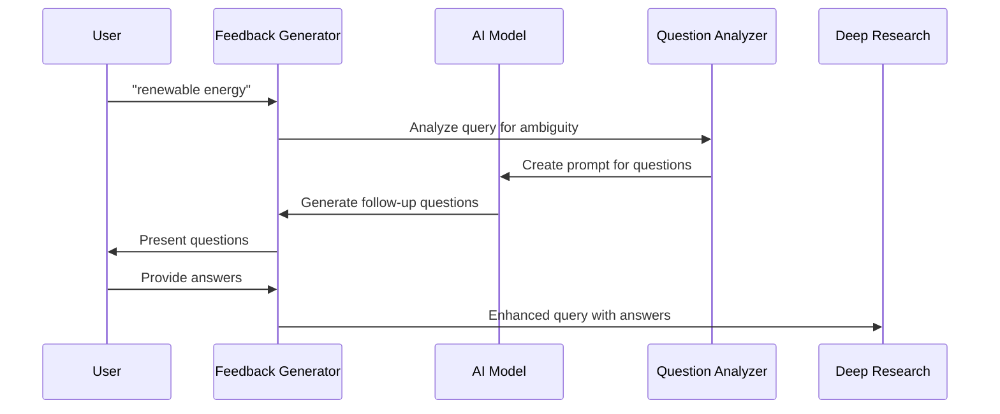

# Chapter 8: Feedback Generation

In [Chapter 7: Research Result Synthesis](07_research_result_synthesis_.md), we learned how to transform raw research data into coherent reports and answers. Now, let's explore how to make our research more effective from the very beginning through Feedback Generation.

## The Journalist's Question Technique

Imagine you're interviewing someone for an important story. Would you ask just one question and walk away? Of course not! Great journalists always ask follow-up questions to get to the heart of a story.

Feedback Generation works exactly the same way. When you provide a research topic like "renewable energy," it acts like a curious journalist, asking clarifying questions such as:

- "Are you interested in a specific type of renewable energy (solar, wind, hydro)?"
- "Are you looking for global trends or focusing on a particular region?"
- "Do you want to learn about economic aspects or environmental impacts?"

These questions help narrow down exactly what you're looking for, leading to much more precise and useful research results.

## A Simple Example

Let's say you want to research "artificial intelligence" - a topic so broad it could fill libraries! Without clarification, your research might be scattered and shallow.

With Feedback Generation, here's what would happen:

1. You submit your research query: "artificial intelligence"
2. The system generates follow-up questions:
   - "Which aspect of AI are you most interested in (e.g., machine learning, neural networks, ethics)?"
   - "Are you researching AI for a specific application (healthcare, finance, education)?"
   - "Are you more interested in current capabilities or future possibilities?"
3. You provide answers to these questions
4. Your research becomes focused on exactly what you care about

The result? Research that's tailored to your specific interests rather than a generic overview.

## Key Concepts

Let's break down the essential concepts of Feedback Generation:

### 1. Query Clarification
Identifying vague or broad aspects of a research query that need more specificity.

### 2. Research Direction
Determining the different paths a research topic could take and helping the user choose the most relevant one.

### 3. Context Building
Gathering additional information about the user's knowledge level, goals, and interests to provide more suitable research.

## How to Use Feedback Generation

Using Feedback Generation in your code is straightforward:

```javascript
// Generate follow-up questions for a research query
const followUpQuestions = await generateFeedback({
  query: "renewable energy",
  numQuestions: 3
});
```

This function takes your initial research query and returns an array of follow-up questions. The `numQuestions` parameter lets you control how many questions to generate.

The result might look like:

```javascript
[
  "Which types of renewable energy are you most interested in exploring?",
  "Are you looking for information on a specific geographic region?",
  "Is your interest more on the technical aspects or economic implications?"
]
```

You can then present these questions to the user and collect their answers:

```javascript
// Display questions and collect answers
const answers = [];
for (const question of followUpQuestions) {
  const answer = await askUser(question);
  answers.push(answer);
}
```

This code loops through each follow-up question, asks the user for their response, and stores their answers in an array.

## Combining Answers with the Original Query

Once you have the answers, you can combine everything into a more detailed research query:

```javascript
// Combine all information for deep research
const enhancedQuery = `
Initial Query: ${initialQuery}
Follow-up Questions and Answers:
${questions.map((q, i) => `Q: ${q}\nA: ${answers[i]}`).join('\n')}
`;
```

This creates a rich, detailed query that includes both the original topic and all the clarifying information, which can then be passed to the [Deep Research Process](01_deep_research_process_.md).

## Under the Hood: How It Works

When you generate feedback questions, here's what happens step by step:



1. You provide an initial research query
2. The system analyzes the query to identify areas that need clarification
3. It creates a prompt for the AI model asking for relevant follow-up questions
4. The AI generates questions targeting different aspects of your topic
5. You answer these questions
6. The system combines your original query with your answers to create a comprehensive research request

## Inside the Feedback Generator

Let's look at how feedback generation is implemented in the `src/feedback.ts` file:

```javascript
export async function generateFeedback({
  query,
  numQuestions = 3,
}) {
  const userFeedback = await generateObject({
    model: getModel(),
    system: systemPrompt(),
    prompt: `Given the following query, ask follow up questions...`,
    schema: z.object({
      questions: z.array(z.string())
    }),
  });

  return userFeedback.object.questions.slice(0, numQuestions);
}
```

This function:
1. Takes your query and the desired number of questions
2. Uses an AI model to generate relevant follow-up questions
3. Defines a schema for the expected response (an array of strings)
4. Returns the generated questions, limited to the requested number

### The AI Prompt Structure

The actual prompt sent to the AI model is carefully designed to generate effective questions:

```javascript
`Given the following query from the user, ask some follow up questions 
to clarify the research direction. Return a maximum of ${numQuestions} 
questions, but feel free to return less if the original query is clear: 
<query>${query}</query>`
```

This prompt instructs the AI to analyze the query, identify areas that need clarification, and generate targeted questions that will help refine the research direction.

## Real-World Application in the CLI Interface

The Feedback Generation component is used in the CLI interface (`src/run.ts`) to improve the research experience:

```javascript
// Inside the run function
if (isReport) {
  log(`Creating research plan...`);

  // Generate follow-up questions
  const followUpQuestions = await generateFeedback({
    query: initialQuery,
  });

  log('\nTo better understand your research needs...');

  // Collect answers to follow-up questions
  const answers = [];
  for (const question of followUpQuestions) {
    const answer = await askQuestion(`\n${question}\nYour answer: `);
    answers.push(answer);
  }
}
```

This code shows how the CLI interface uses Feedback Generation to:
1. Create a research plan
2. Generate follow-up questions based on the user's initial query
3. Present these questions to the user
4. Collect and store their answers
5. Use this enhanced information for the actual research

## Practical Tips for Effective Feedback Generation

To get the most out of Feedback Generation:

1. **Start with a concise query**: While the system can handle broad topics, starting with a somewhat focused query will result in more relevant follow-up questions.

2. **Provide thoughtful answers**: The more detailed your responses to follow-up questions, the better your final research results will be.

3. **Consider different dimensions**: When answering questions, think about aspects like time period, geography, technical depth, and specific applications.

4. **Be specific in your answers**: "I'm interested in home solar panel economics in suburban areas" is better than "I like solar power."

## The Interview Analogy: A Different Perspective

Think of Feedback Generation as an interview between you and a research assistant:

1. **Initial Statement** = Your broad research topic
2. **Journalist's Questions** = The follow-up questions generated by the system
3. **Your Responses** = Your clarifications and specifications
4. **Research Assignment** = The enhanced query with all context included

Just as a journalist uses follow-up questions to get to the heart of a story, our system uses question-and-answer exchanges to understand exactly what you're looking for, leading to much more relevant and useful research.

## Conclusion

Feedback Generation is like having a research coach who helps you refine your questions before diving into research. By identifying areas of ambiguity in your initial query and asking clarifying questions, it ensures that the research process focuses on exactly what you care about.

This question-and-answer process dramatically improves the quality of research results by:
- Narrowing overly broad topics
- Identifying specific aspects of interest
- Clarifying ambiguous terms
- Building context around your research goals

With Feedback Generation, you're no longer throwing a vague question into the void - you're engaging in a dialogue that helps pinpoint exactly what you need to know.

Now that we understand how to refine research queries through effective questioning, let's explore how the underlying AI capabilities are managed in [AI Model Management](09_ai_model_management_.md).

---

Generated by [AI Codebase Knowledge Builder](https://github.com/The-Pocket/Tutorial-Codebase-Knowledge)