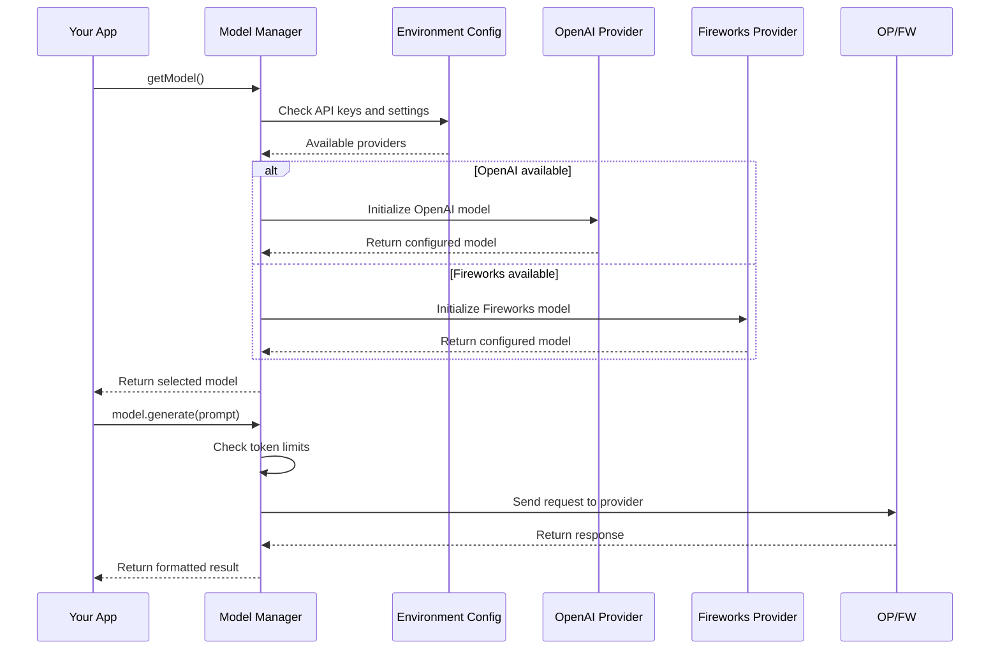

# Chapter 9: AI Model Management

In [Chapter 8: Feedback Generation](08_feedback_generation_.md), we learned how to refine research queries through clarifying questions. Now, let's explore the engine that powers all our AI interactions: AI Model Management.

## The Universal Translator

Imagine you're traveling the world and need to communicate with people who speak many different languages. You'd need a translator who knows all these languages to help you. In our deep-research system, AI Model Management plays exactly this role!

Different AI models (like OpenAI's GPT models or Fireworks' models) are like different languages - they have their own unique APIs, limitations, and ways of communicating. AI Model Management acts as our universal translator, allowing our application to "speak" to any AI model without having to rewrite our code for each one.

## A Simple Example

Let's say you want your application to generate research questions. Without AI Model Management, you'd have to write code like this:

```javascript
// Without AI Model Management (complicated!)
if (useOpenAI) {
  const openai = new OpenAI(OPENAI_KEY);
  const response = await openai.createCompletion({
    model: "gpt-3.5-turbo",
    prompt: researchPrompt,
    max_tokens: 1000
  });
  return response.choices[0].text;
} else if (useFireworks) {
  const fireworks = new Fireworks(FIREWORKS_KEY);
  // Different API structure entirely!
  // ... and so on for each provider
}
```

With AI Model Management, you simply write:

```javascript
// With AI Model Management (simple!)
const model = getModel();
const response = await model.generate({
  prompt: researchPrompt,
  schema: responseSchema
});
return response.object;
```

Much simpler! Our code doesn't need to worry about which AI provider we're using - AI Model Management handles those details for us.

## Key Concepts

Let's break down the essential concepts of AI Model Management:

### 1. Model Selection
Choosing the right AI model based on availability and needs. Like picking the right tool for a job.

### 2. API Abstraction
Creating a consistent interface to interact with different AI providers (OpenAI, Fireworks, etc.).

### 3. Token Management
Ensuring prompts don't exceed the maximum size a model can handle - like making sure a message fits in a text box.

### 4. Error Handling
Gracefully managing when models fail or time out.

## How to Use AI Model Management

Using AI Model Management in your code is straightforward:

```javascript
// Get the appropriate AI model
const model = getModel();

// Use the model for generation
const result = await generateObject({
  model: model,
  prompt: "Generate research questions about climate change",
  schema: questionSchema
});
```

This code gets the appropriate model based on your environment configuration and then uses it to generate content. The `schema` parameter defines what structure the response should have.

Here's how you might use it to generate a list of questions:

```javascript
// Define the expected response structure
const questionSchema = z.object({
  questions: z.array(z.string())
});

// Generate questions
const result = await generateObject({
  model: getModel(),
  prompt: "List questions about renewable energy",
  schema: questionSchema
});

// Now you can use the structured result
console.log(result.object.questions[0]); // First question
```

This example shows how the model generates a structured response (a list of questions) that you can easily work with in your code.

## Under the Hood: How It Works

When you use the AI Model Management system, here's what happens:



1. Your application requests a model using `getModel()`
2. The Model Manager checks environment variables to see which providers are available
3. It selects and configures the appropriate model
4. Your application sends a prompt to the model
5. The Model Manager handles token limits and sends the request to the provider
6. It receives the response and formats it consistently
7. Your application gets back a predictable result structure

Let's look at how this is implemented in the code:

## Inside the Model Manager

The core of AI Model Management is in the `src/ai/providers.ts` file:

### Provider Initialization

```javascript
// Initialize providers based on available API keys
const openai = process.env.OPENAI_KEY
  ? createOpenAI({
      apiKey: process.env.OPENAI_KEY,
      baseURL: process.env.OPENAI_ENDPOINT || 'https://api.openai.com/v1',
    })
  : undefined;

const fireworks = process.env.FIREWORKS_KEY
  ? createFireworks({
      apiKey: process.env.FIREWORKS_KEY,
    })
  : undefined;
```

This code initializes connections to different AI providers, but only if the corresponding API keys are available in your environment variables. This makes it easy to switch providers by simply changing environment variables.

### Model Selection

```javascript
export function getModel(): LanguageModelV1 {
  if (customModel) {
    return customModel;
  }

  const model = deepSeekR1Model ?? o3MiniModel;
  if (!model) {
    throw new Error('No model found');
  }

  return model as LanguageModelV1;
}
```

This function decides which model to use based on what's available. It first checks for a custom model, then tries specific models in a priority order. If no models are available, it throws an error.

### Token Management

```javascript
export function trimPrompt(
  prompt: string,
  contextSize = Number(process.env.CONTEXT_SIZE) || 128_000,
) {
  if (!prompt) {
    return '';
  }

  const length = encoder.encode(prompt).length;
  if (length <= contextSize) {
    return prompt;
  }
  
  // Trim the prompt if it's too long...
}
```

This function checks if a prompt is too large for a model's context window. If it is, it trims the prompt to fit. This is like making sure a message isn't too long before sending it.

## The Phone Call Analogy

Think of AI Model Management like making international phone calls:

1. **Phone Number Selection** = Choosing which AI provider to use
2. **Country Code** = The specific format needed for each provider's API
3. **Line Quality Check** = Ensuring prompts aren't too large
4. **Call Routing** = Directing the request to the right service
5. **Translation Service** = Converting between different API formats

Just as you don't need to know the technical details of how international calls are routed, your application doesn't need to know the technical details of how different AI providers work.

## Practical Applications in Deep Research

Throughout the [Deep Research Process](01_deep_research_process_.md), we make many calls to AI models:

```javascript
// When generating search queries
const queries = await generateSerpQueries({
  query: "Benefits of meditation",
  numQueries: 3
});

// When processing search results
const processed = await processSerpResult({
  query: "meditation benefits",
  result: searchResults
});

// When synthesizing a final report
const report = await writeFinalReport({
  prompt: "Benefits of meditation",
  learnings: learnings
});
```

All these functions rely on AI Model Management behind the scenes to:
1. Select the appropriate model
2. Format the prompt correctly
3. Handle token limits
4. Parse and return the results

## Customizing Model Behavior

The system prompt defines how the AI models should behave across our application:

```javascript
export const systemPrompt = () => {
  const now = new Date().toISOString();
  return `You are an expert researcher. Today is ${now}. Follow these instructions...`;
};
```

This system prompt is sent with every AI request to ensure consistent, high-quality responses. It's like giving the same briefing to every translator before they start working.

## Conclusion

AI Model Management is the quiet workhorse of our deep-research system. Like a skilled translator, it handles the complex communication with different AI providers so the rest of our application can focus on what matters - conducting great research.

By abstracting away the differences between AI models, it allows our code to be simpler, more maintainable, and easily adaptable to new AI providers in the future. It also handles important technical details like token limits to prevent errors.

In this chapter, we've learned:
- How AI Model Management works as a universal translator
- How to select and use AI models without worrying about provider details
- How the system manages token limits and other technical considerations
- How model selection happens under the hood

Now that we understand how to communicate with AI models, let's explore how we process and manipulate text in [Text Processing Utilities](10_text_processing_utilities_.md).

---

Generated by [AI Codebase Knowledge Builder](https://github.com/The-Pocket/Tutorial-Codebase-Knowledge)