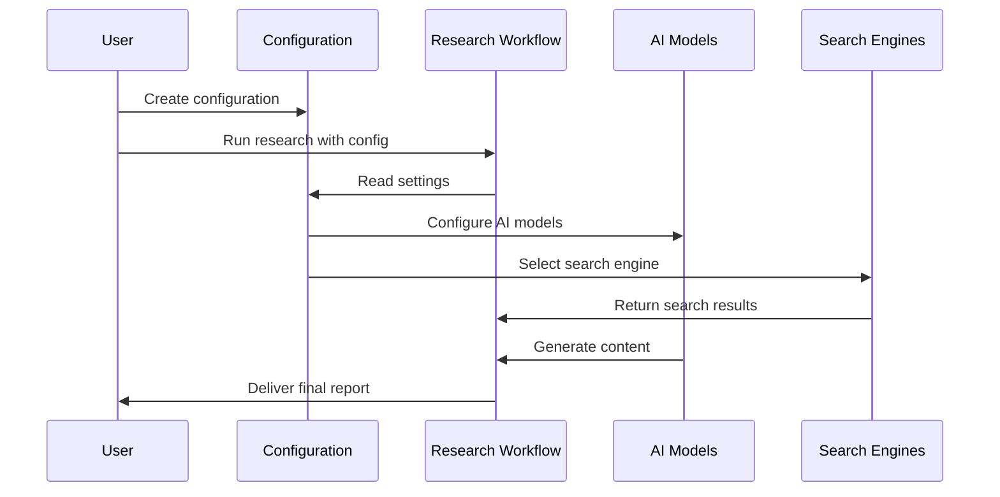

# Chapter 1: Configuration Management

## Introduction: Your Research Control Panel

Have you ever ordered a customized meal at a restaurant? You might specify how spicy you want it, which ingredients to include, and how thoroughly it should be cooked. Configuration management in `open_deep_research` works in a similar way - it's like a menu that lets you customize exactly how your research assistant will work for you.

At its core, configuration management provides a central control system that determines:

- Which search engines to use for finding information
- Which AI models to employ for different tasks
- How deep and thorough the research should be
- How the final report should be structured

Without this control panel, your research assistant wouldn't know how to proceed - like a chef without cooking instructions!

## A Real-World Example

Imagine you need to research "The impact of artificial intelligence on healthcare." You have specific preferences:

- You want to use the Tavily search engine because it provides good medical results
- You'd like to use Claude's latest model for planning the research
- You prefer GPT models for writing the final content
- You want the research to be thorough but not excessive (2 search iterations)

Configuration management lets you specify all these preferences in one place, ensuring your research flows exactly as you want.

## Key Configuration Options

Let's look at the main "knobs and switches" available in our control panel:

### 1. Search API Selection

```python
from open_deep_research.configuration import Configuration, SearchAPI

# Select which search engine to use
config = Configuration(search_api=SearchAPI.TAVILY)
```

This tells the system to use Tavily for searching. You can choose from various options like Perplexity, Exa, ArXiv, PubMed and others depending on your research needs.

### 2. AI Model Selection

```python
# Configure which AI models to use for different tasks
config = Configuration(
    planner_model="claude-3-7-sonnet-latest",
    writer_model="gpt-4"
)
```

This specifies that Claude should handle planning (outlining) the research, while GPT-4 should write the final content. Think of this as choosing different specialists for different parts of your project.

### 3. Research Depth

```python
# Set how deep to go with research
config = Configuration(
    number_of_queries=3,  # Generate 3 search queries per iteration
    max_search_depth=2    # Do 2 rounds of search and reflection
)
```

This is like telling a researcher how thoroughly to investigate a topic - more iterations means more comprehensive but potentially time-consuming research.

### 4. Report Structure

```python
# Define the structure for the final report
custom_structure = """
1. Executive Summary
2. Background
3. Key Findings
4. Conclusion
"""
config = Configuration(report_structure=custom_structure)
```

This defines the template for organizing the final research report, like providing a blueprint before construction begins.

## Putting It All Together

In practice, you'll typically set these configurations all at once when starting a research project:

```python
# Complete configuration example
thread = {"configurable": {
    "thread_id": "123456",
    "search_api": "tavily",
    "planner_provider": "anthropic",
    "planner_model": "claude-3-7-sonnet-latest",
    "writer_provider": "openai",
    "writer_model": "gpt-4",
    "max_search_depth": 2,
    "report_structure": custom_structure
}}
```

This configuration dictionary becomes your "recipe card" that guides the entire research process.

## How Configuration Works Behind the Scenes

To understand how configuration management works internally, let's visualize the process:



When you start a research project, the system:

1. Loads your configuration settings
2. Sets up the appropriate search engines and AI models
3. Configures how deep to go with research
4. Uses your specified report structure

### The Configuration Class

Let's look at the heart of configuration management - the `Configuration` class:

```python
@dataclass(kw_only=True)
class Configuration:
    """The configurable fields for the chatbot."""
    # Common configuration
    report_structure: str = DEFAULT_REPORT_STRUCTURE
    search_api: SearchAPI = SearchAPI.TAVILY
    # Many more fields with default values...
```

This class is like a form with pre-filled default values that you can override as needed. The `kw_only=True` means you must use named parameters when setting configurations.

## Different Configurations for Different Needs

The power of configuration management is that you can tailor the research process for different types of projects:

For academic research:
```python
academic_config = {"configurable": {
    "search_api": "arxiv",
    "max_search_depth": 3,  # Deeper research
}}
```

For quick market analysis:
```python
market_config = {"configurable": {
    "search_api": "tavily",
    "max_search_depth": 1,  # Quick overview
}}
```

## Loading Configuration from Environment Variables

The system can even load configuration from environment variables using the `from_runnable_config` method:

```python
# Load configuration from environment variables
import os
os.environ["SEARCH_API"] = "perplexity"
os.environ["MAX_SEARCH_DEPTH"] = "2"

config = Configuration.from_runnable_config()
```

This is especially useful for production environments where you might set configurations through deployment settings.

## Conclusion

Configuration management is the control panel that lets you customize exactly how your research assistant works. By setting various parameters, you can tailor the search engines, AI models, and research depth to perfectly match your needs for any project.

In the next chapter, [Report Structure](02_report_structure_.md), we'll explore how to define and customize the format of your research reports, ensuring they're organized exactly as you need them.

---

Generated by [AI Codebase Knowledge Builder](https://github.com/The-Pocket/Tutorial-Codebase-Knowledge)