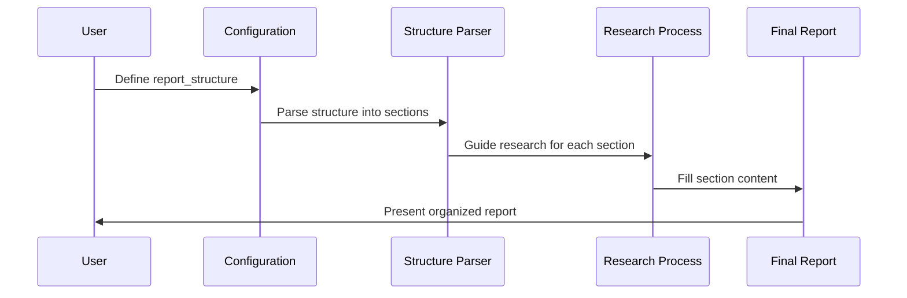
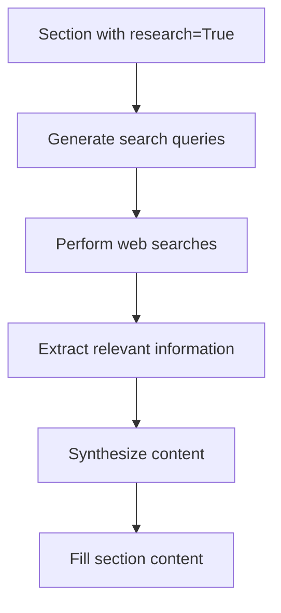
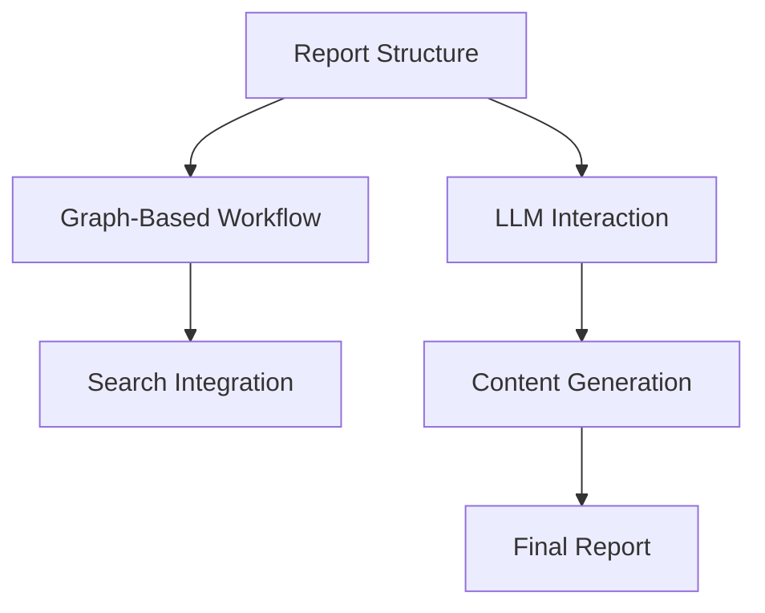

# Chapter 2: Report Structure

In [Chapter 1: Configuration Management](01_configuration_management_.md), we learned how to set up the control panel for our research assistant. Now, let's explore how to design the blueprint for our research reports.

## Building a Blueprint for Knowledge

Imagine you're building a house. Before construction begins, you need architectural plans that specify where each room goes, their sizes, and their purposes. Similarly, when creating a research report, you need a blueprint that outlines the sections, their purposes, and how they fit together.

This is exactly what Report Structure provides in `open_deep_research` – a way to define the organization of your research reports before any research begins.

## A Real-World Example

Let's say you're researching "Renewable Energy Sources." Without a clear structure, your research might become disorganized, with random facts about solar, wind, and hydroelectric power scattered throughout. 

With a well-defined report structure, you might organize it like this:

1. Introduction (overview of renewable energy)
2. Solar Power (technology, adoption, costs)
3. Wind Energy (current implementations, efficiency)
4. Hydroelectric Power (environmental impact, future potential)
5. Conclusion (comparison and future outlook)

This structure guides both the research process and the final report, ensuring a logical flow of information.

## Understanding Section Properties

In `open_deep_research`, a report structure consists of sections, and each section has three key properties:

```python
section = Section(
    name="Solar Power",
    description="Overview of solar technology, adoption rates, and costs",
    research=True
)
```

Let's break down these properties:

- **name**: The title of the section (like "Solar Power")
- **description**: Guidelines for what to cover in this section
- **research**: A flag indicating whether this section needs web research

Some sections (like introductions) might not need research because they're general overviews, so you'd set `research=False` for those.

## Creating a Basic Report Structure

Here's how you might define a simple report structure:

```python
from open_deep_research.state import Section, Sections

# Define individual sections
intro = Section(
    name="Introduction",
    description="Overview of renewable energy",
    research=False,
    content=""  # Empty initially
)
```

We create a section with a name, description, and research flag. The content starts empty and will be filled during the research process.

Let's add more sections to complete our structure:

```python
# More sections for our report
solar = Section(
    name="Solar Power",
    description="Current technology and adoption",
    research=True,
    content=""
)

conclusion = Section(
    name="Conclusion",
    description="Summary of findings",
    research=False,
    content=""
)
```

Finally, we combine these into a complete report structure:

```python
# Combine into a complete structure
report_structure = Sections(
    sections=[intro, solar, conclusion]
)
```

This creates a collection of sections that forms our complete report blueprint.

## Customizing the Default Structure

The system comes with a default report structure, but you can easily customize it:

```python
from open_deep_research.configuration import Configuration

# Create custom structure
custom_structure = """
1. Executive Summary
2. Methodology
3. Findings
4. Recommendations
"""

# Apply custom structure in configuration
config = Configuration(report_structure=custom_structure)
```

This overrides the default structure with your custom one, letting you tailor reports to your specific needs.

## How Report Structure Works Behind the Scenes

To understand how report structures work internally, let's visualize the process:



When you define a report structure:

1. The system parses your structure definition
2. For each section marked with `research=True`, it conducts targeted research
3. It fills in the content for each section
4. It assembles the sections into a coherent final report

## The Section Class Implementation

Let's look at how sections are implemented in the code:

```python
# From src/open_deep_research/state.py
class Section(BaseModel):
    name: str = Field(
        description="Name for this section of the report.",
    )
    description: str = Field(
        description="Brief overview of the main topics and concepts to be covered.",
    )
    research: bool = Field(
        description="Whether to perform web research for this section."
    )
    content: str = Field(
        description="The content of the section."
    )   
```

This Pydantic model defines the structure of a section. The Field descriptions help the AI understand the purpose of each property.

The sections are then collected in a Sections model:

```python
class Sections(BaseModel):
    sections: List[Section] = Field(
        description="Sections of the report.",
    )
```

## How Sections Guide the Research Process

The report structure doesn't just organize the final output – it actively guides the research process. When the system encounters a section with `research=True`, it follows these steps:



For example, when researching the "Solar Power" section, the system might:

1. Generate queries like "latest solar panel efficiency rates" or "solar power adoption statistics"
2. Search for information using the configured search engine
3. Extract relevant facts and data
4. Synthesize a coherent section about solar power
5. Place this content in the proper section of the report

## Advanced Usage: Section States

Behind the scenes, the system tracks the state of each section during research:

```python
# Simplified from src/open_deep_research/state.py
class SectionState(TypedDict):
    topic: str # Report topic
    section: Section # Report section  
    search_iterations: int # Number of search iterations done
    search_queries: list[SearchQuery] # List of search queries
    source_str: str # String of formatted source content
    # Other fields...
```

This state tracking ensures that the system knows:
- Which sections still need research
- How many search iterations have been done for each section
- What information has already been gathered

## Real-World Applications

Report structures are flexible enough to handle many different research needs:

For academic research:
```python
academic_structure = """
1. Abstract
2. Literature Review
3. Methodology
4. Results
5. Discussion
6. Conclusion
"""
```

For market analysis:
```python
market_structure = """
1. Executive Summary
2. Market Overview
3. Competitor Analysis
4. SWOT Analysis
5. Recommendations
"""
```

For technical documentation:
```python
technical_structure = """
1. Introduction
2. System Architecture
3. Installation Guide
4. API Reference
5. Troubleshooting
"""
```

## Connecting Report Structure to the Research Workflow

Report structure works closely with the [Graph-Based Workflow](05_graph_based_workflow_.md) to ensure each section gets properly researched. It also interacts with the [LLM Interaction](06_llm_interaction_.md) system to generate appropriate content for each section.



## Conclusion

Report Structure acts as the architectural blueprint for your research projects in `open_deep_research`. By defining clear sections with specific purposes, you ensure your research is well-organized, comprehensive, and logically structured.

In the next chapter, [Human Feedback Loop](03_human_feedback_loop_.md), we'll explore how you can provide guidance and feedback during the research process to further refine and improve your reports.

---

Generated by [AI Codebase Knowledge Builder](https://github.com/The-Pocket/Tutorial-Codebase-Knowledge)