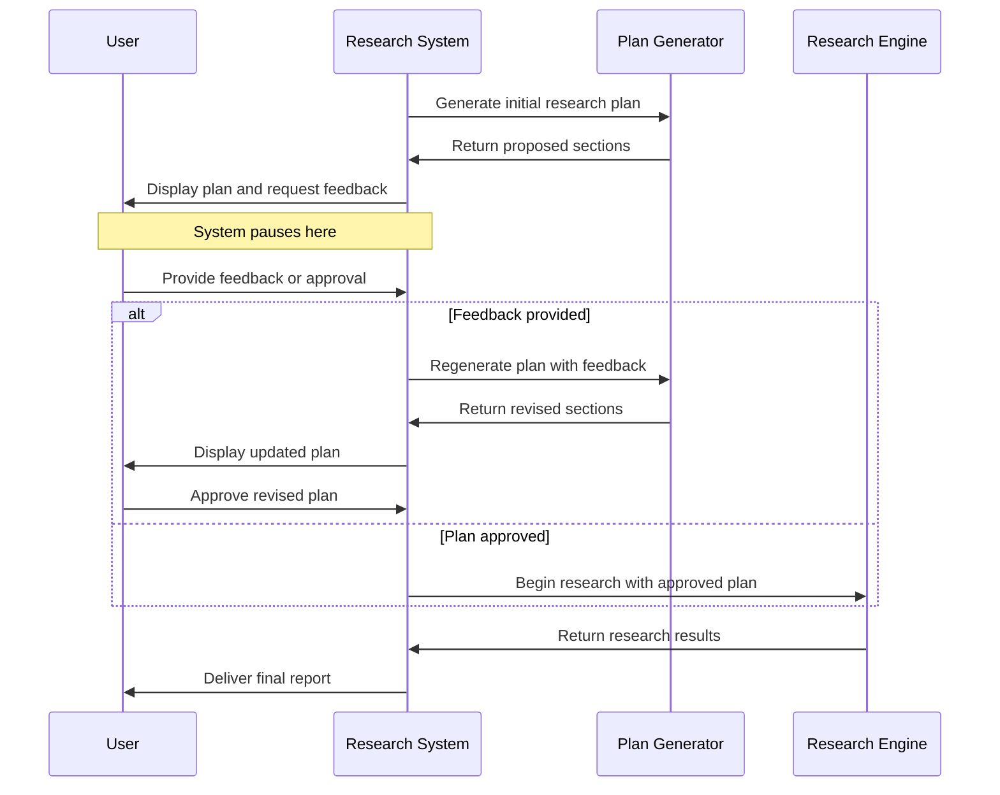

# Chapter 3: Human Feedback Loop

In [Chapter 2: Report Structure](02_report_structure_.md), we learned how to create the blueprint for our research reports. Now, let's explore a critical feature that gives you control over the research process: the Human Feedback Loop.

## When Automation Needs Human Guidance

Imagine you're using a GPS navigation system. You input your destination, and the GPS calculates a route. But instead of immediately proceeding, it shows you the planned route and asks, "Does this look good to you?" giving you a chance to approve or suggest changes before you start driving.

This is exactly what the Human Feedback Loop does in `open_deep_research` - it pauses the automated research workflow at strategic points to get your input, ensuring the system stays aligned with your intentions.

## The Research GPS: A Real-World Example

Let's say you're researching "The impact of quantum computing on cybersecurity." Without a feedback loop, the AI might misunderstand your focus and produce a report heavily focused on quantum physics rather than security implications.

With the Human Feedback Loop, the system will:

1. Analyze your research topic
2. Generate a proposed research plan with sections
3. **Pause** to show you this plan
4. Wait for your approval or revision suggestions
5. Adjust based on your feedback before proceeding

This ensures the research stays on track with what you actually want, not what the AI thought you wanted.

## How the Human Feedback Loop Works

At its core, the feedback loop consists of three key components:

### 1. Interruption Points

These are strategic pauses in the workflow where the system stops and waits for human input. The most critical interruption happens after the initial research plan is generated, but before any actual research begins.

### 2. Feedback Collection

The system presents its current state (like the proposed report structure) and provides options for you to:
- Approve the plan as-is
- Provide specific feedback for improvements
- Request modifications to the focus or scope

### 3. Adaptive Response

Based on your feedback, the system will either:
- Proceed with the approved plan
- Regenerate a new plan incorporating your feedback
- Adjust specific aspects you highlighted

## Using the Human Feedback Loop

Let's see how this works in practice. The feedback loop appears naturally in your research workflow:

```python
# Start the research process with your topic
async for event in graph.astream({"topic": "Quantum computing in cybersecurity"}, 
                                 thread, 
                                 stream_mode="updates"):
    # When an interruption occurs
    if '__interrupt__' in event:
        # Display the message requesting feedback
        feedback_request = event['__interrupt__'][0].value
        display(Markdown(feedback_request))
```

This code starts the research process and automatically detects when the system needs your input. When that happens, it displays the current research plan and waits for your feedback.

### Providing Your Feedback

Once you see the plan, you can respond in two ways:

```python
# Option 1: Approve the plan as-is
async for event in graph.astream(Command(resume=True), thread, 
                               stream_mode="updates"):
    # Continue with research process
```

This tells the system "looks good, proceed as planned."

Alternatively, you can provide specific guidance:

```python
# Option 2: Provide specific feedback
async for event in graph.astream(
    Command(resume="Focus more on post-quantum cryptography and less on hardware"),
    thread, 
    stream_mode="updates"):
    # System will regenerate plan with your guidance
```

This tells the system to adjust its approach based on your specific instructions.

## Under the Hood: How Feedback is Processed

To understand how the feedback loop works internally, let's visualize the process:



This diagram shows how the system pauses after generating the initial plan, waits for your input, and then either revises the plan or proceeds with research based on your feedback.

### The Implementation Details

The human feedback mechanism is implemented in the `human_feedback` function within the system's workflow graph:

```python
def human_feedback(state: ReportState, config: RunnableConfig):
    # Get the current sections from the state
    topic = state["topic"]
    sections = state['sections']
    
    # Format sections for human readability
    sections_str = "\n\n".join(
        f"Section: {section.name}\n"
        f"Description: {section.description}\n"
        f"Research needed: {'Yes' if section.research else 'No'}"
        for section in sections
    )
    
    # Create the interrupt message requesting feedback
    interrupt_message = f"""Please review this research plan:
                        \n\n{sections_str}\n
                        \nPass 'true' to approve or provide feedback:"""
    
    # Pause workflow and wait for human input
    feedback = interrupt(interrupt_message)
    
    # Process the feedback and determine next steps
    # (simplified implementation)
```

When this function runs, it:
1. Takes the current research plan from the system state
2. Formats it in a human-readable way
3. Creates a message asking for your feedback
4. Pauses the workflow with the `interrupt()` call
5. Waits for your response before proceeding

### Handling Different Types of Feedback

The system is designed to handle different types of feedback:

```python
# If user approves (responds with True)
if isinstance(feedback, bool) and feedback is True:
    # Proceed with research using approved sections
    return Command(goto="build_section_with_web_research", 
                   payload={"topic": topic, "sections": sections})

# If user provides text feedback
elif isinstance(feedback, str):
    # Return to planning stage with feedback
    return Command(goto="generate_report_plan", 
                  update={"feedback_on_report_plan": feedback})
```

This code routes the workflow differently based on whether you approved the plan or provided specific feedback for improvements.

## Connecting with Other Components

The Human Feedback Loop works closely with several other components in the system:

- It receives proposed structures from the [Report Structure](02_report_structure_.md) component
- It influences how the [Graph-Based Workflow](05_graph_based_workflow_.md) progresses
- It directly impacts how the [LLM Interaction](06_llm_interaction_.md) system generates content

The feedback you provide isn't just a simple approval mechanism - it actually modifies the state of the entire research system, guiding how all other components operate.

## Real-World Applications

The Human Feedback Loop is especially valuable in several scenarios:

1. **Exploratory Research**: When you're not entirely sure what subtopics matter most, you can refine the focus after seeing the AI's initial understanding
   
2. **Expert-Guided Research**: Subject matter experts can correct misunderstandings or redirect focus to more relevant areas

3. **Iterative Projects**: When building upon previous research, you can ensure the system incorporates prior knowledge appropriately

## Conclusion

The Human Feedback Loop acts as a safety valve and guidance system for your research projects. By pausing the automated workflow at critical points, it ensures the research stays aligned with your intentions and helps avoid the common problem of AI systems "running away" with misunderstood objectives.

This human-in-the-loop design acknowledges that while AI can do the heavy lifting of research, humans still provide the crucial judgment, expertise, and intentionality that makes research truly valuable.

In the next chapter, [Multi-Agent Architecture](04_multi_agent_architecture_.md), we'll explore how different specialized AI agents work together to handle various aspects of the research process.

---

Generated by [AI Codebase Knowledge Builder](https://github.com/The-Pocket/Tutorial-Codebase-Knowledge)