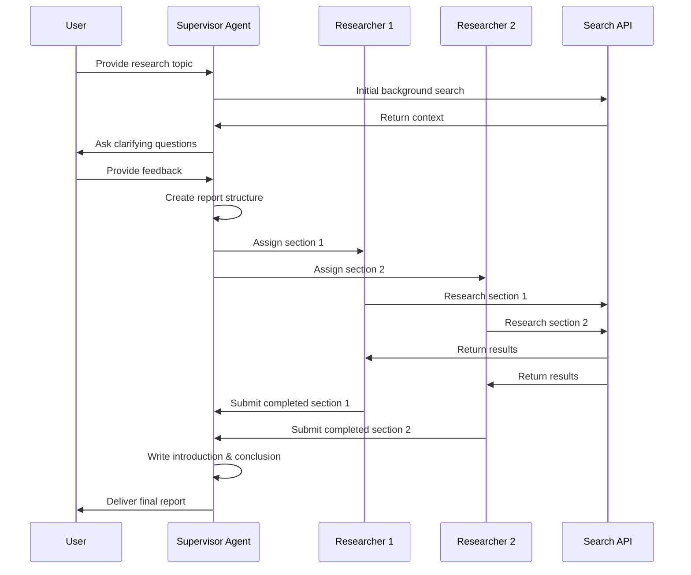

# Chapter 4: Multi-Agent Architecture

In [Chapter 3: Human Feedback Loop](03_human_feedback_loop_.md), we learned how to incorporate human guidance into our research process. Now, let's explore how multiple AI agents can work together as a team to produce high-quality research reports.

## Introduction: The Research Firm Model

Have you ever seen how a professional research company operates? Different specialists work together - some plan projects, others gather information, and others write specific sections. This division of labor allows for more effective research than a single person trying to do everything.

This is exactly what the Multi-Agent Architecture in `open_deep_research` does. Instead of using a single AI to handle the entire research process, it employs a team of specialized AI agents that work together like colleagues in a research firm.

## Why Use Multiple Agents?

Imagine you're researching "Renewable Energy Technologies" - a complex topic with many facets. Trying to handle all aspects at once can be overwhelming. Instead of having one assistant do everything, wouldn't it be better to have:

- A **supervisor** who plans the overall structure
- **Researchers** who each focus on specific subtopics like solar, wind, or hydroelectric power

This approach offers several advantages:
- Each agent can specialize in a particular task
- The work can be distributed more efficiently
- The final result benefits from multiple perspectives

## Meet Your Research Team

In the Multi-Agent Architecture, your research team consists of two types of agents:

### 1. The Supervisor Agent

Think of the supervisor as your project manager or editor-in-chief who:
- Analyzes the research topic to understand what's needed
- Plans the overall report structure
- Assigns specific sections to researcher agents
- Assembles the final report with an introduction and conclusion

### 2. The Researcher Agents

These are like your specialized analysts who:
- Focus on a single section of the report
- Conduct targeted searches for their specific topic
- Write comprehensive content for their assigned section
- Include proper citations and sources

## Using the Multi-Agent Architecture

Let's see how to use this architecture in practice. The setup is surprisingly simple:

```python
from open_deep_research.multi_agent import graph

# Start the research with your topic
async for event in graph.astream({"topic": "Renewable Energy Technologies"}, thread):
    # Process events from the agent team
    print(event)
```

This code initiates the research process with your chosen topic. Behind the scenes, the supervisor agent will analyze the topic, create a plan, and coordinate with researcher agents.

### Configuring Your Research Team

You can customize how your team works by setting configuration parameters:

```python
# Configure your research team
thread = {"configurable": {
    "supervisor_model": "claude-3-sonnet",
    "researcher_model": "gpt-4",
    "search_api": "tavily"
}}
```

This tells the system which AI models to use for different agents and which search API to use for gathering information.

## Behind the Scenes: How Agents Collaborate

To understand how these agents work together, let's visualize the process:



This diagram shows how information flows between the user, the supervisor, and the researcher agents.

## The Implementation Details

Let's look at the key components that make this architecture work:

### 1. State Management

Each agent maintains its own state:

```python
class ReportState(MessagesState):
    sections: list[str]                # List of report sections 
    completed_sections: list           # Sections that are finished
    final_report: str                  # The assembled report
```

This state keeps track of which sections have been assigned, which are completed, and the final report content.

### 2. Agent Tools

Each agent has access to specific tools:

```python
# Supervisor tools
def get_supervisor_tools(config):
    search_tool = get_search_tool(config)
    return [search_tool, Sections, Introduction, Conclusion]

# Researcher tools
def get_research_tools(config):
    search_tool = get_search_tool(config)
    return [search_tool, Section]
```

The supervisor can create sections, introductions, and conclusions, while researchers can search for information and write section content.

### 3. The Workflow Graph

The system uses a graph-based workflow (which we'll learn more about in [Graph-Based Workflow](05_graph_based_workflow_.md)) to connect everything:

```python
# Simplified workflow creation
supervisor_builder = StateGraph(ReportState)
supervisor_builder.add_node("supervisor", supervisor)
supervisor_builder.add_node("research_team", research_builder.compile())

# Connect the nodes
supervisor_builder.add_edge(START, "supervisor")
supervisor_builder.add_edge("research_team", "supervisor")
```

This creates a workflow where the supervisor can delegate tasks to the research team and receive their results.

## How the Agents Make Decisions

Each agent has specific instructions that guide their behavior:

### Supervisor Instructions (Simplified)

The supervisor follows a structured process:
1. Gather background information about the topic
2. Clarify with the user if needed
3. Define the report structure
4. Assign sections to researchers
5. Assemble the final report with introduction and conclusion

### Researcher Instructions (Simplified)

Each researcher follows these steps:
1. Understand their assigned section scope
2. Conduct targeted searches for relevant information
3. Analyze search results and identify gaps
4. Perform follow-up searches if needed
5. Write a comprehensive section with citations

## Integrating with Other Components

The Multi-Agent Architecture works closely with other components in the system:

- It relies on [Configuration Management](01_configuration_management_.md) to set up the agents
- It produces reports following the [Report Structure](02_report_structure_.md) framework
- It can incorporate [Human Feedback Loop](03_human_feedback_loop_.md) for guidance
- It uses the [Graph-Based Workflow](05_graph_based_workflow_.md) for process flow
- It leverages [LLM Interaction](06_llm_interaction_.md) for agent decision-making
- It depends on [Search Integration](08_search_integration_.md) for information gathering

## Real-World Example: Researching Cloud Computing

Let's see a complete example of how this works for a research topic:

1. **User provides topic**: "Cloud Computing Security Challenges"

2. **Supervisor analyzes topic**:
   - Searches for background information
   - Asks user to clarify scope: "Are you interested in challenges for specific industries or general challenges?"
   - User responds: "Focus on healthcare industry specifically"

3. **Supervisor creates structure**:
   - Section 1: "Healthcare Data Compliance in the Cloud"
   - Section 2: "Patient Data Breach Prevention"
   - Section 3: "Secure Cloud Implementation Strategies"

4. **Researchers investigate**:
   - Researcher 1 focuses on healthcare compliance regulations
   - Researcher 2 researches data breach incidents and prevention
   - Researcher 3 studies implementation best practices

5. **Supervisor assembles report**:
   - Writes introduction on importance of cloud security in healthcare
   - Compiles the three research sections
   - Adds conclusion with key recommendations

## Conclusion

The Multi-Agent Architecture provides a powerful team-based approach to research. By dividing complex tasks among specialized agents, it produces more comprehensive and well-organized reports than a single agent could achieve.

This approach mimics how human research teams collaborate, with each member contributing their expertise to create a cohesive final product. The supervisor ensures overall direction and quality, while the researchers dive deep into specific areas.

In the next chapter, [Graph-Based Workflow](05_graph_based_workflow_.md), we'll explore how these agent interactions are orchestrated through a flexible graph structure that enables complex research workflows.

---

Generated by [AI Codebase Knowledge Builder](https://github.com/The-Pocket/Tutorial-Codebase-Knowledge)