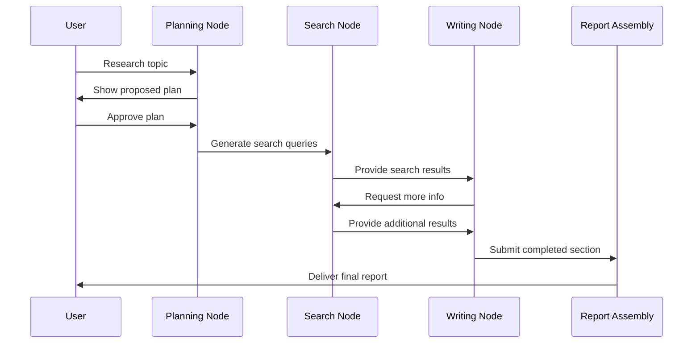

# Chapter 5: Graph-Based Workflow

In [Chapter 4: Multi-Agent Architecture](04_multi_agent_architecture_.md), we learned about how multiple specialized AI agents can collaborate on research tasks. Now, let's explore the system that coordinates these agents and guides them through the research process: the Graph-Based Workflow.

## Introduction: The Railway System for Research

Imagine you're planning a train journey across a country. You need to determine which stations to visit, in what order, and how to get from one to another. Your data (you and your luggage) moves along predefined tracks between stations, each serving a different purpose - one might be a marketplace, another a museum, and another a restaurant.

This is exactly how the Graph-Based Workflow in `open_deep_research` functions. It's like a railway network where:
- **Stations** (nodes) represent specific tasks like planning, searching, or writing
- **Railway tracks** (edges) connect these stations, defining possible paths
- **Trains** (data) carry information from one station to the next
- **Signaling systems** (conditional logic) direct trains to different tracks based on their cargo

This railway system ensures that your research journey gets from the starting point (a research question) to the destination (a complete report) by visiting all the necessary stations in the right order.

## A Day in the Life of a Research Query

Let's follow a concrete example. Imagine you want to research "Renewable Energy Technologies" - here's how the workflow would guide this process:

1. You submit your topic to the system
2. The "planning" node analyzes your topic and creates a report outline
3. The workflow pauses and shows you the plan for approval
4. You provide feedback or approve the plan
5. Based on your approval, the system creates search queries
6. The "search" node gathers information from the web
7. The "write" node creates content for each section
8. If a section needs more information, it loops back to search again
9. Once all sections are complete, they're assembled into a final report

This entire journey is coordinated by the Graph-Based Workflow, ensuring each step happens at the right time and in the right order.

## Key Components of the Graph

Let's break down the essential parts of our research railway system:

### 1. Nodes: Specialized Stations

Nodes are like specialized stations where specific work happens. Each has a particular purpose:

```python
# Define a planning node
builder.add_node("generate_report_plan", generate_report_plan)
# Define a writing node
builder.add_node("write_section", write_section)
```

This code defines two stations in our railway: one for planning and one for writing. Each node is connected to a Python function that performs the actual work.

### 2. Edges: The Connecting Tracks

Edges connect nodes and define possible pathways through the workflow:

```python
# Connect start to the planning node
builder.add_edge(START, "generate_report_plan")
# Connect planning to feedback
builder.add_edge("generate_report_plan", "human_feedback")
```

This creates two railway tracks: one from the starting point to the planning station, and another from planning to a feedback checkpoint. The data (train) can only follow these predefined routes.

### 3. State: The Cargo

State is the information carried through the workflow - like cargo on a train:

```python
# Example of state being passed between nodes
return {"sections": sections, "topic": topic}
```

This code shows how data (like report sections) is packaged and sent to the next node. Each node can add new information or modify existing data.

### 4. Conditional Routing: The Railway Switches

Sometimes the path depends on certain conditions - like railway switches that direct trains to different tracks:

```python
# Route based on whether feedback was approval or comments
if isinstance(feedback, bool) and feedback is True:
    return Command(goto="build_section_with_web_research")
else:
    return Command(goto="generate_report_plan")
```

This code is like a railway switchman deciding which track to use: if feedback is approval, go to writing; otherwise, go back to planning.

## Using the Graph-Based Workflow

Let's see how to use this workflow in practice:

### Setting Up the Research Journey

First, we compile the workflow graph that defines our research railway system:

```python
from open_deep_research.graph import builder
# Compile the graph 
graph = builder.compile()
```

This prepares our railway network, defining all stations and tracks.

### Starting the Research Process

To kick off a research journey, we provide a topic and configuration:

```python
# Start researching with our topic
async for event in graph.astream(
    {"topic": "Renewable Energy Technologies"}, 
    thread_config
):
    print(event)
```

This code starts a train journey through our research railway with "Renewable Energy Technologies" as the destination. The system will guide the process through all the necessary stations.

### Handling Human Feedback Points

At certain stations, the system pauses to get your input:

```python
# When the system needs feedback
if '__interrupt__' in event:
    feedback_request = event['__interrupt__'][0].value
    display(Markdown(feedback_request))
    
    # Provide approval and continue
    await graph.astream(Command(resume=True), thread_config)
```

This code shows how the system pauses at a checkpoint, displays a message asking for your feedback, and then continues when you provide approval.

## Behind the Scenes: How It All Works

To understand how information flows through the workflow, let's visualize a simple research journey:



This diagram shows how information flows between nodes during a research process. Each node performs its specialized task before passing the information along.

### The StateGraph Implementation

At its core, the graph is implemented using a StateGraph from LangGraph:

```python
# Outer graph for the complete workflow
builder = StateGraph(ReportState)
builder.add_node("generate_report_plan", generate_report_plan)
builder.add_node("human_feedback", human_feedback)
# Add more nodes...
```

This code creates the main framework of our railway system, defining what types of stations (nodes) exist.

### Subgraphs for Complex Processes

For more complex processes, the system uses subgraphs - like specialized railway networks for specific purposes:

```python
# Create a subgraph for section research
section_builder = StateGraph(SectionState)
section_builder.add_node("generate_queries", generate_queries)
section_builder.add_node("search_web", search_web)
# Add the compiled subgraph to the main graph
builder.add_node("build_section", section_builder.compile())
```

This creates a specialized mini-network for researching a section, then adds it to the main railway as a single complex station.

### Node Implementation: The generate_report_plan Example

Let's look at how a single node works internally:

```python
async def generate_report_plan(state, config):
    # Get input from state
    topic = state["topic"]
    
    # Generate search queries for planning
    queries = await generate_planning_queries(topic)
    
    # Search the web for context
    results = await search_web(queries)
    
    # Create a structured report plan
    plan = await create_sections(topic, results)
    
    # Return the updated state
    return {"sections": plan}
```

This simplified code shows what happens inside the planning station:
1. It reads the topic from incoming data
2. Generates search queries about that topic
3. Searches the web using those queries
4. Creates a structured plan based on search results
5. Packages the plan and sends it to the next station

## Integrating with Other Components

The Graph-Based Workflow connects with several other key components:

- It uses [Configuration Management](01_configuration_management_.md) to set up nodes with the right parameters
- It creates a report following the [Report Structure](02_report_structure_.md) format
- It incorporates the [Human Feedback Loop](03_human_feedback_loop_.md) at critical decision points
- It coordinates the [Multi-Agent Architecture](04_multi_agent_architecture_.md) agents
- It communicates with models through [LLM Interaction](06_llm_interaction_.md)
- It retrieves information via [Search Integration](08_search_integration_.md)

## Key Benefits of Graph-Based Workflow

Using a graph-based approach provides several advantages:

1. **Modularity**: Each node can be developed and tested independently
2. **Flexibility**: The workflow can be easily modified by adding or reconnecting nodes
3. **Visibility**: The entire research process is clearly defined and can be visualized
4. **Debugging**: It's easy to see where things went wrong when issues occur
5. **Control**: Users can intervene at specific points without disrupting the overall flow

## Conclusion

The Graph-Based Workflow is the orchestration system that guides the entire research process. Like a railway network connecting different cities, it connects specialized tasks into a coherent journey from initial question to final report. This approach ensures that research follows a logical, orderly process where each step builds on the previous ones.

By breaking the complex research process into discrete steps and defining clear pathways between them, the system can handle sophisticated research tasks while remaining flexible enough to incorporate human feedback and adapt to different research needs.

In the next chapter, [LLM Interaction](06_llm_interaction_.md), we'll explore how the system communicates with large language models to generate content and make decisions throughout the research process.

---

Generated by [AI Codebase Knowledge Builder](https://github.com/The-Pocket/Tutorial-Codebase-Knowledge)