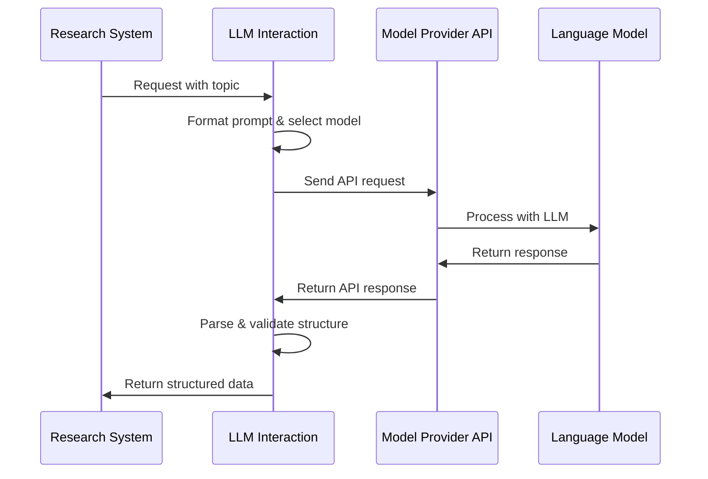

# Chapter 6: LLM Interaction

In [Chapter 5: Graph-Based Workflow](05_graph_based_workflow_.md), we explored how our research system coordinates different tasks through a flexible graph structure. Now, let's dive into how our system actually communicates with AI models - the component that acts as the "translator" between our system and the AI brains that power it.

## The Universal Translator for AI Models

Imagine you're organizing an international conference. You have experts who speak different languages - French, Japanese, German, and Spanish. You need a team of translators who can:
1. Understand what you need to ask each expert
2. Translate your questions into the right language for each expert
3. Collect their responses and translate them back for you
4. Handle any special terminology or cultural nuances

This is exactly what the LLM Interaction component in `open_deep_research` does! It's a universal translator between your research system and various AI models (like Claude, GPT, etc.). Each model "speaks" in slightly different ways, and the LLM Interaction component handles these differences so you don't have to.

## Why We Need an LLM Interaction Layer

Let's consider a real research scenario. You want to generate search queries about renewable energy. Without an LLM Interaction layer, you'd need to:

1. Know how to format prompts specifically for each AI model
2. Handle different API authentication methods
3. Process various response formats
4. Deal with different error messages and retry logic
5. Manage tokens, context lengths, and model-specific limitations

The LLM Interaction layer abstracts away all these complexities, providing a consistent way to communicate with any language model.

## The Key Components of LLM Interaction

The LLM Interaction layer consists of several important components:

### 1. Model Selection and Initialization

This component helps you choose and set up the right model for the task:

```python
from langchain.chat_models import init_chat_model

# Initialize a model for planning
planner_model = init_chat_model(
    model="claude-3-7-sonnet-latest",
    model_provider="anthropic"
)
```

This code selects Claude from Anthropic as the planning model. The `init_chat_model` function handles all the details of setting up the right API connections.

### 2. Prompt Formatting

Different models expect prompts in different formats. The LLM Interaction layer handles this:

```python
from langchain_core.messages import SystemMessage, HumanMessage

# Create properly formatted messages
messages = [
    SystemMessage(content="You are a helpful research assistant."),
    HumanMessage(content="Explain quantum computing.")
]
```

This creates properly formatted messages that will work with the model you've selected. Some models use system messages differently than others, but you don't need to worry about those details.

### 3. Structured Output Processing

To get consistent, structured data from different models:

```python
# Define the expected output structure
from pydantic import BaseModel
class SearchQueries(BaseModel):
    queries: list[str]

# Set up model to return structured output
structured_model = model.with_structured_output(SearchQueries)
```

This tells the model to return data in a specific format that your system can reliably process, regardless of which model you're using.

### 4. Model Invocation and Response Handling

Finally, this component actually sends your prompt to the model and processes the response:

```python
# Get a response from the model
response = await structured_model.ainvoke(messages)

# Now we can access structured data
for query in response.queries:
    print(query)
```

The LLM Interaction layer handles sending the request, waiting for a response, dealing with any errors or retries, and parsing the response into the structured format you specified.

## A Real Research Example

Let's see how all these components work together in a real research task - generating search queries for a topic:

```python
async def generate_queries(state, config):
    # Get topic and section from state
    topic = state["topic"]
    section = state["section"]
    
    # Get configuration for the writer model
    configurable = Configuration.from_runnable_config(config)
    writer_provider = get_config_value(configurable.writer_provider)
    writer_model_name = get_config_value(configurable.writer_model)
```

First, we get the research topic and model configuration. This determines which AI model we'll use.

```python
    # Initialize the model
    writer_model = init_chat_model(
        model=writer_model_name, 
        model_provider=writer_provider
    )
    
    # Set up for structured output
    structured_llm = writer_model.with_structured_output(Queries)
```

Next, we initialize the model and tell it we want structured output in the form of `Queries`.

```python
    # Create instructions for the model
    system_instructions = query_writer_instructions.format(
        topic=topic,
        section_topic=section.description,
        number_of_queries=configurable.number_of_queries
    )
    
    # Generate queries using the model
    queries = await structured_llm.ainvoke([
        SystemMessage(content=system_instructions),
        HumanMessage(content="Generate search queries on the provided topic.")
    ])
```

We format instructions for the model, send them, and get back structured search queries. The LLM Interaction layer handles all the complexities behind the scenes.

## Behind the Scenes: How LLM Interaction Works

To understand how the LLM Interaction layer works internally, let's trace the journey of a request:



This diagram shows how a request flows from your application through the LLM Interaction layer to the model provider's API and back.

## The Implementation Details

Let's look at some key functions that power the LLM Interaction layer:

### Model Initialization

The `init_chat_model` function handles setting up different model providers:

```python
# Simplified version of init_chat_model
def init_chat_model(model, model_provider, **kwargs):
    if model_provider == "anthropic":
        # Set up Claude models
        from langchain_anthropic import ChatAnthropic
        return ChatAnthropic(model=model, **kwargs)
    elif model_provider == "openai":
        # Set up OpenAI models
        from langchain_openai import ChatOpenAI
        return ChatOpenAI(model=model, **kwargs)
    # Additional providers...
```

This function creates the right type of model client based on the provider, handling authentication and other setup steps automatically.

### Structured Output Processing

Here's how structured output works:

```python
# Example Pydantic model for structured output
class SearchQuery(BaseModel):
    search_query: str = Field(
        description="A specific search query to find information."
    )

class Queries(BaseModel):
    queries: List[SearchQuery] = Field(
        description="List of search queries to execute."
    )
```

These Pydantic models define the expected structure of the model's output. The `with_structured_output` method configures the model to return data in this format.

### Special Model Features

Some models have special features, like Claude's "thinking" capability:

```python
# Using Claude's thinking feature
if planner_model == "claude-3-7-sonnet-latest":
    # Set up model with thinking budget
    planner_llm = init_chat_model(
        model=planner_model, 
        model_provider=planner_provider,
        thinking={"type": "enabled", "budget_tokens": 16_000}
    )
```

The LLM Interaction layer makes these special features easily accessible while providing fallbacks for models that don't support them.

## How LLM Interaction Connects with Other Components

The LLM Interaction layer works closely with several other parts of the system:

- It uses [Configuration Management](01_configuration_management_.md) to know which models to use for different tasks
- It helps the [Multi-Agent Architecture](04_multi_agent_architecture_.md) by enabling different agents to use different models
- It provides the intelligence for nodes in the [Graph-Based Workflow](05_graph_based_workflow_.md)
- It implements the techniques defined in [Prompt Engineering](07_prompt_engineering_.md)
- It produces results that flow into [State Management](09_state_management_.md)

## Common Challenges and Solutions

### Challenge 1: Different Model Capabilities

Not all models have the same abilities. For example, some handle structured output better than others. The LLM Interaction layer provides fallbacks and alternatives:

```python
# Check if model supports native structured output
if hasattr(model, "with_structured_output"):
    return model.with_structured_output(output_schema)
else:
    # Use a parser for models without native support
    return model.with_output_parser(PydanticOutputParser(output_schema))
```

### Challenge 2: Error Handling

Models can sometimes fail or return unexpected results:

```python
# Simple retry logic
for attempt in range(max_retries):
    try:
        response = await model.ainvoke(messages)
        return response
    except Exception as e:
        if attempt < max_retries - 1:
            await asyncio.sleep(backoff_seconds)
        else:
            raise e
```

The LLM Interaction layer includes retry logic and error handling to make interactions more reliable.

## Conclusion

The LLM Interaction layer acts as a universal translator between your research system and various AI models. It handles the complexities of different model providers, prompt formats, and response structures so you can focus on your research tasks rather than API details.

By providing a consistent interface to any language model, it allows the rest of the system to work with models interchangeably, making it easy to try different models or use specialized models for different tasks.

In the next chapter, [Prompt Engineering](07_prompt_engineering_.md), we'll explore how to craft effective instructions for language models to get the best results for our research tasks.

---

Generated by [AI Codebase Knowledge Builder](https://github.com/The-Pocket/Tutorial-Codebase-Knowledge)