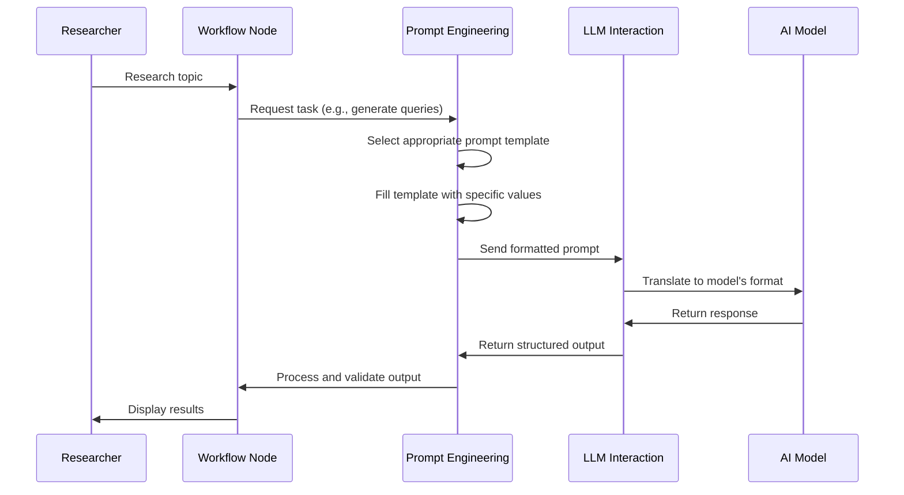

# Chapter 7: Prompt Engineering

In [Chapter 6: LLM Interaction](06_llm_interaction_.md), we explored how our system communicates with AI models. Now, let's learn about the art of crafting effective instructions for these models - a practice called Prompt Engineering.

## Introduction: The Chef's Recipe for AI

Imagine you're teaching someone how to cook a dish over the phone. If your instructions are vague ("make something tasty with chicken"), you'll get unpredictable results. But if you provide a detailed recipe with specific ingredients, measurements, and cooking steps, you're much more likely to get the dish you wanted.

Prompt engineering works the same way! It's about crafting clear, specific instructions that guide AI models to produce exactly the output you need. Like a well-written recipe, a well-engineered prompt ensures consistent, high-quality results no matter who (or which AI model) follows it.

## A Real-World Example

Let's say you need to research "Climate Change Mitigation Strategies." You need to generate effective search queries to find information. Without good prompt engineering, you might simply ask:

> "Give me search queries about climate change mitigation"

This vague prompt could result in generic, unfocused queries that don't yield useful research.

With effective prompt engineering, you'd instead create a detailed prompt like:

> "Generate 3 specific search queries about climate change mitigation strategies. Focus on technological solutions, policy approaches, and economic incentives. Each query should be specific enough to find high-quality scientific or policy sources published in the last 5 years."

See the difference? The second prompt provides clear guidance on the number of queries, specific aspects to focus on, and criteria for the sources you want to find.

## Key Elements of Effective Prompts

Let's break down the essential components that make a prompt effective:

### 1. Clear Role Definition

Start by telling the AI what role it should adopt:

```python
system_message = SystemMessage(
    content="You are an expert research query generator specializing in climate science."
)
```

This sets the context for how the AI should approach the task - as an expert in a specific domain.

### 2. Specific Task Instructions

Clearly state what you want the AI to do:

```python
task_instructions = """
<Task>
Generate {number_of_queries} search queries about {topic} 
that will help gather comprehensive information.
</Task>
"""
```

This template specifies both the task (generating queries) and important parameters (how many and about what topic).

### 3. Context and Background Information

Provide relevant information the AI needs to understand:

```python
context = f"""
<Report topic>
{topic}
</Report topic>

<Section topic>
{section_topic}
</Section topic>
"""
```

This gives the AI the specific context it needs to generate relevant queries for your research.

### 4. Output Format Specification

Define exactly how you want the response structured:

```python
format_instructions = """
<Format>
Call the Queries tool 
</Format>
"""
```

This tells the AI to use a specific tool to format its response, ensuring you get structured data you can work with programmatically.

## Putting It All Together

Let's see how these components come together in a complete prompt template:

```python
query_writer_instructions = """You are an expert technical writer crafting targeted web search queries.

<Report topic>
{topic}
</Report topic>

<Section topic>
{section_topic}
</Section topic>

<Task>
Your goal is to generate {number_of_queries} search queries that will help gather comprehensive information.

The queries should:
1. Be related to the topic 
2. Examine different aspects of the topic
</Task>

<Format>
Call the Queries tool 
</Format>
"""
```

When this template is filled with actual values, it creates a complete prompt that guides the AI to generate effective search queries for your specific research needs.

## The Prompt Library

In `open_deep_research`, we maintain a library of carefully engineered prompts for different research tasks:

```python
# Example prompts from the library (in src/open_deep_research/prompts.py)
report_planner_instructions = """I want a plan for a report that is concise and focused.

<Report topic>
The topic of the report is:
{topic}
</Report topic>

# More instructions follow...
"""

section_writer_instructions = """Write one section of a research report.

<Task>
1. Review the report topic, section name, and section topic carefully.
# More task steps follow...
</Task>

# More instructions follow...
"""
```

These prompt templates are reusable components that have been refined to produce consistent, high-quality results for specific research tasks.

## Using Prompts in the Research Workflow

Now let's see how to use these prompts in practice:

```python
# Format a prompt template with specific values
formatted_prompt = query_writer_instructions.format(
    topic="Climate Change Mitigation",
    section_topic="Renewable Energy Technologies",
    number_of_queries=3
)

# Send to the AI model via the LLM Interaction layer
queries = await structured_llm.ainvoke([
    SystemMessage(content=formatted_prompt),
    HumanMessage(content="Generate search queries on the provided topic.")
])
```

This code takes the query writer prompt template, fills it with specific values for our research topic, and sends it to the AI model to generate search queries.

## Under the Hood: How Prompt Engineering Works

To understand how prompt engineering fits into the overall research process, let's visualize the flow:



This diagram shows how prompts are the crucial bridge between your research workflow and the AI's capabilities. The prompt engineer's job is to design instructions that effectively translate your needs into guidance the AI can follow precisely.

## Advanced Prompt Engineering Techniques

Beyond the basics, several advanced techniques can improve prompt effectiveness:

### 1. Few-Shot Learning with Examples

Including examples helps the AI understand exactly what you want:

```python
few_shot_examples = """
Example query 1: "Latest technological breakthroughs in solar panel efficiency 2020-2023"
Example query 2: "Comparative analysis of carbon capture technologies cost-effectiveness"
"""
```

These examples show the AI the specific format and depth you're looking for.

### 2. Specific Constraints and Guardrails

Adding constraints helps avoid common pitfalls:

```python
constraints = """
IMPORTANT CONSTRAINTS:
- Queries must be specific enough to get targeted results
- Avoid overly broad terms like "overview" or "introduction"
- Ensure each query explores a different aspect of the topic
"""
```

These guardrails help the AI avoid generating vague or overlapping queries.

### 3. Reasoning Steps

Asking the AI to reason through steps often improves results:

```python
reasoning_prompt = """
Before generating queries:
1. Identify the 3 most important aspects of the topic
2. For each aspect, determine what specific information is most relevant
3. Formulate precise queries to find that information
"""
```

This encourages the AI to think more carefully about generating effective queries.

## Real-World Applications in Research

Let's see how different research tasks use specialized prompts:

### Research Planning

```python
# Simplified planning prompt
planning_prompt = """
Create a comprehensive research plan for {topic}.
Identify 4-6 key areas to investigate.
For each area, explain why it's relevant and what specific questions to explore.
"""
```

This prompt helps the AI create a structured research plan at the beginning of a project.

### Information Synthesis

```python
# Simplified synthesis prompt
synthesis_prompt = """
Analyze these search results about {topic}.
Identify the 3 most important findings.
Explain connections between different sources.
Highlight areas where more research is needed.
"""
```

This prompt helps the AI synthesize information from multiple sources into coherent insights.

## Prompt Engineering Best Practices

From our experience, these practices lead to the best results:

1. **Be explicit rather than implicit** - State exactly what you want
2. **Break complex tasks into steps** - Guide the AI through a logical process
3. **Provide context and purpose** - Explain why the task matters
4. **Use consistent formatting** - Section tags like `<Task>` help organize instructions
5. **Test and iterate** - Refine prompts based on the outputs you receive

## Conclusion

Prompt engineering is the art and science of crafting effective instructions for AI models. Like a chef writing a detailed recipe, a good prompt engineer provides clear, specific guidance that ensures consistent, high-quality results.

By understanding the key components of effective prompts and applying best practices, you can guide AI models to produce exactly the research outputs you need - from targeted search queries to well-structured report sections.

In the next chapter, [Search Integration](08_search_integration_.md), we'll explore how to connect our research system to external information sources, allowing it to find the specific information it needs based on the queries generated through our carefully engineered prompts.

---

Generated by [AI Codebase Knowledge Builder](https://github.com/The-Pocket/Tutorial-Codebase-Knowledge)