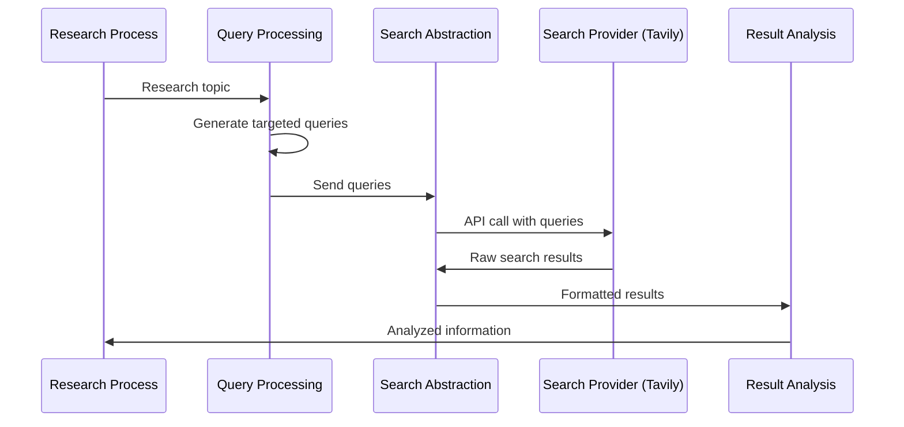

# Chapter 8: Search Integration

In [Chapter 7: Prompt Engineering](07_prompt_engineering_.md), we learned how to craft effective instructions for AI models. Now, let's explore how our research system finds the information it needs by connecting to external knowledge sources through Search Integration.

## Introduction: Your Research Librarian

Imagine you're working on a complex research project. You know what information you need, but you don't have all the facts at your fingertips. What do you do? You might visit a library and ask the librarian for help.

Search Integration works just like that librarian who:
- Understands your information needs
- Knows which sources to check for different types of questions
- Translates your vague requests into specific queries
- Gathers information from multiple sources
- Returns organized results that directly address your question

In `open_deep_research`, the Search Integration component is your professional research librarian who handles all interactions with external search engines and knowledge bases.

## A Real-World Example

Let's say you're researching "Electric Vehicle Battery Technology." You need up-to-date information about different battery types, recent breakthroughs, and cost comparisons.

Without Search Integration, your AI assistant would be limited to the knowledge it learned during training, which might be outdated or incomplete. With Search Integration, the system can:

1. Formulate targeted search queries like "latest solid-state battery advancements 2023"
2. Send these queries to search engines like Tavily or Perplexity
3. Process the search results into usable research material
4. Incorporate this fresh, specific information into your report

This ensures your research includes current information directly relevant to your specific needs.

## The Key Components of Search Integration

Let's break down the essential parts of our research librarian system:

### 1. Query Formulation

First, the system needs to create effective search queries. Remember how we used [Prompt Engineering](07_prompt_engineering_.md) to generate queries? Those queries now feed into our search system:

```python
# Generate specific search queries for battery technology
queries = ["solid-state battery breakthroughs 2023", 
           "lithium-ion vs sodium-ion battery comparison"]
```

These targeted queries are much more effective than vague terms like "battery technology."

### 2. Search Provider Selection

Different search engines have different strengths. Our system can select the right search engine for your needs:

```python
# Configure which search provider to use
from open_deep_research.configuration import Configuration, SearchAPI

config = Configuration(search_api=SearchAPI.TAVILY)
```

This tells the system to use Tavily for this research task. You could also choose Perplexity, Exa, ArXiv, PubMed, or others depending on your research needs.

### 3. Search Execution

Next, the system sends your queries to the selected search provider:

```python
# Execute searches with the configured provider
source_str = await select_and_execute_search(
    search_api="tavily",
    query_list=queries,
    params={"max_results": 5}
)
```

This code sends the queries to Tavily and requests up to 5 results per query.

### 4. Result Processing

Finally, the system processes the raw search results into a format that can be used for research:

```python
# Process and format search results
formatted_results = process_search_results(source_str)
```

This transforms the raw search data into well-structured information that can be incorporated into your research report.

## Using Search Integration in Your Research

Let's see how all these components work together in a practical research workflow:

```python
# Start a research process with search integration
async def research_with_search(topic):
    # Generate search queries based on topic
    queries = await generate_queries(topic)
    
    # Execute searches
    results = await search_web(queries)
    
    # Write section using search results
    section = await write_section(results)
    
    return section
```

This simplified function shows the complete flow:
1. Generate targeted search queries
2. Execute those queries using a search provider
3. Write a research section using the search results

### Configuring Search Options

You can customize how searches work by adjusting the configuration:

```python
# Configure detailed search behavior
config = Configuration(
    search_api=SearchAPI.PERPLEXITY,
    search_api_config={"max_results": 10, "focus": "recent"}
)
```

This sets up Perplexity as the search provider and configures it to return up to 10 results with an emphasis on recent information.

## Behind the Scenes: How Search Integration Works

To understand how search integration works internally, let's visualize the process:



This diagram shows how a research question flows through the system:
1. The Research Process identifies a need for information
2. Query Processing creates targeted search queries
3. Search Abstraction handles communication with external providers
4. The Search Provider returns raw results
5. Result Analysis processes these into usable research material
6. The Research Process incorporates this information

### The Implementation Details

Let's look at some key functions that power the Search Integration layer:

#### Selecting and Executing Searches

The `select_and_execute_search` function is the main entry point for search operations:

```python
# From src/open_deep_research/utils.py
async def select_and_execute_search(search_api, query_list, params=None):
    """Execute searches with a given provider and queries."""
    if search_api == "tavily":
        return await search_tavily(query_list, **params)
    elif search_api == "perplexity":
        return await search_perplexity(query_list, **params)
    # More providers...
```

This function routes your search request to the right provider-specific function.

#### Provider-Specific Search Functions

Each search provider has its own specialized function:

```python
# From src/open_deep_research/utils.py
async def search_tavily(query_list, max_results=3):
    """Search the web using Tavily."""
    from tavily import TavilyClient
    
    client = TavilyClient(api_key=os.environ["TAVILY_API_KEY"])
    results = []
    
    for query in query_list:
        response = await client.search(query=query, max_results=max_results)
        results.append(response)
    
    return format_results(results)
```

This function:
1. Creates a client for the Tavily API
2. Sends each query to Tavily
3. Collects and formats the results

#### Formatting Search Results

Search results need to be processed into a consistent format:

```python
# From src/open_deep_research/utils.py
def format_results(results_list):
    """Format search results into a structured string."""
    formatted = []
    
    for i, results in enumerate(results_list):
        formatted.append(f"SEARCH RESULTS {i+1}:")
        
        for result in results["results"]:
            formatted.append(f"URL: {result['url']}")
            formatted.append(f"TITLE: {result['title']}")
            formatted.append(f"CONTENT: {result['content']}\n")
    
    return "\n".join(formatted)
```

This creates a consistently formatted string with all search results that can be used as context for the AI.

## How Search Integration Connects with Other Components

The Search Integration layer works closely with several other parts of the system:

- It uses [Configuration Management](01_configuration_management_.md) to know which search providers to use
- It relies on [Prompt Engineering](07_prompt_engineering_.md) for generating effective search queries
- It provides essential input to the [LLM Interaction](06_llm_interaction_.md) system
- It fits into the flow defined by the [Graph-Based Workflow](05_graph_based_workflow_.md)
- It stores search results in the [State Management](09_state_management_.md) system

## Advanced Search Techniques

As you become more comfortable with basic search integration, you can use more advanced techniques:

### Domain-Specific Searches

For specialized research topics, you can use domain-specific search engines:

```python
# Use ArXiv for academic research on physics
config = Configuration(search_api=SearchAPI.ARXIV)

# Use PubMed for medical research
config = Configuration(search_api=SearchAPI.PUBMED)
```

Each specialized search provider has knowledge about particular domains.

### Multi-Provider Searches

For comprehensive research, you can search multiple providers:

```python
# Search both general and academic sources
results_general = await select_and_execute_search("tavily", queries)
results_academic = await select_and_execute_search("arxiv", queries)

# Combine results
combined_results = combine_search_results(results_general, results_academic)
```

This gives you the breadth of general search engines and the depth of specialized ones.

## Common Challenges and Solutions

### Challenge 1: Query Quality

The quality of search results depends heavily on the quality of your queries:

```python
# Poor query - too vague
vague_query = ["battery technology"]

# Better queries - specific and targeted
better_queries = [
    "solid-state battery energy density comparison 2023",
    "lithium iron phosphate battery cost reduction trends"
]
```

Using the techniques from [Prompt Engineering](07_prompt_engineering_.md) helps generate better queries.

### Challenge 2: Information Overload

Sometimes searches return too much information:

```python
# Configure max results to manage information volume
config = Configuration(
    search_api=SearchAPI.TAVILY,
    search_api_config={"max_results": 3}
)
```

Limiting results helps focus on the most relevant information.

## Conclusion

Search Integration is the research librarian of your AI system, connecting your research questions to the vast world of information available online. By formulating effective queries, selecting appropriate search providers, and processing the results, it ensures your research is based on current, relevant information rather than just the AI's pre-existing knowledge.

This component bridges the gap between what the AI already knows and what it needs to know for your specific research question, making it possible to create truly informed, up-to-date research reports.

In the next chapter, [State Management](09_state_management_.md), we'll explore how the system keeps track of all this information throughout the research process, ensuring that nothing gets lost as we move from queries to search results to final report.

---

Generated by [AI Codebase Knowledge Builder](https://github.com/The-Pocket/Tutorial-Codebase-Knowledge)