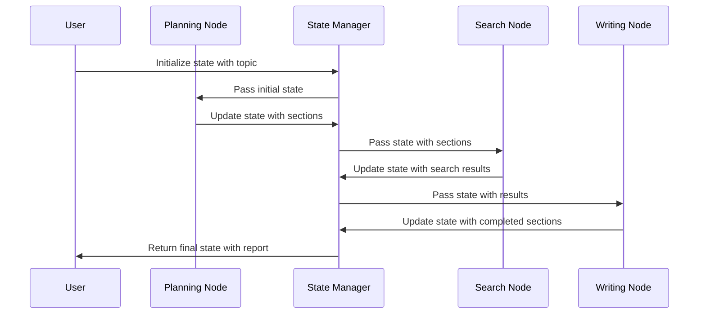

# Chapter 9: State Management

In [Chapter 8: Search Integration](08_search_integration_.md), we explored how our research system finds information from external sources. Now, let's dive into a critical component that keeps track of all this information: State Management.

## The Shared Memory of Your Research System

Imagine you're cooking a complex meal following a recipe. As you progress, you need to keep track of which ingredients you've added, which steps you've completed, and what still needs to be done. Without this tracking, you might add salt twice or forget a crucial step entirely!

State Management in `open_deep_research` works just like this tracking system. It's the shared memory that records everything about your research project:
- What topics you're researching
- Which sections have been planned
- What searches have been performed
- What information has been gathered
- Which sections are complete and which still need work

This shared memory ensures that all parts of the system know what's happening and can build upon each other's work.

## A Real-World Example: Tracking a Climate Change Research Project

Let's say you're researching "Climate Change Mitigation Strategies." Without state management, each component would work in isolation:
- The planner might create a report structure but forget to share it
- The search component might find information but lose track of which searches were already done
- The writing component might not know which sections are already completed

With State Management, the system maintains a central "memory" that tracks everything:

```python
# Simplified example of state for a research project
state = {
    "topic": "Climate Change Mitigation Strategies",
    "sections": [list of planned sections],
    "completed_sections": [sections that are finished],
    "search_queries": [queries already performed]
}
```

This central state allows every component to know exactly what's happening at all times.

## The Two Main Types of State

In `open_deep_research`, there are two primary types of state that work together:

### 1. Report State

This is the overall state of your entire research project:

```python
class ReportState(TypedDict):
    topic: str                             # Your research topic
    sections: list[Section]                # Planned report sections
    completed_sections: list               # Finished sections
    final_report: str                      # The complete report
```

Think of ReportState as the master checklist for your entire project. It tracks the big picture of what's been done and what's still needed.

### 2. Section State

This is the detailed state for each individual section being researched:

```python
class SectionState(TypedDict):
    topic: str                             # Main research topic
    section: Section                       # This specific section
    search_iterations: int                 # Search iterations done
    search_queries: list[SearchQuery]      # Queries already used
    source_str: str                        # Search results found
```

Think of SectionState as a detailed sub-checklist for just one part of your project. It tracks all the details about researching and writing a specific section.

## How State Management Works in Practice

Let's see how state management helps coordinate the research process:

### Starting a Research Project

When you begin a new research project, the system initializes the state:

```python
# Initialize the research state with your topic
initial_state = {"topic": "Climate Change Mitigation Strategies"}

# Start the research with this initial state
async for event in graph.astream(initial_state, thread):
    print(event)
```

This creates a basic starting state with just your research topic.

### Tracking Planning Progress

As the planning node generates a report structure, it updates the state:

```python
# Code that runs inside the planning node
def generate_report_plan(state, config):
    # Generate sections based on the topic...
    sections = create_sections(state["topic"])
    
    # Update the state with these sections
    return {"sections": sections}
```

Now the state includes both the topic and a list of planned sections.

### Managing Section Research

As research begins on each section, the state tracks progress:

```python
# Inside a section research node
def search_web(state, config):
    # Get current state
    queries = state["search_queries"]
    iterations = state["search_iterations"]
    
    # Perform searches and update state
    results = run_searches(queries)
    return {
        "source_str": results, 
        "search_iterations": iterations + 1
    }
```

This updates the state to include search results and increments the iteration counter.

## Behind the Scenes: How State Management Works

To understand how state flows through the system, let's visualize it:



This diagram shows how the State Manager (SM) passes information between different nodes, with each node receiving the current state and returning updates.

### The TypedDict Implementation

In the code, state is implemented using Python's TypedDict, which ensures consistent structure:

```python
# From src/open_deep_research/state.py
class ReportState(TypedDict):
    topic: str                      # Research topic
    sections: list[Section]         # Report sections
    completed_sections: list        # Completed sections
    final_report: str               # Final report
```

This definition creates a blueprint for what information should be tracked in the state.

### State Transformation in Graph Nodes

Each node in the [Graph-Based Workflow](05_graph_based_workflow_.md) receives the current state, performs its task, and returns updates:

```python
# From src/open_deep_research/graph.py
async def write_section(state: SectionState, config):
    # Extract what we need from current state
    topic = state["topic"]
    section = state["section"]
    source_str = state["source_str"]
    
    # Do the work (write the section)...
    section.content = write_content(topic, section, source_str)
    
    # Return state updates
    return {"completed_sections": [section]}
```

This function extracts information from the current state, performs its task (writing a section), and returns updates to be merged into the state.

### State Management for Parallel Tasks

One powerful feature of the state management system is handling parallel tasks:

```python
# Create parallel tasks with shared state
return [
    Send("write_final_sections", {
        "topic": state["topic"], 
        "section": s, 
        "report_sections_from_research": state["report_sections_from_research"]
    }) 
    for s in state["sections"] 
    if not s.research
]
```

This code creates multiple parallel tasks, each with its own portion of the state. The state management system ensures all updates are properly combined when the tasks complete.

## The State Class Structure

Let's take a closer look at how state is structured in the code:

### The Section Model

Sections in the report have their own state structure:

```python
class Section(BaseModel):
    name: str                       # Section name
    description: str                # What it covers
    research: bool                  # Needs research?
    content: str                    # The content
```

This defines what information we track about each section.

### Search Queries

Search queries are also tracked in the state:

```python
class SearchQuery(BaseModel):
    search_query: str               # The actual query
```

This allows the system to remember which searches have been performed.

## How State Management Connects with Other Components

State management is the glue that connects all other components in the system:

- It stores the configuration from [Configuration Management](01_configuration_management_.md)
- It maintains the structure defined by [Report Structure](02_report_structure_.md)
- It tracks human input from the [Human Feedback Loop](03_human_feedback_loop_.md)
- It coordinates the work of the [Multi-Agent Architecture](04_multi_agent_architecture_.md)
- It enables the flow defined in the [Graph-Based Workflow](05_graph_based_workflow_.md)
- It stores prompts and responses from [LLM Interaction](06_llm_interaction_.md)
- It holds the queries generated through [Prompt Engineering](07_prompt_engineering_.md)
- It maintains the results from [Search Integration](08_search_integration_.md)

## Real-World Applications

The state management system enables several powerful capabilities:

### 1. Resuming Interrupted Research

If a research process is interrupted, the state contains all progress:

```python
# Save current state
saved_state = current_state

# Later, resume from saved state
async for event in graph.astream(saved_state, thread):
    print(event)
```

This allows you to pause and resume research without losing work.

### 2. Tracking Progress

You can inspect the state to see how the research is progressing:

```python
# Check research progress
num_sections = len(state["sections"])
num_completed = len(state["completed_sections"])
progress = f"Completed {num_completed}/{num_sections} sections"
```

This helps you understand how much work remains.

### 3. Debugging and Troubleshooting

When something goes wrong, the state shows exactly what happened:

```python
# Inspect the state to debug issues
print(f"Section being worked on: {state['section'].name}")
print(f"Search iterations performed: {state['search_iterations']}")
print(f"Number of search results: {len(state['source_str'])}")
```

This makes it much easier to identify and fix problems.

## Conclusion

State Management is the memory system that connects all parts of the research process. Like a shared whiteboard in a team meeting, it ensures that every component knows what others have done and what still needs to be done.

By maintaining a comprehensive record of the research progress, state management enables the complex coordination needed for effective research. It allows different components to build on each other's work, track progress, and ensure nothing falls through the cracks.

State Management is the final piece that brings together all the components we've explored in this tutorial series, creating a complete and powerful research system.

---

Generated by [AI Codebase Knowledge Builder](https://github.com/The-Pocket/Tutorial-Codebase-Knowledge)