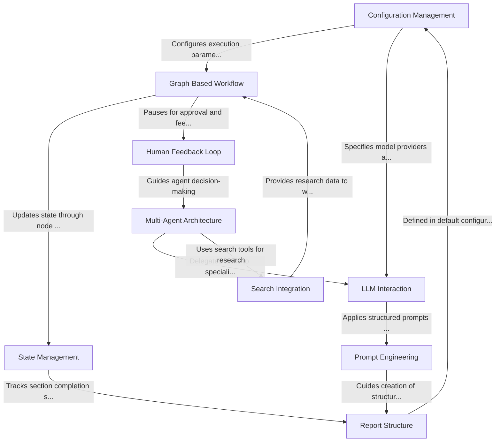

# Tutorial: open_deep_research

**Open Deep Research** is an automated research assistant that creates comprehensive reports on any topic. The system uses a **structured workflow** (either graph-based or multi-agent) to plan reports, conduct web searches, synthesize information, and generate well-organized content. It leverages *language models* for reasoning and writing while incorporating *human feedback* at critical planning stages. Think of it as an AI research team that breaks complex topics into manageable sections, researches each independently, and compiles findings into a cohesive final report with proper citations.

**Source Repository:** [https://github.com/langchain-ai/open_deep_research.git](https://github.com/langchain-ai/open_deep_research.git)

## Chapters

1. [Configuration Management
](01_configuration_management_.md)
2. [Report Structure
](02_report_structure_.md)
3. [Human Feedback Loop
](03_human_feedback_loop_.md)
4. [Multi-Agent Architecture
](04_multi_agent_architecture_.md)
5. [Graph-Based Workflow
](05_graph_based_workflow_.md)
6. [LLM Interaction
](06_llm_interaction_.md)
7. [Prompt Engineering
](07_prompt_engineering_.md)
8. [Search Integration
](08_search_integration_.md)
9. [State Management
](09_state_management_.md)

---

Generated by [AI Codebase Knowledge Builder](https://github.com/The-Pocket/Tutorial-Codebase-Knowledge)