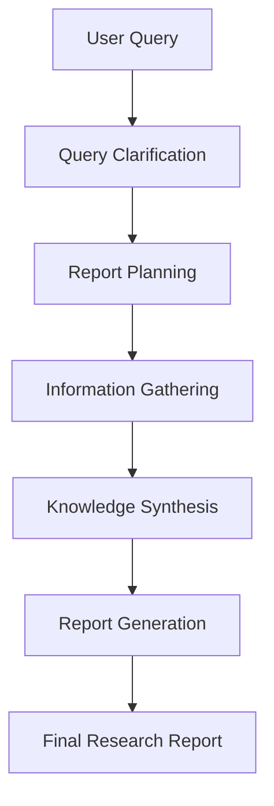
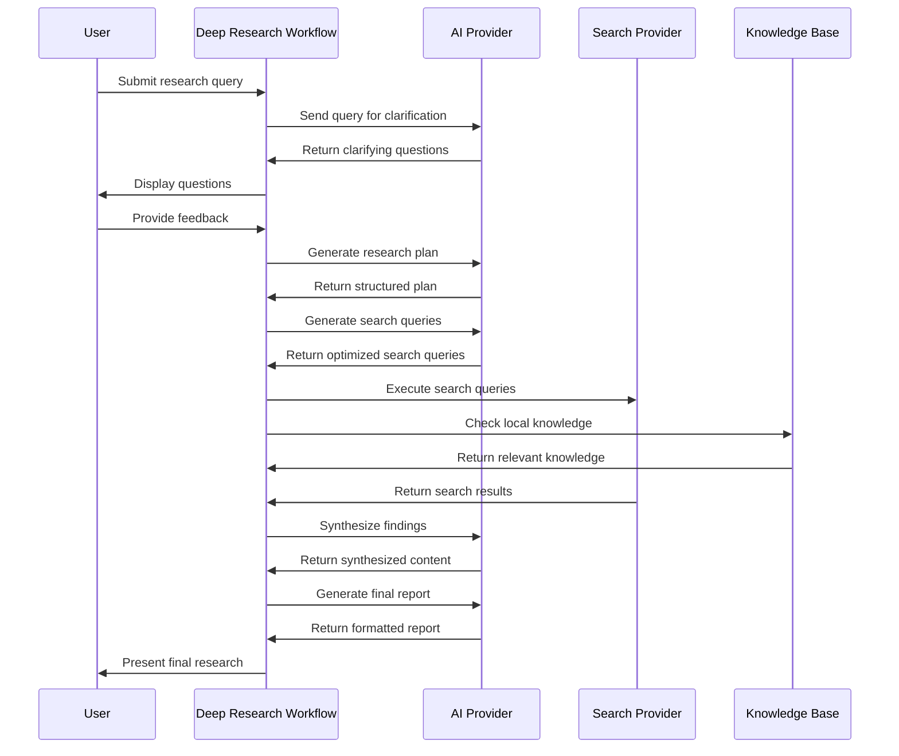

# Chapter 1: Deep Research Workflow

## Introduction: Your AI Research Assistant

Have you ever faced a complex research question and wished for a personal assistant to help you tackle it methodically? The Deep Research Workflow is exactly that - an intelligent orchestration system that breaks down complex research queries into manageable steps and guides you through the entire process.

Think of it as your project manager for research tasks. Just like a human research assistant, it:
- Asks clarifying questions to understand your needs better
- Creates a structured plan for approaching the research
- Searches for relevant information across multiple sources
- Synthesizes the findings into coherent insights
- Produces a comprehensive final report

Let's dive into how this workflow operates and how you can use it for your own research projects.

## Understanding the Workflow Stages

The Deep Research Workflow follows a structured approach with several key stages:

1. **Query Clarification**: Asks follow-up questions to better understand your research needs
2. **Report Planning**: Creates an organized outline for the research
3. **Information Gathering**: Executes searches through various providers
4. **Knowledge Synthesis**: Combines and analyzes the gathered information
5. **Report Generation**: Produces a comprehensive final document

Let's visualize this process:



## Getting Started with Deep Research

To understand how to use the Deep Research Workflow, let's walk through a simple example. Imagine you want to research "The impact of artificial intelligence on healthcare."

### 1. Initialize the Deep Research Hook

First, we need to set up our research workflow:

```javascript
import useDeepResearch from "@/hooks/useDeepResearch";

function ResearchComponent() {
  const { 
    askQuestions, 
    writeReportPlan,
    deepResearch, 
    writeFinalReport 
  } = useDeepResearch();
  
  // Research functionality comes next
}
```

This hook provides the core functions we'll need to conduct our research.

### 2. Start with Clarifying Questions

When starting a research project, the first step is to clarify what exactly we're looking for:

```javascript
// First set the query in your state management
taskStore.setQuery("The impact of artificial intelligence on healthcare");

// Then ask clarifying questions
await askQuestions();
```

This function sends your query to an AI system that will generate several follow-up questions to better understand your research needs. For example:

- Which specific areas of healthcare are you most interested in?
- Are you looking for current applications or future potential?
- Should the research focus on benefits, challenges, or both?
- Are you interested in specific regions or global perspectives?
- What timeframe should the research cover?

### 3. Create a Research Plan

Once the query is clarified, you can create a structured plan:

```javascript
// Generate a detailed report plan
const reportPlan = await writeReportPlan();
```

This function creates an organized outline for your research project. The result might look like:

```markdown
## Research Plan: The Impact of AI on Healthcare

1. Current AI Applications in Healthcare
2. Benefits and Improvements to Patient Care
3. Implementation Challenges and Limitations
4. Ethical and Privacy Considerations
5. Future Developments and Potential Impact
```

### 4. Execute the Research

Now comes the heart of the process - conducting the actual research:

```javascript
// Execute the deep research process
await deepResearch();
```

Behind the scenes, this function:
- Generates search queries based on your research plan
- Executes searches through configured providers
- Processes and organizes the information found

### 5. Generate the Final Report

Once all the information is gathered, you can generate a comprehensive report:

```javascript
// Generate the final research report
const finalReport = await writeFinalReport();
```

The final report combines all the gathered information into a structured document following your research plan.

## Under the Hood: How It Works

Let's explore what actually happens when you initiate a Deep Research Workflow:



### Core Implementation Details

The main implementation of the Deep Research Workflow is contained in the `useDeepResearch` hook. Let's examine some key parts:

#### Task Management

```javascript
// From src/hooks/useDeepResearch.ts
async function deepResearch() {
  const { language } = useSettingStore.getState();
  const { reportPlan } = useTaskStore.getState();
  const { thinkingModel } = getModel();
  setStatus(t("research.common.thinking"));
  
  // Generate search queries based on report plan
  // ...
  
  // Run search tasks with the generated queries
  await runSearchTask(queries);
}
```

The workflow stores all state in a Zustand store (`useTaskStore`), which allows for persistence and easy state management:

```javascript
// Simplified from src/store/task.ts
export const useTaskStore = create(
  persist<TaskStore & TaskFunction>(
    (set, get) => ({
      id: "",
      question: "",
      reportPlan: "",
      tasks: [],
      // More state properties...
      
      // And functions to update the state
      updateTask: (query, task) => {
        const newTasks = get().tasks.map((item) => {
          return item.query === query ? { ...item, ...task } : item;
        });
        set(() => ({ tasks: [...newTasks] }));
      },
      // More functions...
    }),
    { name: "research" }
  )
);
```

#### Search Execution

The workflow can utilize various search providers to gather information:

```javascript
// Simplified from runSearchTask function
if (enableSearch) {
  if (searchProvider !== "model") {
    try {
      if (searchProvider === "tavily") {
        sources = await tavily(item.query);
      } else if (searchProvider === "firecrawl") {
        sources = await firecrawl(item.query);
      }
      // Other search providers...
    } catch (err) {
      // Error handling...
    }
    // Process search results...
  }
}
```

This allows flexibility in how research is conducted, whether through specialized search APIs or AI model-based search capabilities.

## Prompt Engineering for Research Tasks

One of the most important aspects of the Deep Research Workflow is how it communicates with AI models through carefully crafted prompts. These prompts instruct the AI on how to approach each step of the research process.

For example, the system uses a prompt like this for asking clarifying questions:

```javascript
// From src/constants/prompts.ts
export const systemQuestionPrompt = `Given the following query from the user, ask at least 5 follow-up questions to clarify the research direction:

<query>
{query}
</query>

Questions need to be brief and concise. No need to output content that is irrelevant to the question.`;
```

The entire workflow is guided by these carefully designed prompts for each stage of the research process. For more on this topic, see [Prompt Engineering](04_prompt_engineering_.md).

## Integration Points

The Deep Research Workflow connects with several other components:

1. **AI Providers**: Integrates with various AI models to generate content, ask questions, and synthesize information. Learn more in [AI Provider Integration](02_ai_provider_integration_.md).

2. **Search Providers**: Connects with search engines and APIs to gather information. Explore this in [Search Provider Integration](03_search_provider_integration_.md).

3. **Knowledge Management**: Leverages local knowledge bases to supplement online research. Details in [Knowledge Management](05_knowledge_management_.md).

## Conclusion

The Deep Research Workflow is the orchestration engine that brings together all the components needed for effective AI-powered research. By breaking down complex queries into manageable steps, coordinating various tools, and synthesizing information into a coherent report, it transforms how research can be conducted.

In the next chapter, [AI Provider Integration](02_ai_provider_integration_.md), we'll explore how this workflow connects with different AI models to leverage their capabilities for various research tasks.

---

Generated by [AI Codebase Knowledge Builder](https://github.com/The-Pocket/Tutorial-Codebase-Knowledge)