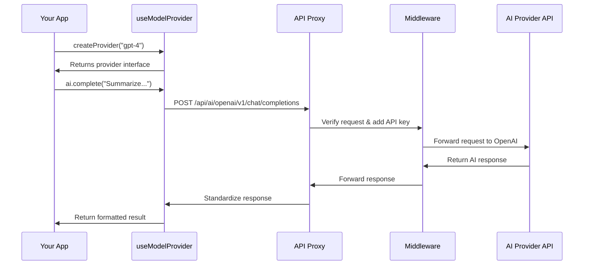

# Chapter 2: AI Provider Integration

In [Chapter 1: Deep Research Workflow](01_deep_research_workflow_.md), we explored how our research assistant breaks down complex queries into manageable steps. Now, let's look at how our application actually communicates with different AI models to make this possible.

## What is AI Provider Integration?

Imagine you speak English, but need to talk to friends who speak French, Spanish, and Japanese. You'd need a translator for each language. Similarly, our application needs to "speak" to different AI services like OpenAI, Google, and Anthropic - each with their own "language" (API format).

AI Provider Integration is like having a team of translators that:
1. Knows how to authenticate with each service
2. Translates your requests into formats each AI understands
3. Converts their responses back to a standard format your app can use

This saves you from writing different code for each AI provider and makes it easy to switch between them.

## A Simple Example

Let's say you want to ask an AI to summarize a paragraph. Without an integration layer, you'd need different code for each provider:

```javascript
// For OpenAI
const openaiResponse = await fetch('https://api.openai.com/v1/chat/completions', {
  method: 'POST',
  headers: { 'Authorization': `Bearer ${OPENAI_API_KEY}` },
  body: JSON.stringify({ model: 'gpt-4', messages: [{ role: 'user', content: 'Summarize this...' }] })
});
```

```javascript
// For Google's Gemini
const geminiResponse = await fetch('https://generativelanguage.googleapis.com/v1beta/models/gemini-pro:generateContent', {
  method: 'POST',
  headers: { 'x-goog-api-key': GOOGLE_API_KEY },
  body: JSON.stringify({ contents: [{ parts: [{ text: 'Summarize this...' }] }] })
});
```

As you can see, each provider needs different URLs, headers, and request formats!

## How AI Provider Integration Works

Our integration system provides a unified way to interact with any AI model:

```javascript
import useModelProvider from "@/hooks/useAiProvider";

function MyComponent() {
  const { createProvider } = useModelProvider();
  
  async function summarizeText(text) {
    const ai = createProvider("gpt-4"); // or "gemini-pro", "claude-3", etc.
    const response = await ai.complete({ prompt: `Summarize this: ${text}` });
    return response.text();
  }
}
```

With this approach, you just specify which model you want to use, and the integration layer handles all the differences behind the scenes!

## Key Components of the Integration

### 1. Provider Selection

The first step is choosing which AI provider and model to use:

```javascript
// Get the configured models from settings
function getModel() {
  const { provider } = useSettingStore.getState();
  
  switch (provider) {
    case "google":
      const { thinkingModel, networkingModel } = useSettingStore.getState();
      return { thinkingModel, networkingModel };
    case "openai":
      // Similar pattern for other providers...
  }
}
```

This code checks your application settings to determine which provider and models you've configured to use.

### 2. Authentication

Each provider requires different authentication methods. Our system handles this transparently:

```javascript
// For Google models
const google = createGoogleGenerativeAI({
  baseURL: "/api/ai/google/v1beta", // Our proxy endpoint
  apiKey: accessKey, // A temporary access key for our proxy
});
```

This sends requests through our application's proxy, which adds the real API key on the server side for security.

### 3. Request Formatting

Different providers expect different request formats. Our integration abstracts this away:

```javascript
// Creating a provider-specific client
function createProvider(model) {
  // ... provider selection logic ...
  
  // Return the appropriate provider with the selected model
  switch (provider) {
    case "google":
      return google(model, settings);
    case "openai":
      return openai(model, settings);
    // Other providers...
  }
}
```

## Under the Hood: Request Flow

Let's visualize what happens when you make a request to an AI provider:



When you call `ai.complete()`, here's what happens:

1. The hook prepares a request for the specific provider
2. It sends this to our application's API proxy
3. The middleware adds the real API key and forwards it
4. The provider processes your request and returns a response
5. The proxy standardizes this response and returns it to your app

## Provider-Specific Proxies

Our application includes separate API routes for each provider. For example, here's a simplified version of the OpenAI proxy:

```javascript
// src/app/api/ai/openai/[...slug]/route.ts
export async function handler(req: NextRequest) {
  // Extract path and request body
  const body = await req.json();
  const path = req.nextUrl.searchParams.getAll("slug");
  
  // Forward to OpenAI with proper authentication
  const response = await fetch(`${OPENAI_BASE_URL}/${path.join("/")}`, {
    method: req.method,
    headers: {
      "Content-Type": "application/json",
      "Authorization": `Bearer ${API_KEY}`, // Real API key
    },
    body: JSON.stringify(body)
  });
  
  // Return the response to the client
  return new NextResponse(response.body, response);
}
```

This proxy receives requests from your application, adds the real API key (stored securely on the server), and forwards them to OpenAI.

## Middleware for Security

To prevent unauthorized access to AI providers, our application uses middleware:

```javascript
// From src/middleware.ts (simplified)
export async function middleware(request: NextRequest) {
  if (request.nextUrl.pathname.startsWith("/api/ai/openai")) {
    // Verify the request has proper authorization
    const authorization = request.headers.get("authorization") || "";
    if (!verifySignature(authorization.substring(7), accessPassword)) {
      return NextResponse.json({ error: "No permissions" }, { status: 403 });
    }
    
    // Add the real API key and forward the request
    const requestHeaders = new Headers();
    requestHeaders.set("Authorization", `Bearer ${OPENAI_API_KEY}`);
    return NextResponse.next({ request: { headers: requestHeaders } });
  }
  // Similar handling for other providers...
}
```

This middleware verifies that requests are coming from your application, then adds the real API keys before forwarding them.

## Using Different AI Models for Different Tasks

In the Deep Research Workflow, we often use different models for different tasks:

```javascript
// From useDeepResearch hook
async function askQuestions() {
  const { createProvider, getModel } = useModelProvider();
  const { thinkingModel } = getModel();
  
  // Use the "thinking" model for generating questions
  const ai = createProvider(thinkingModel);
  const response = await ai.complete({ prompt: systemQuestionPrompt });
  
  // Process and return the response
  // ...
}
```

This allows us to use more powerful models for complex reasoning tasks and faster, cheaper models for simpler tasks.

## Conclusion

The AI Provider Integration is the bridge that lets your application communicate seamlessly with multiple AI services. It handles all the complex differences between providers, allowing you to focus on building features rather than managing API intricacies.

In the next chapter, [Search Provider Integration](03_search_provider_integration_.md), we'll explore how our application connects to different search engines to gather information for your research tasks.

---

Generated by [AI Codebase Knowledge Builder](https://github.com/The-Pocket/Tutorial-Codebase-Knowledge)