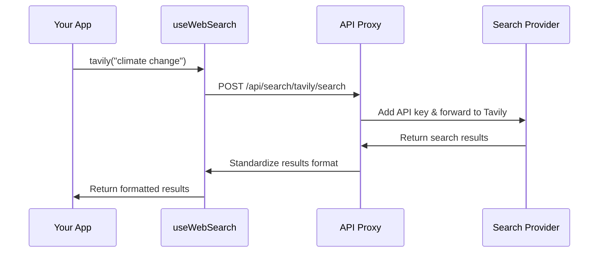

# Chapter 3: Search Provider Integration

In [Chapter 2: AI Provider Integration](02_ai_provider_integration_.md), we learned how our application communicates with different AI models. Now, let's explore how we gather the information those AI models need to work with.

## Introduction: Your Research Librarian

Imagine you're writing a research paper and need to find information from various sources - academic journals, news sites, and specialized databases. Each requires different search methods, login credentials, and returns results in different formats.

Search Provider Integration works like a skilled research librarian who:

1. Knows how to navigate different information sources
2. Takes your questions and adapts them for each specific database
3. Handles all the access credentials for you
4. Brings back organized information in a consistent format

Instead of learning how to use each search engine API separately, you can use one consistent interface that handles all the complexities for you.

## Understanding Search Providers

Our deep-research project supports several search providers:

- **Tavily**: Research-focused search engine with advanced filtering
- **Firecrawl**: Web scraping and search with real-time capabilities
- **Exa**: Academic search with summarization features
- **Bocha**: General web search with customizable filters
- **SearxNG**: Privacy-respecting metasearch engine

Each has different strengths, but without an integration layer, you'd need different code for each:

```javascript
// For Tavily (simplified example)
const tavilyResults = await fetch('https://api.tavily.com/search', {
  method: 'POST',
  headers: { 'Authorization': `Bearer ${TAVILY_API_KEY}` },
  body: JSON.stringify({ query: 'renewable energy' })
});
```

```javascript
// For Firecrawl (different parameters and format)
const firecrawlResults = await fetch('https://api.firecrawl.dev/v1/search', {
  method: 'POST',
  headers: { 'Authorization': `Bearer ${FIRECRAWL_API_KEY}` },
  body: JSON.stringify({ query: 'renewable energy', formats: ['markdown'] })
});
```

Maintaining separate code for each provider would be tedious and error-prone!

## Using the Search Provider Integration

Our integration system makes searching much simpler with a unified interface:

```javascript
import useWebSearch from "@/hooks/useWebSearch";

function ResearchComponent() {
  const { tavily, firecrawl } = useWebSearch();
  
  async function searchInformation(query) {
    // Search using Tavily
    const results = await tavily(query);
    return results; // Standardized format
  }
}
```

With just one line of code, you can search any provider and get standardized results!

### Performing a Simple Search

Let's see how to search for information about climate change:

```javascript
// Get access to all search providers
const { tavily } = useWebSearch();

// Search with Tavily
const results = await tavily("climate change solutions");

// Results will look like this:
// [
//   {
//     title: "Recent Advances in Climate Solutions",
//     content: "This article discusses...",
//     url: "https://example.com/article"
//   },
//   ...more results...
// ]
```

The search results are standardized across all providers, making them easy to work with!

### Customizing Your Searches

Each provider supports additional options to refine searches:

```javascript
// Search academic content with more specific parameters
const academicResults = await tavily("quantum computing", {
  topic: "science",
  searchDepth: "advanced",
  maxResults: 5
});
```

These options let you customize the search behavior while maintaining the simplicity of the unified API.

## Under the Hood: How It Works

Let's see what happens when you make a search request:



When you call a search function like `tavily()`:

1. The hook prepares a request formatted specifically for Tavily
2. It sends this request to our application's secure proxy server
3. The proxy adds your real API key (stored securely on the server)
4. Tavily processes your search and returns results
5. Our proxy converts these results into a standard format
6. Your application receives neatly organized search results

This approach keeps your API keys secure and handles all the provider-specific details for you.

## Provider Implementation Details

Let's look at how the Tavily search provider is implemented:

```javascript
// From src/hooks/useWebSearch.ts (simplified)
async function tavily(query, options = {}) {
  // Get settings and create secure access key
  const { searchMaxResult, accessPassword } = useSettingStore.getState();
  const accessKey = generateSignature(accessPassword, Date.now());
  
  // Make the request through our proxy
  const response = await fetch("/api/search/tavily/search", {
    method: "POST",
    headers: {
      "Content-Type": "application/json",
      "Authorization": `Bearer ${accessKey}`,
    },
    body: JSON.stringify({
      query,
      maxResults: searchMaxResult,
      ...options,
    }),
  });
  
  // Process and standardize results
  const { results = [] } = await response.json();
  return results.map(result => ({
    title: result.title,
    content: result.content,
    url: result.url
  }));
}
```

This function:
1. Gets your search preferences from the application settings
2. Creates a secure signature for authentication
3. Sends the search request through our proxy server
4. Receives the results and converts them to a standard format

## Proxy Server Security

Each search provider has its own proxy endpoint. Here's a simplified example for Tavily:

```javascript
// From src/app/api/search/tavily/[...slug]/route.ts
export async function POST(req) {
  const body = await req.json();
  
  // Forward to Tavily with the real API key
  const response = await fetch(`${TAVILY_BASE_URL}/search`, {
    method: "POST",
    headers: {
      "Content-Type": "application/json",
      "Authorization": `Bearer ${process.env.TAVILY_API_KEY}`,
    },
    body: JSON.stringify(body)
  });
  
  return new NextResponse(response.body, response);
}
```

The proxy adds the real API key (stored as an environment variable) before forwarding the request to Tavily. This keeps your API keys secure by never exposing them to the browser.

## Using Search in the Research Workflow

In the [Deep Research Workflow](01_deep_research_workflow_.md) we explored in Chapter 1, search providers are used during the Information Gathering stage:

```javascript
// From the deepResearch function (simplified)
async function deepResearch() {
  // Generate search queries based on research plan
  const queries = generateQueriesFromPlan(reportPlan);
  
  // Use the configured search provider
  const { searchProvider } = useSettingStore.getState();
  const webSearch = useWebSearch();
  
  // Search for each query
  for (const query of queries) {
    if (searchProvider === "tavily") {
      sources = await webSearch.tavily(query);
    } else if (searchProvider === "firecrawl") {
      sources = await webSearch.firecrawl(query);
    }
    // Store results for later synthesis
    storeSearchResults(query, sources);
  }
}
```

This code:
1. Creates specific search queries based on your research plan
2. Uses your preferred search provider to find information
3. Stores the results for the AI to analyze in later stages

## Configuring Search Providers

You can choose and configure different search providers in your application settings:

```javascript
// Example of updating search settings
const { setSearchProvider, setSearchMaxResult } = useSettingStore();

// Change the default search provider
setSearchProvider("exa");

// Set the maximum number of results to return
setSearchMaxResult(10);
```

This flexibility allows you to choose the best search provider for different research topics and adjust settings as needed.

## Conclusion

Search Provider Integration is like having a team of research librarians at your disposal. It navigates different search services, handles authentication, and brings back neatly organized information - all through a simple, consistent interface.

By abstracting away the complexities of different search APIs, it lets you focus on your research questions rather than the technical details of how to find information.

In the next chapter, [Prompt Engineering](04_prompt_engineering_.md), we'll explore how to craft effective instructions for AI models to analyze and synthesize the information we've gathered using these search providers.

---

Generated by [AI Codebase Knowledge Builder](https://github.com/The-Pocket/Tutorial-Codebase-Knowledge)