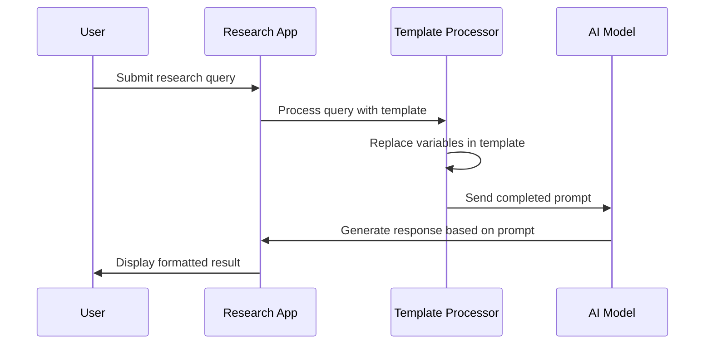

# Chapter 4: Prompt Engineering

In [Chapter 3: Search Provider Integration](03_search_provider_integration_.md), we learned how to gather information from various sources. Now, let's explore how to instruct AI models to process this information effectively.

## Introduction: The Recipe Cards for AI

Imagine you're teaching a very intelligent but extremely literal friend how to cook. This friend has never cooked before but can follow instructions perfectly if they're clear and precise. You wouldn't just say "make dinner" - you'd provide detailed recipes with specific ingredients, measurements, and step-by-step instructions.

**Prompt engineering is exactly like creating recipe cards for AI models**. Just as cooking recipes determine what dish you'll get, prompts determine what output you'll receive from an AI. A well-crafted prompt can be the difference between getting a generic, unhelpful response and receiving exactly the analysis you need.

In the deep-research project, prompt engineering provides the structured instructions that guide AI models through each stage of the research process, from asking clarifying questions to generating the final report.

## Key Components of an Effective Prompt

A well-engineered prompt typically consists of several key components:

### 1. System Instructions

System instructions establish the AI's role and general behavior. Think of them as setting the "character" the AI should play - like telling a chef "today you're a French pastry specialist."

Here's a simplified example from our project:

```javascript
const systemInstruction = `You are an expert researcher. Today is {now}.
- Be highly organized.
- Provide detailed explanations.
- Treat me as an expert in all subject matter.`;
```

This brief instruction establishes the AI as a research expert and sets expectations for its communication style.

### 2. Output Formatting Guidelines

These guidelines tell the AI exactly how to structure its response - like specifying that a recipe should include separate sections for ingredients and preparation steps.

```javascript
const outputGuidelinesPrompt = `<OutputGuidelines>
- Use clear paragraphs for different ideas
- Use headings to divide content hierarchically
- Use bold and italics to emphasize key points
</OutputGuidelines>`;
```

These guidelines ensure consistent formatting across all AI-generated content, making it easier to read and navigate.

### 3. Task-Specific Templates

These are specialized prompts designed for particular stages of the research process - like having different recipe cards for appetizers, main courses, and desserts.

For example, here's a simplified template for asking clarifying questions:

```javascript
const systemQuestionPrompt = `Given the following query from the user, 
ask at least 5 follow-up questions to clarify the research direction:

<query>
{query}
</query>

Questions need to be brief and concise.`;
```

This template tells the AI exactly what's expected when we need it to generate clarifying questions.

## Using Prompts in Your Research Project

Let's see how to use these prompts in a real research scenario. Imagine we want to research "The impact of renewable energy on global economies."

### 1. Setting Up System Instructions

First, we prepare our system instructions:

```javascript
// From src/utils/deep-research.ts
function getSystemPrompt() {
  // Replace {now} with the current date
  return systemInstruction.replace("{now}", new Date().toISOString());
}

// Usage
const systemPrompt = getSystemPrompt();
```

This function creates our system prompt, inserting the current date so the AI knows what "today" is.

### 2. Generating Clarifying Questions

Next, we use a question prompt template to help the AI ask good follow-up questions:

```javascript
// From src/utils/deep-research.ts
function generateQuestionsPrompt(query) {
  return systemQuestionPrompt.replace("{query}", query);
}

// Usage
const questionPrompt = generateQuestionsPrompt("The impact of renewable energy on global economies");
```

When sent to an AI model, this prompt will instruct it to generate specific clarifying questions about our renewable energy research topic.

### 3. Creating a Research Plan

After getting clarification, we can generate a structured research plan:

```javascript
// From src/utils/deep-research.ts
function writeReportPlanPrompt(query) {
  return reportPlanPrompt.replace("{query}", query);
}

// Usage
const planPrompt = writeReportPlanPrompt("The impact of renewable energy on global economies");
```

This prompt guides the AI to create a well-organized outline for our research project.

## Under the Hood: How Prompts Work

Let's visualize what happens when a prompt is processed in the deep-research workflow:



When you use the deep-research system, here's what happens:

1. You submit a research query like "renewable energy economics"
2. The app selects the appropriate prompt template for the current research stage
3. It replaces variables in the template with your specific content
4. The completed prompt is sent to the AI model
5. The AI generates a response following the instructions in the prompt
6. You receive a well-structured result formatted according to the guidelines

### How Prompt Processing Works

The core of prompt processing is handled by template functions that replace variables with actual content:

```javascript
// From src/utils/deep-research.ts
export function processSearchResultPrompt(query, researchGoal, results) {
  // Format each search result into a context block
  const context = results.map(
    (result, idx) => `<content index="${idx + 1}" url="${result.url}">
${result.content}
</content>`
  );
  
  // Insert values into the template
  return searchResultPrompt
    .replace("{query}", query)
    .replace("{researchGoal}", researchGoal)
    .replace("{context}", context.join("\n"));
}
```

This function takes search results and formats them into a structured prompt that the AI can analyze.

## Specialized Prompt Types in deep-research

The project uses several specialized prompt types for different research phases:

### 1. Question Prompts

These guide the AI to ask follow-up questions to better understand your research needs:

```javascript
// Usage example
const clarificationPrompt = generateQuestionsPrompt("Climate change solutions");
// AI will respond with questions like:
// 1. Which specific aspects of climate change are you focusing on?
// 2. Are you looking for technological solutions, policy approaches, or both?
// ...
```

### 2. Planning Prompts

These help the AI create structured research plans and outlines:

```javascript
// Usage example
const planPrompt = writeReportPlanPrompt("Climate change solutions");
// AI will respond with a structured plan like:
// 1. Current State of Climate Change
// 2. Technological Solutions: Renewable Energy
// 3. Policy Approaches: Carbon Pricing
// ...
```

### 3. Search Query Prompts

These instruct the AI to generate effective search queries based on your research plan:

```javascript
// From src/utils/deep-research.ts
export function generateSerpQueriesPrompt(plan) {
  return serpQueriesPrompt
    .replace("{plan}", plan)
    .replace("{outputSchema}", getSERPQueryOutputSchema());
}
```

This special prompt includes a JSON schema to ensure the AI returns search queries in a consistent format.

### 4. Synthesis Prompts

These guide the AI in analyzing and combining information from multiple search results:

```javascript
// Usage example
const synthesisPrompt = processSearchResultPrompt(
  "renewable energy economics", 
  "Understand economic impacts", 
  searchResults
);
// AI will analyze the search results and extract key insights
```

### 5. Report Generation Prompts

These instruct the AI on how to create the final research report, including citation guidelines:

```javascript
// Simplified example
const reportPrompt = writeFinalReportPrompt(
  researchPlan,
  researchFindings,
  sources,
  "Academic style with citations"
);
// AI will generate a comprehensive report following these instructions
```

## Advanced Feature: Structured Output with JSON Schemas

For certain outputs, we need to ensure the AI returns data in a specific format. We use JSON schemas for this:

```javascript
// From src/utils/deep-research.ts
export function getSERPQuerySchema() {
  return z.array(
    z.object({
      query: z.string().describe("The search query."),
      researchGoal: z.string().describe("The goal of this search query.")
    })
  );
}
```

This schema ensures that when we ask the AI to generate search queries, they're returned in a consistent format that our application can process automatically.

## Customizing Output with Artifact Manipulation

The [Artifact Manipulation](07_artifact_manipulation_.md) chapter will show how you can modify content generated by these prompts:

```javascript
// From src/utils/artifact.ts
export function changeReadingLevelPrompt(content, level) {
  return `You are tasked with re-writing the following 
artifact to be at a ${level} reading level.
Ensure you do not change the meaning...`;
}
```

This allows you to take research content and adapt it for different audiences - like simplifying academic content for a general audience.

## Working with Knowledge Management

Prompts also help the AI leverage your existing knowledge, as you'll learn in the [Knowledge Management](05_knowledge_management_.md) chapter:

```javascript
// From src/utils/deep-research.ts
export function processSearchKnowledgeResultPrompt(query, researchGoal, results) {
  // Format knowledge base results into context blocks
  const context = results.map(result => 
    `<content index="${result.id}">${result.content}</content>`);
  
  // Return a prompt that instructs the AI to analyze this knowledge
  return searchKnowledgeResultPrompt
    .replace("{query}", query)
    .replace("{context}", context.join("\n"));
}
```

This special prompt instructs the AI to analyze information from your local knowledge base, connecting new research with what you already know.

## Conclusion

Prompt engineering is both an art and a science. Well-crafted prompts are essential for guiding AI models to produce high-quality, relevant research outputs. They provide the structure and instructions that shape how the AI interprets your queries and formats its responses.

As you work with the deep-research project, you'll develop an intuition for which prompt templates work best for different research tasks, and how to customize them for your specific needs.

In the next chapter, [Knowledge Management](05_knowledge_management_.md), we'll explore how to build and leverage a personal knowledge base to enhance your research capabilities even further.

---

Generated by [AI Codebase Knowledge Builder](https://github.com/The-Pocket/Tutorial-Codebase-Knowledge)