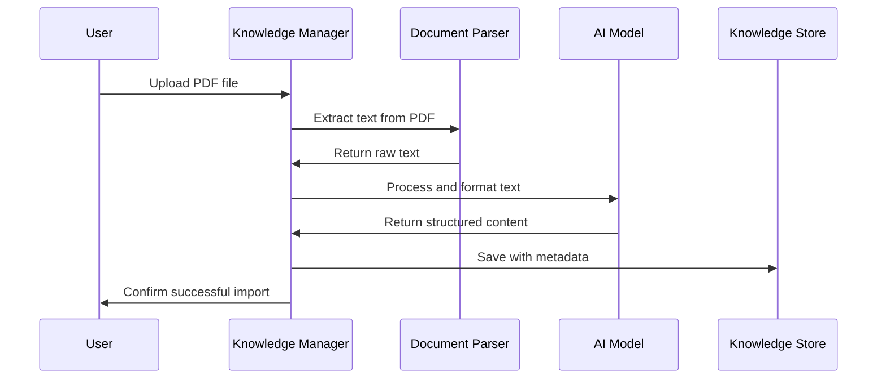

# Chapter 5: Knowledge Management

In [Chapter 4: Prompt Engineering](04_prompt_engineering_.md), we learned how to craft effective instructions for AI models. Now, let's explore how to manage the information these models work with.

## Introduction: Your Personal Digital Library

Imagine you're a researcher with hundreds of documents - research papers, notes, reports, and web articles. Without organization, finding the right information becomes nearly impossible.

Knowledge Management in our deep-research project works like a smart digital library that:

1. Accepts different types of documents (PDFs, Word files, web pages)
2. Automatically extracts and organizes their text
3. Makes all your information searchable
4. Connects your knowledge to AI models for analysis

Think of it as a personal research assistant that remembers everything you've read and can instantly find relevant information when you need it.

## Understanding Knowledge Management

Let's break down how knowledge management works in our system:

### 1. Importing Knowledge

The system can import knowledge from various sources:

- **Files**: PDFs, Word documents, text files
- **Web pages**: Articles, blog posts, online resources
- **Notes**: Your own written knowledge

Each piece of content gets a unique ID and is stored in a structured format.

### 2. Processing and Storage

When you import a document, the system:

1. Extracts the text content
2. Processes it into a consistent format
3. Generates metadata (like title, size, type)
4. Stores everything in a searchable knowledge base

### 3. Retrieving and Using Knowledge

Once stored, this knowledge can be:

- Searched using keywords
- Referenced during research tasks
- Fed to AI models for analysis
- Used to enrich your research reports

## Using Knowledge Management: A Simple Example

Let's see how to use the knowledge management system to import a research paper and use it in your research.

### Step 1: Import a PDF research paper

```javascript
import useKnowledge from "@/hooks/useKnowledge";

function KnowledgeImporter() {
  const { getKnowledgeFromFile } = useKnowledge();
  
  // Called when a file is selected in the UI
  function handleFileUpload(event) {
    const file = event.target.files[0];
    getKnowledgeFromFile(file);
  }
}
```

This code creates a function that can take a file (like a PDF) and import it into your knowledge base. The `getKnowledgeFromFile` function handles all the complex processing.

### Step 2: Import a web article

```javascript
function WebImporter() {
  const { getKnowledgeFromUrl } = useKnowledge();
  
  // Called when a URL is submitted
  function handleUrlSubmit(url) {
    getKnowledgeFromUrl(url, "local"); // "local" is the crawler to use
  }
}
```

This lets you import content directly from web pages. The system automatically extracts the main content, ignoring ads and navigation elements.

### Step 3: Use your knowledge in research

```javascript
import { useKnowledgeStore } from "@/store/knowledge";

function ResearchComponent() {
  // Get all stored knowledge items
  const knowledges = useKnowledgeStore(state => state.knowledges);
  
  // Find relevant knowledge for a topic
  function findRelevantKnowledge(topic) {
    return knowledges.filter(item => 
      item.content.toLowerCase().includes(topic.toLowerCase())
    );
  }
}
```

This simple example shows how to access your stored knowledge and filter it for relevant content.

## Under the Hood: How Knowledge Management Works

Let's visualize what happens when you import a document:



When you upload a file, the system:
1. Identifies the file type and selects the appropriate parser
2. Extracts the raw text content
3. Uses AI to clean and format the content if needed
4. Generates a unique ID based on the file's properties
5. Stores the processed information in the knowledge store
6. Makes it available for future research

## Key Implementation Details

### Generating Unique IDs

Each document needs a unique identifier. Here's how the system creates them:

```javascript
// From src/hooks/useKnowledge.ts
function generateId(type, options) {
  if (type === "file" && options.fileMeta) {
    const { fileMeta } = options;
    const meta = `${fileMeta.name}::${fileMeta.size}::${fileMeta.type}`;
    return Md5.hashStr(meta); // Creates a unique hash from file properties
  } else if (type === "url" && options.url) {
    return Md5.hashStr(`${options.url}::${Date.now().toString().substring(0, 8)}`);
  }
}
```

This function creates a unique fingerprint for each document by hashing its properties, ensuring we don't store duplicates.

### Processing Different File Types

Different document types require different processing approaches:

```javascript
// From src/utils/parser/index.ts (simplified)
async function fileParser(file) {
  if (file.type.startsWith("text/")) {
    return await readTextFromFile(file);
  } else if (file.type === "application/pdf") {
    return await readTextFromPDF(file);
  } else if (file.type.startsWith("application/vnd.openxmlformats")) {
    return await readTextFromOffice(file);
  }
}
```

This code selects the right parser based on the file type - whether it's plain text, PDF, or an Office document. Each file type has its own specialized parser (which we'll explore more in [Document Parsing](06_document_parsing_.md)).

### Storing Knowledge

Once processed, knowledge is stored in a persistent store:

```javascript
// From src/store/knowledge.ts (simplified)
export const useKnowledgeStore = create(
  persist(
    (set, get) => ({
      knowledges: [],
      save: (knowledge) => {
        set((state) => ({ knowledges: [knowledge, ...state.knowledges] }));
      },
      get: (id) => {
        return get().knowledges.find((item) => item.id === id) || null;
      },
      // More methods...
    }),
    { name: "knowledgeStore" }
  )
);
```

This code creates a persistent store that saves your knowledge even when you close your browser. The `save` function adds new knowledge items, while `get` retrieves them by ID.

### Web Content Extraction

For importing web articles, the system can use different crawlers:

```javascript
// From src/hooks/useKnowledge.ts
async function getKnowledgeFromUrl(url, crawler) {
  // Choose the appropriate crawler
  if (crawler === "jina") {
    const result = await jinaReader(url);
    // Store the extracted content
    knowledgeStore.save({
      id: generateId("url", { url }),
      title: result.title,
      content: result.content,
      type: "url",
      url,
      createdAt: Date.now(),
      updatedAt: Date.now(),
    });
  } else if (crawler === "local") {
    // Use local crawler implementation
    // ...
  }
}
```

This function extracts the main content from web pages, filtering out navigation, ads, and other non-essential elements.

## Integrating with Research Workflow

Knowledge management integrates with the [Deep Research Workflow](01_deep_research_workflow_.md) to enhance your research capabilities:

```javascript
// Example of using knowledge in research
async function researchWithKnowledge(query) {
  // Search your knowledge base for relevant information
  const relevantKnowledge = searchKnowledge(query);
  
  // Use the knowledge to inform AI responses
  const enhancedResponse = await askAIWithContext(query, relevantKnowledge);
  
  return enhancedResponse;
}
```

When conducting research, the system can automatically search your knowledge base for relevant information and provide it to the AI. This means the AI can reference papers you've imported, articles you've saved, and other personal knowledge.

## Practical Tips for Knowledge Management

1. **Import diverse sources**: The more varied your knowledge base, the richer your research will be

2. **Organize as you go**: Import resources as you discover them rather than waiting until you need them

3. **Check for duplicates**: The system tries to prevent duplicates, but it's good to verify

4. **Use recently imported knowledge**: Recently added items are displayed at the top of your knowledge list

5. **Remove outdated knowledge**: You can delete items that are no longer relevant

## Conclusion

Knowledge Management turns your scattered documents into a structured, searchable library that powers your research. By automatically processing and storing information from various sources, it creates a personal knowledge base that you can draw upon during your research projects.

The system handles the complexities of different file formats, web content extraction, and storage, allowing you to focus on your research questions rather than information management.

In the next chapter, [Document Parsing](06_document_parsing_.md), we'll dive deeper into how the system extracts information from different file types, from simple text files to complex PDFs and Office documents.

---

Generated by [AI Codebase Knowledge Builder](https://github.com/The-Pocket/Tutorial-Codebase-Knowledge)