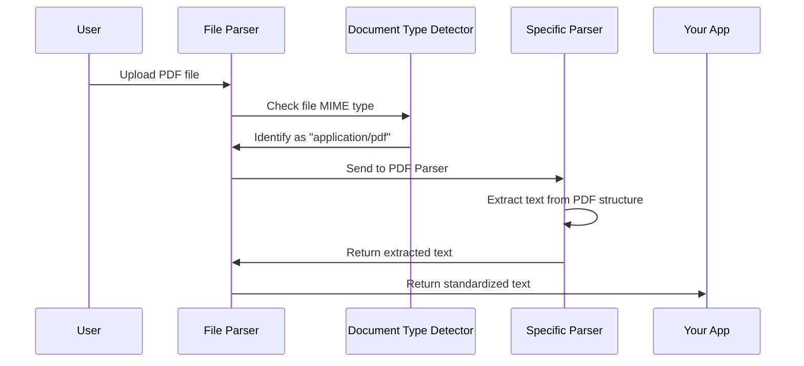

# Chapter 6: Document Parsing

In [Chapter 5: Knowledge Management](05_knowledge_management_.md), we learned how to build a personal knowledge library. Now, let's explore how to actually extract text from various document formats to feed into that library.

## Introduction: Your Universal Document Translator

Imagine you have a collection of information in different formats - PDF research papers, Word documents, Excel spreadsheets, and text files. Each speaks a different "language" that computers understand differently. To use this information, you'd need to know how to open and read each format.

Document Parsing is like having a universal translator that can read any document format and convert it to plain text that both you and AI models can understand. It's the bridge between complex document formats and usable information.

Let's say you're researching climate change and have:
- A PDF scientific paper with data
- A Word document with interview transcripts
- An Excel spreadsheet with temperature records

Instead of manually copying text from each, document parsing automatically extracts all this text for you, making it available for your research.

## Understanding Document Parsing

Document parsing involves a few key concepts:

### 1. File Type Detection

Before parsing a document, the system needs to identify what type of file it's dealing with. This is typically done by checking the file's MIME type (like "application/pdf" for PDF files).

```javascript
function identifyFileType(file) {
  const mimeType = file.type;
  console.log(`Detected file type: ${mimeType}`);
  return mimeType;
}
```

This simple function looks at a file's MIME type to determine what kind of document it is.

### 2. Format-Specific Parsers

Different document formats store text in completely different ways:
- PDF files store text as objects in a page structure
- Word documents store text in XML files inside a ZIP container
- Excel files store cell values and formulas in separate XML files

The system needs specialized parsers for each format.

### 3. Text Extraction

Once the format is identified, the appropriate parser extracts the text. This is where the real work happens - navigating the structure of each format to find the actual text content.

### 4. Text Standardization

After extraction, the system standardizes the text format so your application can work with it consistently, regardless of the original document type.

## Using Document Parsing

Let's see how to use document parsing in your application:

### Basic Text Extraction

Here's a simple example of parsing a document:

```javascript
import { fileParser } from "@/utils/parser";

async function extractTextFromFile(file) {
  try {
    const text = await fileParser(file);
    console.log("Extracted text:", text.substring(0, 100) + "...");
    return text;
  } catch (error) {
    console.error("Could not parse file:", error);
  }
}
```

This function takes any file and extracts its text content. The `fileParser` function automatically detects the file type and uses the appropriate parser.

### Integrating with Knowledge Management

Here's how document parsing integrates with the [Knowledge Management](05_knowledge_management_.md) system we explored in the previous chapter:

```javascript
import { fileParser } from "@/utils/parser";
import { useKnowledgeStore } from "@/store/knowledge";

async function addDocumentToKnowledge(file) {
  const text = await fileParser(file);
  const { save } = useKnowledgeStore.getState();
  
  save({
    id: generateId(file),
    title: file.name,
    content: text,
    type: "file",
    createdAt: Date.now()
  });
}
```

This function parses a document and adds its content to your knowledge base for later use in research.

## Under the Hood: How Document Parsing Works

Let's see what happens when you parse a document:



When you upload a file, here's what happens:

1. The file parser checks the MIME type to identify the document format
2. It selects the appropriate specialized parser for that format
3. The specialized parser extracts text according to that format's structure
4. The extracted text is returned in a standardized format

### Main Parser Entry Point

Let's look at how the main parser function works:

```javascript
// From src/utils/parser/index.ts
async function fileParser(file) {
  if (file.type.startsWith("text/")) {
    return await readTextFromFile(file);
  } else if (file.type === "application/pdf") {
    return await readTextFromPDF(file);
  } else if (file.type.startsWith("application/vnd.openxmlformats")) {
    return await readTextFromOffice(file);
  }
  // More file types...
}
```

This function examines the file's MIME type and calls the appropriate specialized parser. It supports:
- Plain text files (`text/*`)
- PDF documents (`application/pdf`)
- Office documents like Word, Excel, and PowerPoint (`application/vnd.openxmlformats-*`)

### Parsing Different Document Types

#### Text Files

Parsing text files is straightforward:

```javascript
// From src/utils/parser/textParser.ts
async function readTextFromFile(file) {
  return new Promise((resolve, reject) => {
    const reader = new FileReader();
    reader.onload = () => resolve(reader.result.toString());
    reader.onerror = () => reject(new Error("Error reading file"));
    reader.readAsText(file, "utf-8");
  });
}
```

This simply uses JavaScript's built-in `FileReader` to read the file as text.

#### PDF Documents

PDF parsing is more complex because PDFs store text in a structured format:

```javascript
// From src/utils/parser/pdfParser.ts (simplified)
async function readTextFromPDF(file) {
  const arrayBuffer = await file.arrayBuffer();
  const pdf = await pdfjsLib.getDocument(arrayBuffer).promise;
  
  let fullText = "";
  for (let i = 1; i <= pdf.numPages; i++) {
    const page = await pdf.getPage(i);
    const content = await page.getTextContent();
    const pageText = content.items
      .filter(item => "str" in item)
      .map(item => item.str)
      .join(" ");
    fullText += pageText + "\n";
  }
  
  return fullText;
}
```

This uses the pdf.js library to:
1. Load the PDF document
2. Process each page one by one
3. Extract text items from each page
4. Join them together into a single string

#### Office Documents

Office documents (like .docx, .xlsx, .pptx) are actually ZIP files containing XML files:

```javascript
// From src/utils/parser/officeParser.ts (very simplified)
async function readTextFromOffice(file) {
  // Identify the Office format (Word, Excel, PowerPoint)
  if (file.type === officeFileTypes.docx) {
    return parseWord(file);
  } else if (file.type === officeFileTypes.pptx) {
    return parsePowerPoint(file);
  } else if (file.type === officeFileTypes.xlsx) {
    return parseExcel(file);
  }
}
```

For each Office format, the parser:
1. Extracts the ZIP archive
2. Finds the specific XML files containing text
3. Parses the XML structure to extract text content
4. Combines text from different parts (like slides in PowerPoint or sheets in Excel)

## Handling Different Office Formats

Each Office format requires a different approach:

### Word Documents

Word documents store text in `document.xml`:

```javascript
// Simplified Word parsing
function parseWord(file) {
  // Extract document.xml from the ZIP
  const xmlContent = extractXmlFile(file, "word/document.xml");
  
  // Find all paragraph elements
  const paragraphs = xmlContent.getElementsByTagName("w:p");
  
  // Extract text from each paragraph
  return Array.from(paragraphs)
    .map(paragraph => extractTextFromParagraph(paragraph))
    .join("\n");
}
```

This extracts paragraphs from the Word document's XML structure.

### PowerPoint Presentations

PowerPoint files have separate XML files for each slide:

```javascript
// Simplified PowerPoint parsing
function parsePowerPoint(file) {
  // Extract all slide XML files
  const slideFiles = extractXmlFiles(file, /ppt\/slides\/slide\d+\.xml/);
  
  // Process each slide
  return slideFiles.map(slideXml => {
    // Find text elements in the slide
    const textElements = slideXml.getElementsByTagName("a:t");
    // Extract and join text
    return Array.from(textElements)
      .map(element => element.textContent)
      .join(" ");
  }).join("\n\n");
}
```

This processes each slide XML file and extracts the text elements.

### Excel Spreadsheets

Excel files are the most complex, with text in cells across multiple sheets:

```javascript
// Simplified Excel parsing
function parseExcel(file) {
  // Extract sheet XML files and shared strings
  const sheets = extractXmlFiles(file, /xl\/worksheets\/sheet\d+\.xml/);
  const sharedStrings = extractSharedStrings(file);
  
  // Process each sheet
  return sheets.map(sheetXml => {
    // Find cell elements with values
    const cells = sheetXml.getElementsByTagName("c");
    // Extract text from cells
    return processExcelCells(cells, sharedStrings);
  }).join("\n\n");
}
```

Excel parsing must handle both direct values and references to a "shared strings" table.

## Advanced Feature: Customizing Parsing Behavior

Sometimes you need more control over how documents are parsed:

```javascript
// Custom parsing options for Office documents
const options = {
  newlineDelimiter: "\n\n",  // Double spacing between paragraphs
  ignoreNotes: true,        // Skip notes in PowerPoint
};

async function customParsing(file) {
  return await readTextFromOffice(file, options);
}
```

This allows you to customize how text is formatted after extraction.

## Using Document Parsing in the Research Workflow

Document parsing connects with the [Deep Research Workflow](01_deep_research_workflow_.md) by enabling the use of diverse information sources:

```javascript
async function researchWithDocuments(query, documents) {
  // Parse all documents
  const texts = await Promise.all(
    documents.map(doc => fileParser(doc))
  );
  
  // Add to knowledge base
  texts.forEach((text, i) => 
    knowledgeStore.save({
      id: generateId(documents[i]),
      content: text,
      title: documents[i].name
    })
  );
  
  // Now perform research with this knowledge
  return deepResearch(query);
}
```

This function parses multiple documents, adds them to your knowledge base, and then uses them for research.

## Common Challenges and Solutions

### Large Documents

Very large documents can slow down parsing:

```javascript
async function handleLargeDocument(file) {
  // Show loading indicator
  setLoading(true);
  
  try {
    // Parse in chunks or with a timeout
    const text = await fileParser(file);
    return text;
  } finally {
    setLoading(false);
  }
}
```

For large documents, it's good to show a loading indicator and possibly implement chunked processing.

### Format Detection Failures

Sometimes file extensions don't match content:

```javascript
function handleParsingError(file) {
  try {
    return await fileParser(file);
  } catch (error) {
    console.error("Parsing failed:", error);
    return "Could not extract text from this document.";
  }
}
```

Always include error handling in case parsing fails.

## Conclusion

Document parsing is the universal translator that makes diverse information sources available to your research system. By automatically extracting text from various file formats, it eliminates the manual work of copying and pasting content from different documents.

The system handles the complex technical details of different file formats, providing a simple, unified interface for accessing document content. This makes it possible to include PDFs, Word documents, Excel spreadsheets, and other formats in your research process.

In the next chapter, [Artifact Manipulation](07_artifact_manipulation_.md), we'll explore how to work with the extracted text and other content to transform, enhance, and customize it for your specific needs.

---

Generated by [AI Codebase Knowledge Builder](https://github.com/The-Pocket/Tutorial-Codebase-Knowledge)