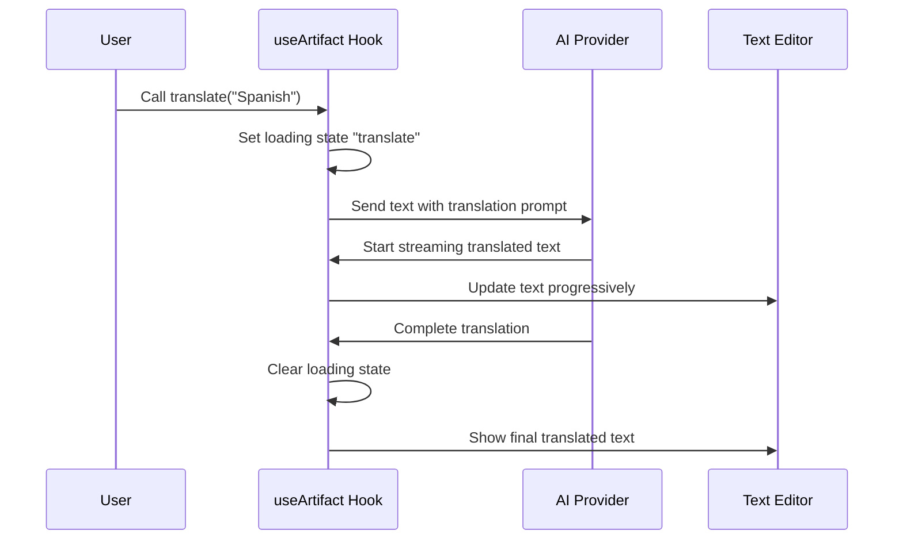

# Chapter 7: Artifact Manipulation

In [Chapter 6: Document Parsing](06_document_parsing_.md), we learned how to extract text from various document formats. Now, let's explore how to shape and refine that text to better suit your needs.

## Introduction: Your AI-Powered Text Editor

Imagine you've just finished writing a research report. It's full of valuable information, but maybe it's too technical for your audience, or perhaps you need a shorter version for an executive summary. Maybe you want to translate it into another language or make it more engaging with some emojis.

Artifact Manipulation is like having a smart text editor with built-in AI assistants that can transform your content in various ways with just a few clicks. Instead of manually rewriting everything, you can let the AI handle these transformations while preserving the core meaning of your text.

Let's say you've written a technical report about climate change and need to:
- Create a simpler version for a general audience
- Translate a section into Spanish for international colleagues
- Make a more concise version for a presentation
- Add some personality with emojis for a social media post

Artifact Manipulation makes all these tasks easy!

## Understanding Artifact Manipulation

The `useArtifact` hook provides several text transformation tools:

1. **Language Translation** - Convert text to different languages
2. **Reading Level Adjustment** - Simplify or make text more complex
3. **Length Adjustment** - Make text longer or shorter
4. **Text Continuation** - Extend text with AI-generated content
5. **Emoji Enhancement** - Add relevant emojis to text
6. **Custom Text Transformation** - Modify text based on custom instructions

Let's explore how to use each of these tools!

## Basic Usage: Transforming Your Text

First, let's set up the artifact manipulation hook:

```javascript
import useArtifact from "@/hooks/useArtifact";

function TextEditor() {
  const [text, setText] = useState("Climate change is a significant global challenge...");
  
  const { 
    translate, 
    changeReadingLevel 
  } = useArtifact({
    value: text,
    onChange: setText
  });
}
```

This code initializes the useArtifact hook with our text content and a function to update it. The hook returns several transformation functions we can use.

### Translating Text

To translate text to another language:

```javascript
function handleTranslate() {
  // Translate text to Spanish
  translate("Spanish");
}
```

This function call will transform your text from any language to Spanish. The AI handles the translation and updates your text automatically.

### Adjusting Reading Level

To make text simpler or more complex:

```javascript
function simplifyText() {
  // Make text suitable for middle school level
  changeReadingLevel("middle school");
}
```

This transforms complex content into simpler language appropriate for middle school readers, while keeping the core meaning intact.

For fun, you can even use special styles:

```javascript
function makePirateText() {
  // Transform text into pirate-speak
  changeReadingLevel("pirate");
}
```

Ahoy! This turns your text into swashbuckling pirate language, matey!

### Adjusting Text Length

Need a shorter or longer version of your text?

```javascript
function makeTextConcise() {
  const { adjustLength } = useArtifact({ value: text, onChange: setText });
  
  // Create a shorter version
  adjustLength("shorter");
}
```

This condenses your text while preserving the key points. You can also use "longer" to expand the content with more details.

### Continuing Text

Want to extend your text with AI-generated content?

```javascript
function continueWriting() {
  const { continuation } = useArtifact({ value: text, onChange: setText });
  
  // Generate additional text that follows your style
  continuation();
}
```

This function analyzes your writing style and adds more content that matches it, making it perfect for extending drafts or overcoming writer's block.

### Adding Emojis

Want to make your text more engaging?

```javascript
function enhanceWithEmojis() {
  const { addEmojis } = useArtifact({ value: text, onChange: setText });
  
  // Sprinkle appropriate emojis throughout the text
  addEmojis();
}
```

This intelligently adds relevant emojis to your text, making it more visually engaging for social media or informal communications.

### Custom Text Transformation

For more specialized needs, you can use the general-purpose AIWrite function:

```javascript
function customTransform() {
  const { AIWrite } = useArtifact({ value: text, onChange: setText });
  
  // Custom transformation instruction
  AIWrite("Convert this into a bullet-point summary");
}
```

This allows you to give any text transformation instruction to the AI.

## Under the Hood: How Artifact Manipulation Works

Let's see what happens when you call an artifact manipulation function:



When you call a function like `translate()`:

1. The hook sets a loading state to show the action in progress
2. It crafts a specialized prompt instructing the AI how to transform the text
3. It sends this prompt to the configured AI model via the [AI Provider Integration](02_ai_provider_integration_.md)
4. As the AI generates the new text, it streams back in real-time
5. The hook updates your text progressively as new content arrives
6. When complete, the loading state is cleared

### Core Implementation

The main functions in `useArtifact` follow a similar pattern. Here's a simplified version of the translate function:

```javascript
async function translate(lang, systemInstruction) {
  const { thinkingModel } = getModel();
  setLoadingAction("translate");
  
  const result = streamText({
    model: createProvider(thinkingModel),
    prompt: changeLanguagePrompt(value, lang, systemInstruction),
    experimental_transform: smoothTextStream(),
    onError: handleError,
  });
  
  let text = "";
  for await (const textPart of result.textStream) {
    text += textPart;
    onChange(text);
  }
  
  setLoadingAction("");
}
```

This function:
1. Gets the appropriate AI model for thinking tasks
2. Sets a loading state to indicate translation is happening
3. Streams text from the AI using a specialized translation prompt
4. Updates the content progressively as new text arrives
5. Clears the loading state when done

### Prompt Templates

Each transformation uses a specialized prompt template that instructs the AI exactly how to modify the text. Here's a simplified translation prompt:

```javascript
export function changeLanguagePrompt(content, lang, systemInstruction = "") {
  return `You are a professional ${lang} translator.
You can understand any language and translate it correctly into ${lang}.

Here is the content to translate:
<artifact>
${content}
</artifact>

Rules:
- ONLY change the language and nothing else.
- Respond with ONLY the translated text.`;
}
```

This prompt tells the AI:
1. What role to take (professional translator)
2. What language to translate to
3. The content to translate
4. Clear rules about what to change and what to preserve

Similar prompt templates exist for each transformation type, each carefully designed for its specific purpose.

## Integration with Research Workflow

Artifact Manipulation integrates seamlessly with the [Deep Research Workflow](01_deep_research_workflow_.md) to help refine research outputs:

```javascript
async function finalizeResearchReport(report) {
  const { value, setValue } = useState(report);
  const { changeReadingLevel, adjustLength } = useArtifact({
    value,
    onChange: setValue
  });
  
  // First adjust to the appropriate reading level
  await changeReadingLevel("undergraduate");
  
  // Then create a more concise version
  await adjustLength("shorter");
  
  return value;
}
```

This allows you to take AI-generated research content and fine-tune it for your specific audience and needs.

## Practical Examples

### Example 1: Simplifying a Technical Explanation

```javascript
// Original text: "Quantum computing leverages quantum mechanical phenomena 
// such as superposition and entanglement to perform computations."

// After changeReadingLevel("elementary school")
// Result: "Quantum computers are special computers that work with very tiny 
// things that can be in many places at once and connect to each other in 
// special ways. This helps them solve problems."
```

### Example 2: Translating a Business Report

```javascript
// Original text: "Q3 revenue increased by 15% compared to projections."

// After translate("Japanese")
// Result: "第3四半期の収益は予測と比較して15%増加しました。"
```

### Example 3: Adding Character with Emojis

```javascript
// Original text: "Our team successfully launched the new product yesterday."

// After addEmojis()
// Result: "Our team 👥 successfully launched 🚀 the new product ✨ yesterday! 🎉"
```

## Common Use Cases and Tips

1. **Academic Writing**: Use `changeReadingLevel` to adapt research content for different audiences (from "academic" to "high school" or "general audience")

2. **International Collaboration**: Use `translate` to share research with international colleagues

3. **Content Creation**: Use `continuation` to expand on your ideas or overcome writer's block

4. **Presentations**: Use `adjustLength("shorter")` to create concise presentation points from longer research content

5. **Engagement**: Use `addEmojis` to make social media posts about your research more engaging

## Conclusion

Artifact Manipulation provides a powerful set of AI-powered text transformation tools that help you refine and reshape your content for different purposes and audiences. By automating these transformations, it saves you time and effort while ensuring your message remains clear and consistent.

Whether you're simplifying complex research for a general audience, translating content for international colleagues, or creating more engaging versions for different platforms, these tools make the process quick and easy.

In the next chapter, [State Management with Zustand](08_state_management_with_zustand_.md), we'll explore how the application manages and persists all this research data across your sessions.

---

Generated by [AI Codebase Knowledge Builder](https://github.com/The-Pocket/Tutorial-Codebase-Knowledge)