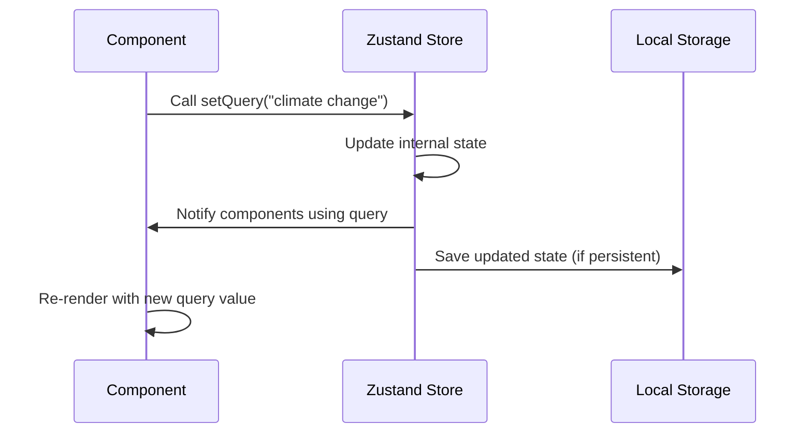

# Chapter 8: State Management with Zustand

In [Chapter 7: Artifact Manipulation](07_artifact_manipulation_.md), we learned how to transform and refine text for different purposes. Now, let's explore how our application keeps track of all this data across different components and sessions.

## Introduction: Your Application's Memory

Imagine you're doing complex research that involves multiple steps: asking questions, gathering information, analyzing data, and creating reports. Throughout this process, you need to remember many things:

- What was my original research question?
- What search queries have I tried?
- What information have I collected?
- What settings am I using for AI models?

State management is like your application's memory. It gives your app the ability to remember information across different screens and even after you close and reopen your browser.

Zustand (German for "state") is a lightweight state management library that helps organize this "memory" in a simple, predictable way - like having a set of labeled boxes where you store different types of information.

## Understanding State Management with Zustand

Let's break down how state management works in our application:

### 1. Creating a Store

A "store" is a container for a specific type of information. In our project, we have separate stores for:

- **Task information** - current research, questions, results
- **Knowledge base** - imported documents and resources
- **Settings** - API keys, model preferences, search settings
- **History** - past research projects
- **UI state** - which panels are open or closed

Creating a simple store with Zustand looks like this:

```javascript
import { create } from "zustand";

const useCounterStore = create((set) => ({
  count: 0,
  increment: () => set((state) => ({ count: state.count + 1 })),
  decrement: () => set((state) => ({ count: state.count - 1 })),
}));
```

This creates a store that tracks a counter value and provides functions to increase or decrease it.

### 2. Using Store Values

Once you've created a store, you can access its values from any component:

```javascript
function CounterDisplay() {
  const count = useCounterStore((state) => state.count);
  return <div>Current count: {count}</div>;
}
```

This component will automatically update whenever the count changes.

### 3. Updating Store Values

You can update store values using the functions you defined:

```javascript
function CounterButtons() {
  const { increment, decrement } = useCounterStore();
  
  return (
    <div>
      <button onClick={increment}>+</button>
      <button onClick={decrement}>-</button>
    </div>
  );
}
```

When these buttons are clicked, the counter value changes, and any component using that value updates automatically.

## The Deep Research State Architecture

Our application uses several key stores to manage different aspects of the research process:

### Task Store - Managing the Current Research

The Task Store keeps track of your current research project:

```javascript
import { useTaskStore } from "@/store/task";

function ResearchComponent() {
  // Get values from the store
  const query = useTaskStore((state) => state.query);
  const reportPlan = useTaskStore((state) => state.reportPlan);
  
  // Get functions to update the store
  const { setQuery, updateReportPlan } = useTaskStore();
}
```

This store tracks everything about your current research: your question, search results, report plan, and more.

### Knowledge Store - Your Research Library

The Knowledge Store manages your imported documents and information:

```javascript
import { useKnowledgeStore } from "@/store/knowledge";

function KnowledgeComponent() {
  // Get all knowledge items
  const knowledges = useKnowledgeStore((state) => state.knowledges);
  
  // Get functions to manage knowledge
  const { save, remove } = useKnowledgeStore();
}
```

This store lets you save and retrieve information from your personal knowledge base.

### Settings Store - Application Configuration

The Settings Store manages your preferences and API configurations:

```javascript
import { useSettingStore } from "@/store/setting";

function SettingsComponent() {
  // Get current settings
  const searchProvider = useSettingStore((state) => state.searchProvider);
  const thinkingModel = useSettingStore((state) => state.thinkingModel);
  
  // Update settings
  const { update } = useSettingStore();
}
```

This configures which AI models and search providers your application uses.

## Using State in Your Application

Let's see how to use these stores to manage a research project:

### 1. Starting a New Research Query

```javascript
function NewResearch() {
  const { setQuery, setQuestion } = useTaskStore();
  
  function handleSubmit(research) {
    setQuery(research);
    setQuestion("Tell me about " + research);
  }
}
```

This sets the initial query for your research, which will be tracked in the Task Store.

### 2. Saving Research Results

```javascript
function SaveResearchButton() {
  const { save } = useHistoryStore();
  const taskState = useTaskStore.getState();
  
  function handleSave() {
    save(taskState);
    alert("Research saved to history!");
  }
}
```

This saves your current research to the History Store so you can access it later.

### 3. Loading Saved Research

```javascript
function LoadResearch({ id }) {
  const { load } = useHistoryStore();
  const { restore } = useTaskStore();
  
  function handleLoad() {
    const savedResearch = load(id);
    if (savedResearch) {
      restore(savedResearch);
    }
  }
}
```

This loads a past research project from history into your current workspace.

## Data Persistence: Remembering Across Sessions

One powerful feature of our state management system is persistence - saving data even when you close your browser:

```javascript
// From src/store/knowledge.ts (simplified)
export const useKnowledgeStore = create(
  persist(
    (set, get) => ({
      knowledges: [],
      save: (knowledge) => 
        set((state) => ({ 
          knowledges: [knowledge, ...state.knowledges] 
        })),
      // Other functions...
    }),
    { name: "knowledgeStore" }
  )
);
```

The `persist` wrapper automatically saves your data to the browser's storage. When you reopen the application, your research, settings, and knowledge are all still there!

## Under the Hood: How Zustand Works

Let's visualize what happens when you update a store value:



When you update a store value:

1. You call a function from the store (like `setQuery`)
2. The store updates its internal state
3. Any components that use that value are notified
4. If the store is persistent, the data is saved to local storage
5. Components re-render with the new value

### Core Implementation Detail: The Store Pattern

The pattern used by our stores looks like this:

```javascript
// Basic structure of our stores
export const useStore = create(
  persist(
    (set, get) => ({
      // State values
      someValue: initialValue,
      
      // Functions to update state
      updateValue: (newValue) => set(() => ({ someValue: newValue })),
      
      // Functions that use current state
      computeFromState: () => {
        const current = get().someValue;
        return current + " processed";
      },
    }),
    { name: "storeName" } // Persistence configuration
  )
);
```

Each store follows this pattern, providing:
1. State values that represent your data
2. Functions to update these values
3. Optional persistence configuration

## Integration with the Research Workflow

The state management system is central to the [Deep Research Workflow](01_deep_research_workflow_.md) we explored in Chapter 1:

```javascript
// Simplified research workflow
async function conductResearch(query) {
  // Set the query in the task store
  useTaskStore.getState().setQuery(query);
  
  // Get settings for AI models
  const { thinkingModel } = useSettingStore.getState();
  
  // Generate questions using AI
  const questions = await generateQuestions(query, thinkingModel);
  
  // Save questions to the task store
  useTaskStore.getState().updateQuestions(questions);
  
  // Continue with research process...
}
```

Throughout the research workflow, the state stores act as the central nervous system:
1. The Task Store tracks the current research state
2. The Settings Store provides configuration for AI and search providers
3. The Knowledge Store supplies relevant information from your library
4. The History Store saves completed research for future reference

## Advanced Feature: Combining Multiple Stores

Often you'll need information from multiple stores:

```javascript
function ResearchWithKnowledge() {
  // Get current query from task store
  const query = useTaskStore((state) => state.query);
  
  // Get all knowledge items
  const knowledges = useKnowledgeStore((state) => state.knowledges);
  
  // Find knowledge relevant to current query
  const relevantKnowledge = knowledges.filter(item => 
    item.content.includes(query)
  );
}
```

This powerful feature lets you connect different parts of your application's state - like finding knowledge relevant to your current research.

## Practical Tips for State Management

1. **Keep related data together**: Group related information in the same store

2. **Use selectors efficiently**: Only select the specific data you need
   ```javascript
   // Good: Only get what you need
   const query = useTaskStore((state) => state.query);
   
   // Less efficient: Gets entire state
   const { query } = useTaskStore();
   ```

3. **Update state immutably**: Don't modify state directly, create new objects
   ```javascript
   // Good: Creates new array
   set((state) => ({ tasks: [...state.tasks, newTask] }));
   
   // Bad: Modifies existing array
   state.tasks.push(newTask);
   ```

4. **Use getState() for external functions**: When working outside React components
   ```javascript
   function processExternally() {
     const currentState = useTaskStore.getState();
     // Now you can use the state outside a component
   }
   ```

## Conclusion

State management with Zustand provides the memory system for our application, keeping track of everything from user settings to complex research tasks. By organizing our data into specialized stores and using a consistent pattern to update them, we ensure that information flows predictably throughout the application.

This system allows the deep-research project to maintain complex state across different components and even across browser sessions, making your research experience seamless and efficient.

In the next chapter, [API Middleware & Security](09_api_middleware___security_.md), we'll explore how our application securely communicates with external services like AI and search providers, protecting your API keys and ensuring reliable connectivity.

---

Generated by [AI Codebase Knowledge Builder](https://github.com/The-Pocket/Tutorial-Codebase-Knowledge)