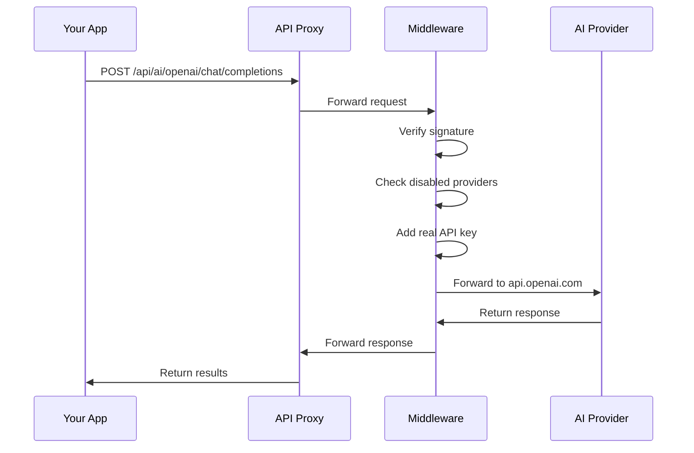

# Chapter 9: API Middleware & Security

In [Chapter 8: State Management with Zustand](08_state_management_with_zustand_.md), we learned how our application manages and persists data. Now, let's explore how it securely communicates with external AI and search services.

## Introduction: Your API Security Guard

Imagine you need to make a phone call to several important people who only accept calls from trusted sources. Instead of giving everyone your direct number, you hire a receptionist who:

1. Verifies callers are actually allowed to contact these VIPs
2. Places the calls using special access numbers you've provided
3. Connects the caller without revealing the secret access numbers
4. Maintains a record of all communication

API Middleware works exactly like this receptionist. When your application needs to communicate with external services like OpenAI or Google, the middleware:

1. Verifies the request is legitimate and authorized
2. Adds your actual API keys (which are stored securely on the server)
3. Forwards the request to the correct service
4. Returns the response to your application

This keeps your valuable API keys secure while allowing your application to use powerful external services.

## Understanding API Middleware & Security

Let's break this down into a few key concepts:

### 1. API Proxy Routing

Your application doesn't call external APIs directly. Instead, it sends requests to your own server endpoints that act as proxies:

```javascript
// Instead of calling https://api.openai.com directly
const response = await fetch("/api/ai/openai/v1/chat/completions", {
  method: "POST",
  headers: { "Authorization": `Bearer ${tempAccessKey}` },
  body: JSON.stringify(payload)
});
```

This code sends a request to your own server's endpoint, not directly to OpenAI. The middleware then forwards it to the actual OpenAI API.

### 2. Temporary Access Keys

Instead of putting real API keys in your frontend code (which would be a security risk), your application uses temporary access keys:

```javascript
// Generate a temporary access key
const accessKey = generateSignature(accessPassword, Date.now());

// Use this temporary key for authentication
const headers = {
  "Authorization": `Bearer ${accessKey}`
};
```

This generates a secure, time-based signature that your middleware can verify. It's like a temporary passcode rather than your permanent API key.

### 3. API Key Management

Your actual API keys are stored securely on the server as environment variables:

```javascript
// These are securely stored on the server, not in browser code
const OPENAI_API_KEY = process.env.OPENAI_API_KEY || "";
const GOOGLE_GENERATIVE_AI_API_KEY = process.env.GOOGLE_GENERATIVE_AI_API_KEY || "";
```

The middleware adds these real keys to requests after verifying they're legitimate.

### 4. Request Verification

Before forwarding any request, the middleware verifies it's authorized:

```javascript
// Verify the request signature
if (!verifySignature(authorization.substring(7), accessPassword, Date.now())) {
  return NextResponse.json({ error: "No permissions" }, { status: 403 });
}
```

This prevents unauthorized users from accessing your API services through your proxy.

## Using API Middleware in Your Application

Let's see how your application uses this security system to talk to AI services:

### 1. Setting Up API Routes

First, your application defines which API endpoints to proxy:

```javascript
// From next.config.ts (simplified)
nextConfig.rewrites = async () => {
  return [
    {
      source: "/api/ai/openai/:path*",
      destination: `${OPENAI_API_BASE_URL}/:path*`,
    },
    {
      source: "/api/ai/google/:path*",
      destination: `${GOOGLE_GENERATIVE_AI_API_BASE_URL}/:path*`,
    },
    // More API routes...
  ];
};
```

This tells your application to forward requests from "/api/ai/openai/..." to the actual OpenAI API URL.

### 2. Making Secure API Calls

When using an AI provider, your application creates a secure request:

```javascript
// From src/hooks/useModelProvider.ts (simplified)
async function callOpenAI(prompt) {
  // Generate temporary access key
  const accessKey = generateSignature(accessPassword, Date.now());
  
  // Call through proxy endpoint
  return fetch("/api/ai/openai/v1/chat/completions", {
    method: "POST",
    headers: {
      "Content-Type": "application/json",
      "Authorization": `Bearer ${accessKey}`
    },
    body: JSON.stringify({
      model: "gpt-4",
      messages: [{ role: "user", content: prompt }]
    })
  });
}
```

This code creates a secure request that will be verified by the middleware.

## Under the Hood: How API Middleware Works

Let's visualize what happens when you make an API request:



Here's what happens step by step:

1. Your application sends a request to your proxy endpoint
2. The proxy forwards it to the middleware
3. The middleware verifies the request signature
4. It checks if this provider or model is disabled
5. It adds your real API key from secure environment variables
6. It forwards the request to the actual external API
7. The external API sends back a response
8. The middleware forwards the response back to your application

### Middleware Implementation

Let's look at how the middleware handles requests:

```javascript
// From src/middleware.ts (simplified)
export async function middleware(request: NextRequest) {
  // Check if this is an OpenAI request
  if (request.nextUrl.pathname.startsWith("/api/ai/openai")) {
    // Extract the authorization header
    const authorization = request.headers.get("authorization") || "";
    
    // Verify the signature is valid
    if (!verifySignature(authorization.substring(7), accessPassword, Date.now())) {
      return NextResponse.json({ error: "No permissions" }, { status: 403 });
    }
    
    // Get the real API key
    const apiKey = OPENAI_API_KEY;
    
    // Create new headers with the real API key
    const requestHeaders = new Headers();
    requestHeaders.set("Content-Type", "application/json");
    requestHeaders.set("Authorization", `Bearer ${apiKey}`);
    
    // Forward the request with the real API key
    return NextResponse.next({
      request: { headers: requestHeaders }
    });
  }
  
  // Similar handling for other providers...
}
```

This middleware function intercepts API requests, verifies they're authorized, and adds the real API keys before forwarding them.

### Signature Verification

The security system uses a signature system to verify requests:

```javascript
// From src/utils/signature.ts
export function generateSignature(key: string, timestamp: number): string {
  const data = `${key}::${timestamp.toString().substring(0, 8)}`;
  return Md5.hashStr(data);
}

export function verifySignature(
  signature = "",
  key: string,
  timestamp: number
): boolean {
  const generatedSignature = generateSignature(key, timestamp);
  return signature === generatedSignature;
}
```

This creates and verifies secure, time-based signatures using a shared secret (the access password).

## Supporting Multiple Providers

The middleware supports many different AI and search providers:

```javascript
// From src/middleware.ts (simplified)
if (request.nextUrl.pathname.startsWith("/api/ai/google")) {
  // Google-specific authentication
  // ...
} else if (request.nextUrl.pathname.startsWith("/api/ai/anthropic")) {
  // Anthropic-specific authentication
  // ...
} else if (request.nextUrl.pathname.startsWith("/api/search/tavily")) {
  // Tavily-specific authentication
  // ...
}
```

Each provider may have different authentication requirements, which the middleware handles appropriately.

## Integration with Other Components

The API Middleware works closely with other parts of the application:

1. **AI Provider Integration**: In [Chapter 2: AI Provider Integration](02_ai_provider_integration_.md), we learned how the application creates provider-specific clients. These clients use the secure middleware to make their API calls.

2. **Search Provider Integration**: Similarly, the [Search Provider Integration](03_search_provider_integration_.md) uses the middleware to securely communicate with search services.

3. **State Management**: The [State Management](08_state_management_with_zustand_.md) system stores configurations like which providers to use, while the middleware enforces these settings.

## Advanced Feature: API Key Rotation

For extra security, the middleware can rotate between multiple API keys:

```javascript
// From src/utils/model.ts (simplified)
export function multiApiKeyPolling(apiKeys = "") {
  // Split multiple API keys by comma
  const keys = apiKeys.split(",").filter(Boolean);
  
  // If only one key, return it
  if (keys.length <= 1) return apiKeys;
  
  // Otherwise, select a key based on the current time
  const index = Math.floor(Date.now() / 1000) % keys.length;
  return keys[index];
}
```

This function rotates between multiple API keys to distribute usage and avoid rate limits.

## Practical Tips for API Security

1. **Never expose API keys in frontend code**: Always use a secure proxy like this middleware.

2. **Use temporary access tokens**: Generate time-limited signatures instead of sharing permanent credentials.

3. **Validate all requests**: Always verify that requests are legitimate before forwarding them.

4. **Implement proper error handling**: Return clear errors when requests can't be processed.

## Conclusion

API Middleware & Security acts as your application's security guard, ensuring that all communications with external services are properly authenticated and secured. It keeps your valuable API keys protected while still allowing your application to leverage powerful AI and search capabilities.

By routing requests through a secure proxy, verifying their authenticity, and adding real API keys only on the server side, the middleware prevents unauthorized access to external services and protects your credentials from exposure.

This completes our exploration of the core components of the deep-research project. You now understand how the application manages research workflows, integrates with AI and search providers, processes documents, manipulates text, manages state, and securely communicates with external services.

---

Generated by [AI Codebase Knowledge Builder](https://github.com/The-Pocket/Tutorial-Codebase-Knowledge)