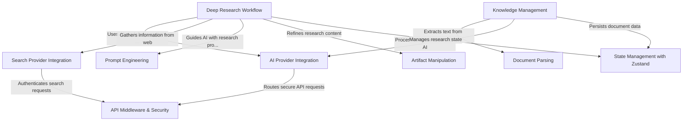

# Tutorial: deep-research

**Deep Research** is an AI-powered research assistant that helps users conduct comprehensive research on any topic. It integrates with *multiple AI models* (like OpenAI, Google, Anthropic) and *search engines* to gather information, analyze documents, and generate detailed reports. The application extracts text from various file formats, searches the web for relevant information, and synthesizes findings into well-structured research documents - all while maintaining security through API middleware and organizing data with state management.

**Source Repository:** [https://github.com/u14app/deep-research](https://github.com/u14app/deep-research)

## Chapters

1. [Deep Research Workflow
](01_deep_research_workflow_.md)
2. [AI Provider Integration
](02_ai_provider_integration_.md)
3. [Search Provider Integration
](03_search_provider_integration_.md)
4. [Prompt Engineering
](04_prompt_engineering_.md)
5. [Knowledge Management
](05_knowledge_management_.md)
6. [Document Parsing
](06_document_parsing_.md)
7. [Artifact Manipulation
](07_artifact_manipulation_.md)
8. [State Management with Zustand
](08_state_management_with_zustand_.md)
9. [API Middleware & Security
](09_api_middleware___security_.md)

---

Generated by [AI Codebase Knowledge Builder](https://github.com/The-Pocket/Tutorial-Codebase-Knowledge)