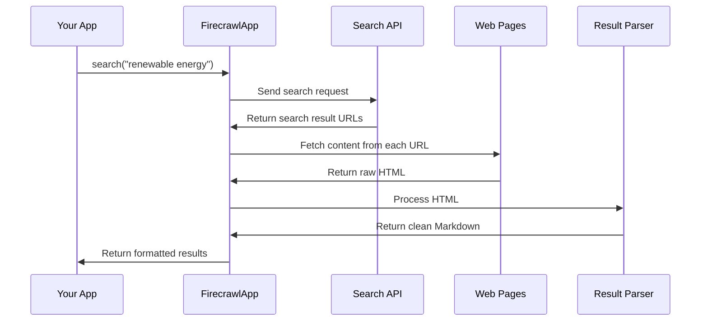

# Chapter 6: FirecrawlApp Integration

In [Chapter 5: Search Result Processing](05_search_result_processing_.md), we learned how to extract valuable information from search results. But how do we actually get those search results in the first place? That's where FirecrawlApp comes in!

## Your Personal Web Explorer

Think of FirecrawlApp as your tireless research assistant who does the actual legwork of exploring the web. When you need information about a topic, FirecrawlApp goes out to find relevant web pages, reads their content, and brings back what it discovers.

Without this component, our research system would be like a brilliant analyst with no data to analyze. FirecrawlApp solves this problem by connecting our system to the vast knowledge available on the internet.

## A Simple Example

Imagine you're researching "renewable energy in developing countries." You need real data about solar panel adoption in India, wind farm projects in Brazil, or hydroelectric initiatives in Kenya.

Using FirecrawlApp, our system can:
1. Turn your query into web-friendly search terms
2. Send those terms to search engines
3. Retrieve the actual content of the most relevant pages
4. Bring that content back for analysis

Instead of manually searching and copying information, FirecrawlApp does this automatically, saving hours of tedious work!

## Key Concepts

Let's break down the important aspects of FirecrawlApp Integration:

### 1. Search API Connection
FirecrawlApp connects to search engines and web services to find information relevant to your query.

### 2. Content Retrieval
Once relevant pages are identified, FirecrawlApp fetches the actual content from those pages.

### 3. Format Conversion
Web pages contain lots of formatting, menus, ads, etc. FirecrawlApp extracts the main content and converts it to a clean format (Markdown) for easier processing.

### 4. Error Handling
The web is unpredictable - pages time out, servers go down, content changes. FirecrawlApp includes robust error handling to deal with these challenges.

## Using FirecrawlApp in Your Research

Here's a simple example of how to use FirecrawlApp directly:

```javascript
// Initialize the FirecrawlApp with your API key
const firecrawl = new FirecrawlApp({
  apiKey: process.env.FIRECRAWL_KEY || '',
});

// Search for a topic
const results = await firecrawl.search("renewable energy in India");
```

This code initializes FirecrawlApp with your API key and performs a basic search. The results contain the content from relevant web pages.

You can customize your search with additional options:

```javascript
// More detailed search with options
const results = await firecrawl.search("solar power adoption", {
  timeout: 10000,        // 10 second timeout
  limit: 5,              // Get 5 results
  scrapeOptions: {
    formats: ['markdown'] // Get content in Markdown format
  }
});
```

This example sets a timeout of 10 seconds (to avoid hanging if pages are slow), limits to 5 results, and specifies that we want content returned in Markdown format.

## FirecrawlApp in the Deep Research Process

In our overall research system, FirecrawlApp is called from within the `deepResearch` function:

```javascript
// Inside the deepResearch function
const result = await firecrawl.search(serpQuery.query, {
  timeout: 15000,
  limit: 5,
  scrapeOptions: { formats: ['markdown'] },
});
```

This snippet shows how we pass the generated search query to FirecrawlApp, along with options to customize the search. The results are then passed to the [Search Result Processing](05_search_result_processing_.md) component to extract valuable information.

## Under the Hood: How FirecrawlApp Works

When you make a search request through FirecrawlApp, here's what happens behind the scenes:



1. Your application calls the search method with a query
2. FirecrawlApp connects to a search API to find relevant URLs
3. It retrieves the actual content from those URLs
4. It processes the HTML to extract the main content
5. It converts the content to Markdown for easier analysis
6. It returns the formatted results to your application

## Inside the FirecrawlApp Integration

Let's take a closer look at how FirecrawlApp is implemented in our system:

### Initialization

First, we need to initialize FirecrawlApp with our API key:

```javascript
// From src/deep-research.ts
const firecrawl = new FirecrawlApp({
  apiKey: process.env.FIRECRAWL_KEY ?? '',
  apiUrl: process.env.FIRECRAWL_BASE_URL,
});
```

This creates a new instance of FirecrawlApp configured with our API key. We can also specify a custom API URL if needed.

### Managing Concurrency

To avoid overwhelming the search API, we use a concurrency limit:

```javascript
// Limit concurrent searches
const ConcurrencyLimit = Number(process.env.FIRECRAWL_CONCURRENCY) || 2;

// Create a limit function
const limit = pLimit(ConcurrencyLimit);
```

This ensures we don't make too many search requests at once, which could lead to rate limiting or even being blocked by search engines.

### Performing Searches

In the `deepResearch` function, we map each query to a search operation:

```javascript
const results = await Promise.all(
  serpQueries.map(serpQuery =>
    limit(async () => {
      try {
        // Perform the search with FirecrawlApp
        const result = await firecrawl.search(serpQuery.query, {
          timeout: 15000,
          limit: 5,
          scrapeOptions: { formats: ['markdown'] },
        });
        
        // ... process results ...
      } catch (e) {
        // ... handle errors ...
      }
    })
  )
);
```

This code:
1. Takes each generated search query
2. Uses the concurrency limiter to control how many run at once
3. Makes the actual search request to FirecrawlApp
4. Wraps everything in a try/catch block to handle errors

### Error Handling

FirecrawlApp integration includes robust error handling:

```javascript
try {
  // Search code here...
} catch (e: any) {
  if (e.message && e.message.includes('Timeout')) {
    log(`Timeout error running query: ${serpQuery.query}: `, e);
  } else {
    log(`Error running query: ${serpQuery.query}: `, e);
  }
  return {
    learnings: [],
    visitedUrls: [],
  };
}
```

This ensures that if a search fails (due to timeout, network issues, etc.), the entire research process doesn't crash. Instead, it logs the error and continues with other queries.

## Customizing FirecrawlApp Behavior

You can customize FirecrawlApp's behavior in several ways:

### 1. Setting Timeouts

```javascript
// Set a 10-second timeout
const result = await firecrawl.search(query, {
  timeout: 10000  // 10 seconds
});
```

This prevents searches from hanging indefinitely if a website is slow to respond.

### 2. Limiting Results

```javascript
// Get only 3 results
const result = await firecrawl.search(query, {
  limit: 3
});
```

This controls how many results are returned. Fewer results mean faster searches but potentially less information.

### 3. Specifying Content Format

```javascript
// Get content in Markdown format
const result = await firecrawl.search(query, {
  scrapeOptions: { 
    formats: ['markdown'] 
  }
});
```

This tells FirecrawlApp to convert web content to Markdown, making it easier to process.

## Best Practices for FirecrawlApp Integration

When working with FirecrawlApp, keep these tips in mind:

1. **Set reasonable timeouts**: The web can be slow, but waiting too long decreases research efficiency.

2. **Use concurrency limits**: Respect search engines by not making too many requests at once.

3. **Handle errors gracefully**: Always include error handling to make your application resilient.

4. **Store your API key safely**: Use environment variables instead of hardcoding API keys.

5. **Cache results when possible**: To avoid redundant searches for the same information.

## FirecrawlApp Response Structure

When FirecrawlApp returns search results, here's what the data looks like:

```javascript
// Example response structure
{
  data: [
    {
      url: "https://example.com/page1",
      title: "Renewable Energy Solutions",
      markdown: "# Renewable Energy\n\nSolar power has become...",
      // other fields...
    },
    // more results...
  ]
}
```

This structured format makes it easy to extract the URL, title, and content of each result. The Markdown field contains the cleaned, formatted content of the page.

## Conclusion

FirecrawlApp Integration is like having a skilled research assistant who knows exactly how to navigate the vast library of the internet. It handles the complex task of finding and retrieving relevant information so that the rest of our system can focus on analyzing and synthesizing that information into valuable insights.

By managing API connections, handling errors, and formatting content appropriately, FirecrawlApp provides the raw material that powers our entire research process. Without it, we'd have a research system with nothing to research!

In this chapter, we've learned:
- How FirecrawlApp connects our system to web content
- How to initialize and use FirecrawlApp for searches
- How to customize search behavior with options
- How errors are handled to ensure reliability
- Best practices for effective integration

Now that we understand how to retrieve information from the web, let's see how we combine all this information into coherent research results in [Research Result Synthesis](07_research_result_synthesis_.md).

---

Generated by [AI Codebase Knowledge Builder](https://github.com/The-Pocket/Tutorial-Codebase-Knowledge)