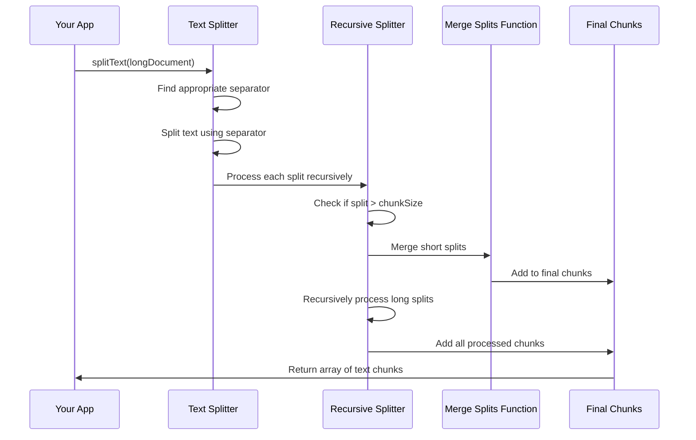

# Chapter 10: Text Processing Utilities

In [Chapter 9: AI Model Management](09_ai_model_management_.md), we explored how our system communicates with different AI models. Now, let's tackle another essential challenge: how do we handle documents that are too large for these models to process all at once?

## The Paper Cutter Problem

Think about a really long research paper - maybe 50 pages. If you ask someone to read the entire thing at once, they might get overwhelmed. Instead, you might cut it into sections like "Introduction," "Methods," "Results," and so on, making it easier to digest.

AI models face a similar challenge. They have what's called a "context window" or "token limit" - they can only look at a certain amount of text at one time. For example, some models might only be able to process about 4,000 words at once.

The Text Processing Utilities in deep-research solve this problem by acting like a smart paper cutter. They take large documents and divide them into smaller "chunks" that fit within AI model limits - but they do this intelligently, cutting at natural boundaries like paragraphs or sentences rather than mid-sentence or mid-word.

## A Simple Example

Let's say you have a 20-page research paper on climate change that you want to analyze with an AI model. Without text processing, you might encounter this error:

```
Error: Input exceeds maximum context length (8,192 tokens)
```

With our Text Processing Utilities, you can handle this gracefully:

```javascript
// Create a text splitter with specific parameters
const splitter = new RecursiveCharacterTextSplitter({
  chunkSize: 4000,  // Characters per chunk
  chunkOverlap: 200 // Overlap between chunks
});

// Split the large document
const chunks = splitter.splitText(largeResearchPaper);

// Now process each chunk with your AI model
for (const chunk of chunks) {
  await processWithAI(chunk);
}
```

This code creates a text splitter, divides your document into chunks of approximately 4000 characters each (with a 200-character overlap between chunks), and then allows you to process each chunk separately.

## Key Concepts

Let's understand the key concepts of text processing:

### 1. Chunks and Chunk Size

A "chunk" is simply a piece of the original document. The "chunk size" determines how big each piece should be, usually measured in characters or tokens (roughly words or parts of words).

### 2. Chunk Overlap

To maintain context between chunks, we include some overlap. If one chunk ends with "The climate change impact on polar" and the next begins with "bears is significant," the overlap ensures we don't lose the connection between "polar" and "bears."

### 3. Intelligent Splitting

Our system tries to split text at natural boundaries like paragraph breaks, sentences, or even commas - never in the middle of words or phrases if possible.

### 4. Recursive Approach

For very large documents, the system works recursively - first trying to split at paragraph breaks, then sentences, then smaller units if needed.

## How to Use Text Processing Utilities

Let's walk through how to use these utilities for different scenarios:

### Basic Text Splitting

```javascript
// Import the text splitter
import { RecursiveCharacterTextSplitter } from './text-splitter';

// Create a splitter with default settings
const splitter = new RecursiveCharacterTextSplitter({
  chunkSize: 1000,  // Characters per chunk
  chunkOverlap: 100 // Overlap between chunks
});

// Split a document
const text = "This is a very long document...";
const chunks = splitter.splitText(text);
```

This code imports the text splitter, initializes it with parameters for chunk size and overlap, and then splits a document into chunks.

### Customizing Separators

You can also specify which characters or patterns should be used as separation points:

```javascript
// Create a splitter with custom separators
const splitter = new RecursiveCharacterTextSplitter({
  chunkSize: 1000,
  chunkOverlap: 100,
  separators: ['\n\n', '\n', '. ', ', ', ' ', '']
});
```

This code creates a splitter that will try to split first at paragraph breaks, then line breaks, then sentences, and so on. The empty string at the end is a fallback that splits character by character if needed.

### Processing Multiple Documents

```javascript
// Process a collection of documents
const documents = ["Doc 1 content...", "Doc 2 content..."];
const allChunks = splitter.createDocuments(documents);

// Now allChunks contains all documents split into appropriate sizes
```

This utility method helps when you have multiple documents to process at once.

## Under the Hood: How It Works

When you split a document, here's what happens step by step:



1. The system receives a large document
2. It tries to find the most appropriate separator (paragraph, sentence, etc.)
3. It splits the text using that separator
4. For each piece that's still too large, it recursively splits again with a finer separator
5. It merges small pieces together until they approach (but don't exceed) the chunk size
6. It ensures consecutive chunks have some overlap for context preservation
7. It returns an array of appropriately sized text chunks

Let's look at the key parts of the implementation from `src/ai/text-splitter.ts`:

### The Core Splitter Class

```javascript
export class RecursiveCharacterTextSplitter extends TextSplitter {
  // Default separators in order of preference
  separators: string[] = ['\n\n', '\n', '.', ',', '>', '<', ' ', ''];

  constructor(fields?: Partial<RecursiveCharacterTextSplitterParams>) {
    super(fields);
    this.separators = fields?.separators ?? this.separators;
  }
  
  // More code follows...
}
```

This establishes the `RecursiveCharacterTextSplitter` class with default separators. The separators are ordered from largest logical units (paragraphs) to smallest (individual characters).

### The Split Text Method

```javascript
splitText(text: string): string[] {
  const finalChunks: string[] = [];
  
  // Find the first separator that exists in the text
  let separator: string = this.separators[this.separators.length - 1]!;
  for (const s of this.separators) {
    if (text.includes(s)) {
      separator = s;
      break;
    }
  }
  
  // Split the text using this separator
  let splits: string[];
  if (separator) {
    splits = text.split(separator);
  } else {
    splits = text.split('');
  }
  
  // More code to process splits...
}
```

This method finds the first appropriate separator present in the text and splits the document using it. For example, if the text contains paragraph breaks, it will split at paragraphs first.

### Handling Splits Recursively

```javascript
// Inside splitText method
let goodSplits: string[] = [];
for (const s of splits) {
  if (s.length < this.chunkSize) {
    // If the split is small enough, keep it
    goodSplits.push(s);
  } else {
    // If we have accumulated small splits, merge them
    if (goodSplits.length) {
      const mergedText = this.mergeSplits(goodSplits, separator);
      finalChunks.push(...mergedText);
      goodSplits = [];
    }
    // Recursively split the large split
    const otherInfo = this.splitText(s);
    finalChunks.push(...otherInfo);
  }
}
```

This section processes each split. If a split is small enough, it's added to `goodSplits`. If a split is too large, it's split recursively using finer separators.

### Merging Splits with Overlap

```javascript
mergeSplits(splits: string[], separator: string): string[] {
  const docs: string[] = [];
  const currentDoc: string[] = [];
  let total = 0;
  
  for (const d of splits) {
    const _len = d.length;
    
    // If adding this split would exceed chunk size
    if (total + _len >= this.chunkSize) {
      // Add current accumulated splits as a chunk
      if (currentDoc.length > 0) {
        const doc = this.joinDocs(currentDoc, separator);
        if (doc !== null) {
          docs.push(doc);
        }
        
        // Remove from the start until we're under overlap size
        while (total > this.chunkOverlap) {
          total -= currentDoc[0]!.length;
          currentDoc.shift();
        }
      }
    }
    
    // Add the current split
    currentDoc.push(d);
    total += _len;
  }
  
  // Add any remaining content
  const doc = this.joinDocs(currentDoc, separator);
  if (doc !== null) {
    docs.push(doc);
  }
  
  return docs;
}
```

This method takes small splits and combines them into chunks that approach (but don't exceed) the maximum chunk size. It also ensures there's proper overlap between consecutive chunks.

## Practical Applications

In our [Deep Research Process](01_deep_research_process_.md), text processing is crucial when:

1. **Processing Search Results**: When web pages are too long to analyze at once
   
2. **Generating Reports**: When synthesizing large amounts of information

3. **Trimming Prompts**: When ensuring prompts fit within token limits

For example, in the `providers.ts` file, the `trimPrompt` function uses our text splitter:

```javascript
export function trimPrompt(
  prompt: string,
  contextSize = Number(process.env.CONTEXT_SIZE) || 128_000,
) {
  // Check if prompt exceeds context size
  const length = encoder.encode(prompt).length;
  if (length <= contextSize) {
    return prompt;
  }

  // Calculate how much to trim
  const overflowTokens = length - contextSize;
  const chunkSize = prompt.length - overflowTokens * 3;
  
  // Use the text splitter to trim intelligently
  const splitter = new RecursiveCharacterTextSplitter({
    chunkSize,
    chunkOverlap: 0,
  });
  
  return splitter.splitText(prompt)[0] ?? '';
}
```

This function uses our text splitter to ensure prompts don't exceed the AI model's context window, trimming them in an intelligent way if they do.

## A Library Book Analogy

Think of our text processing system like a librarian organizing books:

1. **Full Library** = The complete document
2. **Bookshelves** = Major sections split by paragraph breaks
3. **Book Categories** = Sentences within paragraphs
4. **Individual Books** = Words or phrases
5. **Cross-References** = The overlap between chunks

Just as a good librarian ensures you can navigate smoothly between related books by providing cross-references, our text processing system ensures that the connections between chunks are maintained through strategic overlap.

## Conclusion

Text Processing Utilities might not be the most glamorous part of our deep research system, but they're absolutely essential. They're like the invisible infrastructure that makes everything else possible - without them, our AI models would constantly run into token limits and be unable to process larger documents.

By intelligently dividing text at natural boundaries and maintaining context through overlap, these utilities ensure that even when we're processing large documents piece by piece, we don't lose the coherence and meaning of the whole.

In this chapter, we've learned:
- Why token limits in AI models create challenges for processing large documents
- How text chunking solves this problem by dividing documents intelligently
- How to use the RecursiveCharacterTextSplitter for different scenarios
- How the splitting process works under the hood
- How text processing supports our overall research process

With this understanding of how we process text, you now have a complete picture of all the key components in the deep-research project. You've learned about the entire process from query generation to result synthesis, and all the supporting systems that make it possible.

As you begin using and potentially extending the deep-research project, remember that these text processing utilities are always there working behind the scenes, ensuring that no document is too large to research effectively!

---

Generated by [AI Codebase Knowledge Builder](https://github.com/The-Pocket/Tutorial-Codebase-Knowledge)