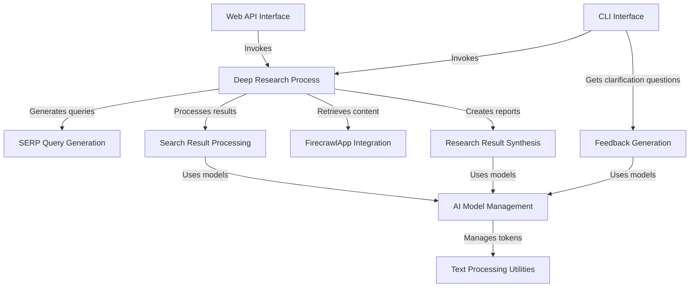

# Tutorial: deep-research

**Deep Research** is an AI-powered research assistant that performs *comprehensive investigation* on user queries. It works by generating **search engine queries**, retrieving and processing web content, and **synthesizing** findings into coherent reports or specific answers. The system uses a *recursive approach* to explore topics in depth, branching into related questions and following leads until reaching the specified depth. It provides both **web API** and **command-line interfaces** for users to interact with the system, making advanced research capabilities accessible to anyone.

**Source Repository:** [https://github.com/dzhng/deep-research.git](https://github.com/dzhng/deep-research.git)

## Chapters

1. [Deep Research Process
](01_deep_research_process_.md)
2. [Web API Interface
](02_web_api_interface_.md)
3. [CLI Interface
](03_cli_interface_.md)
4. [SERP Query Generation
](04_serp_query_generation_.md)
5. [Search Result Processing
](05_search_result_processing_.md)
6. [FirecrawlApp Integration
](06_firecrawlapp_integration_.md)
7. [Research Result Synthesis
](07_research_result_synthesis_.md)
8. [Feedback Generation
](08_feedback_generation_.md)
9. [AI Model Management
](09_ai_model_management_.md)
10. [Text Processing Utilities
](10_text_processing_utilities_.md)

---

Generated by [AI Codebase Knowledge Builder](https://github.com/The-Pocket/Tutorial-Codebase-Knowledge)