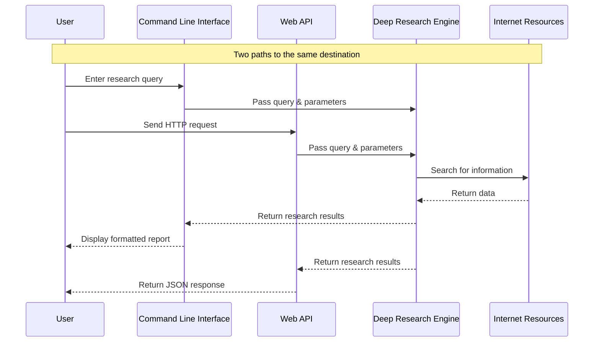

# Chapter 1: User Interfaces

## Welcome to Deep Research!

Imagine you have a powerful research assistant that can scour the internet, collect information, and synthesize findings on any topic you're curious about. Now, how would you communicate with this assistant? Would you type commands in a terminal? Build a web application that connects to it? This is where **user interfaces** come into play.

In the `deep-research` project, we provide multiple ways to interact with our research system - similar to a building with multiple entrances designed for different purposes. This chapter introduces these interfaces and helps you understand which one to use for your needs.

## The Two Gateways to Deep Research

The `deep-research` project offers two primary interfaces:

1. **Command Line Interface (CLI)**: A direct, text-based interface for humans to interact with the system through a terminal
2. **Web API**: A programmatic interface that allows other applications to leverage the research capabilities

Let's explore each one to understand when and how to use them.

## Command Line Interface: Direct Human Interaction

The CLI is perfect for researchers, students, or anyone who wants to directly use the research system. It's interactive, guided, and doesn't require any programming knowledge beyond running a script.

### Using the CLI

To start a research session with the command line interface:

```bash
node dist/run.js
```

The system will guide you through a conversation to understand your research needs:

```
Using model: gpt-4
What would you like to research? Benefits of meditation
Enter research breadth (recommended 2-10, default 4): 3
Enter research depth (recommended 1-5, default 2): 2
Do you want to generate a long report or a specific answer? (report/answer, default report): report
```

After providing these inputs, the system will:
1. Start researching your topic
2. Collect information from various sources
3. Generate a comprehensive report or specific answer
4. Save the results to a file and display them in your terminal

### What's Happening Behind the Scenes?

Let's look at a simplified version of the CLI code:

```typescript
// Get initial query from the user
const initialQuery = await askQuestion('What would you like to research? ');

// Get research parameters
const breadth = parseInt(await askQuestion('Enter research breadth: '), 10) || 4;
const depth = parseInt(await askQuestion('Enter research depth: '), 10) || 2;

// Start the research process
const { learnings, visitedUrls } = await deepResearch({
  query: initialQuery,
  breadth,
  depth,
});
```

This code collects your inputs, then passes them to the main research function that handles the actual investigation process.

## Web API: Programmatic Access

The Web API provides a way for other software to access the research capabilities. This is ideal for developers who want to integrate deep research into their own applications.

### Using the API

To use the API, you send an HTTP request with your research parameters:

```javascript
// Example: Calling the API from JavaScript
async function researchTopic() {
  const response = await fetch('http://localhost:3051/api/research', {
    method: 'POST',
    headers: { 'Content-Type': 'application/json' },
    body: JSON.stringify({
      query: "Benefits of meditation",
      depth: 2,
      breadth: 3
    })
  });
  
  const result = await response.json();
  console.log(result.answer);
}
```

The API returns a JSON object containing:
- The final answer or report
- Individual learning points discovered during research
- A list of URLs that were visited as part of the research

### How the API Works

The API is built using Express.js, a popular web framework for Node.js:

```typescript
// Set up the API endpoint
app.post('/api/research', async (req: Request, res: Response) => {
  // Extract parameters from the request
  const { query, depth = 3, breadth = 3 } = req.body;
  
  // Perform the research
  const { learnings, visitedUrls } = await deepResearch({
    query, breadth, depth,
  });
  
  // Generate the final answer and return results
  const answer = await writeFinalAnswer({ prompt: query, learnings });
  return res.json({ success: true, answer, learnings, visitedUrls });
});
```

The API validates your inputs, performs the research, and returns structured results that your application can process.

## How It All Fits Together

To understand how these interfaces connect to the research engine, let's visualize the flow:



As you can see, both interfaces lead to the same research engine - they just provide different ways to access it.

## Which Interface Should You Choose?

The interface you select depends on your specific needs:

- **Choose the CLI if:**
  - You want to directly interact with the system
  - You're doing occasional research tasks
  - You prefer a guided experience
  - You want detailed reports

- **Choose the Web API if:**
  - You're building an application that needs research capabilities
  - You need to automate multiple research tasks
  - You want to integrate research into a larger workflow
  - You need to process the research results programmatically

## The Interface Parameters Explained

Both interfaces accept the same core parameters:

1. **Query**: The research question or topic you want to investigate
2. **Breadth**: How many different sources to consult (recommended range: 2-10)
3. **Depth**: How deeply to explore each source (recommended range: 1-5)

Higher breadth values result in more diverse sources, while higher depth values lead to more detailed investigation of each source.

## Conclusion

In this chapter, we've explored the two main interfaces of the `deep-research` project. Like different entrances to a building, both the CLI and Web API provide access to the same powerful research engine, just in different ways tailored to different needs.

Whether you're a researcher using the command line or a developer integrating with the API, you now understand how to begin interacting with the system to unlock its research capabilities.

In the next chapter, [Deep Research Process](02_deep_research_process_.md), we'll dive into what happens after you submit your query - how the system actually conducts research, gathers information, and synthesizes findings into coherent answers.

---

Generated by [AI Codebase Knowledge Builder](https://github.com/The-Pocket/Tutorial-Codebase-Knowledge)