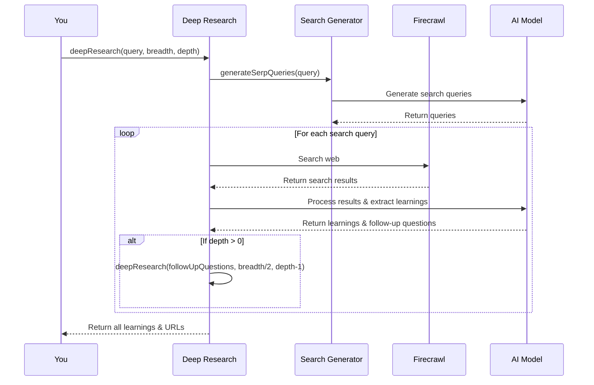

# Chapter 2: Deep Research Process

In [Chapter 1: User Interfaces](01_user_interfaces_.md), we learned about the different ways to interact with the deep-research system. Now let's dive into what actually happens when you submit a research query - the engine that powers the entire system.

## What is the Deep Research Process?

Imagine you're researching a complex topic like "the effects of climate change on coral reefs." You could spend hours manually searching for information, clicking through websites, taking notes, and refining your search terms as you learn more. The Deep Research Process automates this entire workflow!

At its core, the Deep Research Process is like having a tireless research assistant who:

1. Takes your initial question
2. Searches the web for relevant information
3. Extracts key learnings from what it finds
4. Asks more specific follow-up questions based on those learnings
5. Repeats this process to go deeper into the topic
6. Finally compiles everything into a comprehensive report

Let's see how this works with a concrete example.

## Understanding the Process Through an Example

Imagine you ask: "What are the health benefits of meditation?"

Here's what happens behind the scenes:

1. **Initial Query Processing**: The system takes your question and develops more specific search queries to investigate different aspects.

2. **Web Search & Learning Extraction**: For each search query, the system:
   - Searches the web for relevant information
   - Extracts key learnings from the search results
   - Identifies follow-up questions based on what it learned

3. **Recursive Deepening**: For each follow-up question, the system repeats steps 1-2, going deeper into specific aspects of meditation benefits.

4. **Knowledge Compilation**: Finally, all the collected learnings are organized into a comprehensive report or specific answer.

## Key Parameters: Breadth and Depth

The research process is guided by two important parameters:

- **Breadth**: How wide to cast the research net (how many different search queries to explore)
- **Depth**: How many layers of follow-up questions to pursue

Picture breadth as exploring different rooms in a house, while depth is how thoroughly you examine each room.

## How to Use the Deep Research Process

Let's look at how to use this process in your code:

```typescript
const { learnings, visitedUrls } = await deepResearch({
  query: "What are the health benefits of meditation?",
  breadth: 3,
  depth: 2,
});
```

This code initiates a research process with:
- Your initial question about meditation
- A breadth of 3 (generating 3 different search queries)
- A depth of 2 (following up with 2 layers of questions)

After running, it returns:
- `learnings`: An array of key facts and information discovered
- `visitedUrls`: A list of all websites that were consulted

## Generating the Final Output

Once you have the research results, you can generate either a comprehensive report or a specific answer:

```typescript
// For a detailed report:
const report = await writeFinalReport({
  prompt: query,
  learnings,
  visitedUrls,
});

// Or for a specific answer:
const answer = await writeFinalAnswer({
  prompt: query,
  learnings,
});
```

The report option provides extensive information with sources, while the answer option gives a concise response to your specific question.

## Under the Hood: How the Process Works

Let's look at what happens step-by-step when you call `deepResearch`:



Let's walk through each major component:

### 1. Search Query Generation

First, the system takes your initial question and generates multiple search queries:

```typescript
const serpQueries = await generateSerpQueries({
  query,
  learnings,
  numQueries: breadth,
});
```

For our meditation example, it might generate queries like:
- "Scientific research on meditation benefits for mental health"
- "Physical health improvements from regular meditation practice"
- "Meditation effects on stress reduction and blood pressure"

### 2. Web Search and Learning Extraction

For each query, the system searches the web and processes the results:

```typescript
const result = await firecrawl.search(serpQuery.query, {
  timeout: 15000,
  limit: 5,
  scrapeOptions: { formats: ['markdown'] },
});

const newLearnings = await processSerpResult({
  query: serpQuery.query,
  result,
});
```

The code uses [Firecrawl Integration](05_firecrawl_integration_.md) to search the web, then analyzes the content to extract key learnings.

### 3. Recursive Deepening

If the depth parameter is greater than 0, the system goes deeper by generating follow-up questions:

```typescript
if (newDepth > 0) {
  return deepResearch({
    query: nextQuery, // Based on follow-up questions
    breadth: newBreadth,
    depth: newDepth,
    learnings: allLearnings,
    visitedUrls: allUrls,
  });
}
```

This recursive process creates a tree of research, starting broad and becoming increasingly specific.

## The Power of Recursive Research

The magic of Deep Research Process is in its recursive nature. With each layer of depth:

1. It learns from previous searches
2. It asks more specific and informed questions
3. It narrows down to more precise information

It's like a detective following leads. The first round of questioning gives some clues, then those clues inform the next round of more specific questions, and so on until the case is solved.

### Research Breadth vs Depth: Finding the Right Balance

Finding the right balance between breadth and depth is important:

- **Higher breadth (4-10)**: Covers more aspects of a topic but may be less detailed in each area
- **Higher depth (3-5)**: Dives deeper into specific aspects but may miss broader context
- **Balanced approach (breadth: 4, depth: 2)**: Good for most general research needs

For broad topics like "renewable energy," you might want higher breadth.
For specific questions like "how do solar panels work," you might want higher depth.

## Practical Example: From Query to Report

Let's trace through a complete example:

1. **Initial Query**: "Benefits of meditation"

2. **Search Queries Generated** (breadth=3):
   - "Scientific research on meditation health benefits"
   - "Psychological effects of regular meditation practice"
   - "Physical health improvements from meditation"

3. **First Round of Research**:
   - Searches web for each query
   - Extracts learnings like:
     - "Regular meditation reduces cortisol levels by 20%"
     - "8-week meditation programs show improved sleep quality"
     - "Meditation increases gray matter density in brain regions"

4. **Follow-up Queries** (depth=1):
   - "Cortisol reduction mechanisms through meditation"
   - "Meditation techniques most effective for sleep improvement"
   - "Brain structure changes from different meditation styles"

5. **Final Report Generation**:
   - Compiles all learnings into a structured report
   - Includes all sources (visited URLs)

## Implementation Details

The core implementation of the Deep Research Process is in the `deep-research.ts` file. Let's look at some key parts:

```typescript
export async function deepResearch({
  query,
  breadth,
  depth,
  learnings = [],
  visitedUrls = [],
}) {
  // Generate search queries based on the initial query
  const serpQueries = await generateSerpQueries({
    query,
    numQueries: breadth,
  });
  
  // Process each search query in parallel
  const results = await Promise.all(
    serpQueries.map(/* search and process results */)
  );
  
  // Combine results from all queries
  return {
    learnings: [...new Set(results.flatMap(r => r.learnings))],
    visitedUrls: [...new Set(results.flatMap(r => r.visitedUrls))],
  };
}
```

The function manages the overall research flow, while specialized helper functions handle specific tasks:

- `generateSerpQueries`: Creates search queries based on your question
- `processSerpResult`: Extracts key learnings from search results
- `writeFinalReport` or `writeFinalAnswer`: Compiles the final output

## How Text Processing Works

The Deep Research Process relies heavily on [Text Splitting](03_text_splitting_.md) to handle large amounts of web content. When web pages are retrieved, they often contain too much text to process at once. Text splitting breaks them into manageable chunks while preserving context.

Similarly, the system uses [AI Model Providers](04_ai_model_providers_.md) to:
1. Generate appropriate search queries 
2. Extract meaningful learnings from content
3. Create coherent final reports

## Advanced Feature: Research Progress Tracking

The Deep Research Process includes an optional progress tracking feature:

```typescript
await deepResearch({
  query: "Benefits of meditation",
  breadth: 3,
  depth: 2,
  onProgress: (progress) => {
    console.log(`Depth: ${progress.currentDepth}/${progress.totalDepth}`);
    console.log(`Completed: ${progress.completedQueries}/${progress.totalQueries}`);
  }
});
```

This allows you to monitor the research process in real-time, showing:
- Current depth level
- Number of completed queries
- Current query being researched

## Conclusion

The Deep Research Process is the engine that powers the entire research automation system. By mimicking how a human researcher would approach a topic—asking questions, learning from results, and asking better follow-up questions—it creates a powerful, recursive learning system.

In practice, this process allows you to get comprehensive research on virtually any topic with minimal effort, going from a simple question to detailed insights automatically.

In the next chapter, [Text Splitting](03_text_splitting_.md), we'll explore how the system handles large documents and web pages, breaking them into manageable pieces while preserving their meaning and context.

---

Generated by [AI Codebase Knowledge Builder](https://github.com/The-Pocket/Tutorial-Codebase-Knowledge)