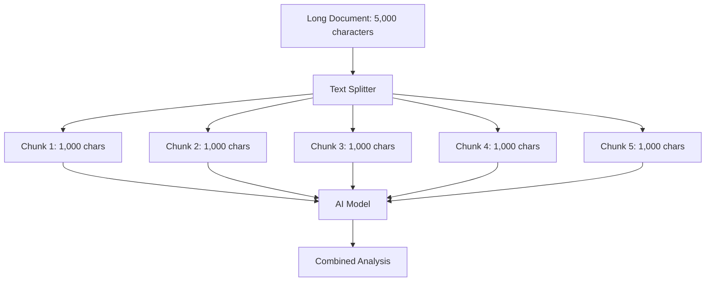
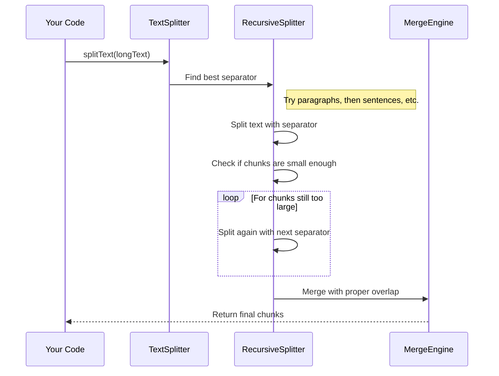

# Chapter 3: Text Splitting

In the [Deep Research Process](02_deep_research_process_.md), we learned how our system automatically conducts research by searching the web and extracting information. But what happens when it encounters a lengthy webpage or document? Most AI models have a maximum limit on how much text they can process at once—this is where text splitting becomes essential.

## Why Do We Need Text Splitting?

Imagine you're reading a 50-page research paper and need to take notes, but you can only look at one index card's worth of text at a time. You'd need to divide that paper into smaller sections to work with it effectively.

AI models face a similar challenge. They have what's called a "context window" – a limit on how much text they can analyze at once. For example, some models might only handle about 4,000 tokens (roughly 3,000 words) at a time.

Text splitting solves this problem by intelligently dividing large texts into smaller, manageable chunks.

## How Text Splitting Works

Think of text splitting like cutting a long ribbon of text, but being careful to cut at natural breaking points:

1. First, try to cut at paragraph breaks
2. If paragraphs are too large, try cutting at sentence endings
3. If needed, cut at commas or spaces between words
4. Only as a last resort, cut in the middle of a word

This approach preserves the natural flow and meaning of the text as much as possible.

## Using the Text Splitter

Let's look at how we use text splitting in the deep-research project:

```typescript
import { RecursiveCharacterTextSplitter } from './text-splitter';

// Create a new text splitter
const splitter = new RecursiveCharacterTextSplitter({
  chunkSize: 1000,  // Maximum characters per chunk
  chunkOverlap: 200 // Overlap between chunks
});

// Split your text into chunks
const chunks = splitter.splitText(longDocument);
```

This code creates a text splitter that will break text into chunks of no more than 1,000 characters, with a 200-character overlap between chunks.

## Understanding the Key Parameters

There are two important settings when using the text splitter:

### 1. chunkSize

This is the maximum number of characters that should be in each chunk. If your model can only handle 4,000 tokens, you might set this to around 3,000 characters to be safe.

### 2. chunkOverlap

This controls how much each chunk overlaps with the next one. Overlap helps preserve context between chunks. 

```
Original text: "The quick brown fox jumps over the lazy dog."

With chunkSize=20, chunkOverlap=5:
Chunk 1: "The quick brown fox"
Chunk 2: "brown fox jumps over"
Chunk 3: "jumps over the lazy"
Chunk 4: "the lazy dog."
```

Notice how "brown fox" appears in both chunk 1 and 2, and "jumps over" appears in chunks 2 and 3. This overlap ensures that related ideas aren't completely separated.

## A Visual Example

Let's visualize how text splitting works with a concrete example:



## Under the Hood: How Text Splitting Works

When you call `splitText()`, the system follows this process:



The key to this approach is recursive splitting. Let's look at a simplified version of the main splitting algorithm:

```typescript
splitText(text: string): string[] {
  // Find the best separator in the text
  let separator = this.findBestSeparator(text);
  
  // Split the text using that separator
  const splits = text.split(separator);
  
  // Process each split
  let finalChunks = [];
  for (const split of splits) {
    if (split.length < this.chunkSize) {
      // This chunk is good as is
      finalChunks.push(split);
    } else {
      // Still too big, split again with next separator
      const subChunks = this.splitText(split);
      finalChunks = [...finalChunks, ...subChunks];
    }
  }
  
  return this.mergeSplits(finalChunks, separator);
}
```

This shows how the splitter tries different separators when needed and calls itself recursively to handle large chunks.

## The Splitting Logic in Detail

Let's examine the actual implementation in the `text-splitter.ts` file:

1. The splitter has a list of separators to try, in order of preference:
   ```typescript
   separators: string[] = ['\n\n', '\n', '.', ',', '>', '<', ' ', ''];
   ```

2. For any text, it finds the first separator that exists in the text
3. It splits the text on that separator
4. If any resulting chunk is still too large, it repeats the process with the next separator
5. Finally, it merges chunks back together with the proper overlap

## Real-World Example

Here's a practical example of text splitting in action:

```
Original Text: 
"Text splitting is an essential technique in AI research. It allows systems 
to process documents of any length. Without text splitting, we would be 
limited by the context window of AI models. This would restrict our 
ability to analyze long documents effectively."

With chunkSize=50, chunkOverlap=10:

Chunk 1: "Text splitting is an essential technique in AI"
Chunk 2: "in AI research. It allows systems to process"
Chunk 3: "process documents of any length. Without text"
Chunk 4: "text splitting, we would be limited by the context"
Chunk 5: "context window of AI models. This would restrict"
Chunk 6: "restrict our ability to analyze long documents"
```

Notice how the system tries to break at sentences (after "AI research.") and always maintains the specified overlap.

## How Text Splitting Fits into the Research Process

Text splitting is a crucial part of the [Deep Research Process](02_deep_research_process_.md):

1. When the system finds a relevant webpage or PDF
2. It uses the text splitter to break that content into chunks
3. Each chunk is separately processed by the [AI Model Providers](04_ai_model_providers_.md)
4. The insights from all chunks are combined to form complete learnings

This approach allows the system to work with documents of any length, from short articles to entire books.

## Advanced Customization

If you have special needs, you can customize the text splitter:

```typescript
// Create a splitter specially for HTML content
const htmlSplitter = new RecursiveCharacterTextSplitter({
  chunkSize: 1000,
  chunkOverlap: 200,
  separators: ['</div>', '</p>', '<br>', '\n', '. ', ' ', '']
});
```

This example would try to split HTML at tag boundaries first, which might preserve the structure better.

## Common Challenges and Solutions

### Challenge 1: Very Large Documents

For extremely large documents (like books), the system may create hundreds of chunks. This is handled by processing chunks in batches to avoid overwhelming the system.

### Challenge 2: Specialized Content

Some content like code or tables doesn't split well at normal text boundaries. For these cases, you can customize the separators list to include domain-specific break points.

### Challenge 3: Preserving Context

Sometimes important context appears at the beginning of a document but is needed for understanding later sections. The chunk overlap helps with this, ensuring that related information stays connected.

## Conclusion

Text splitting is like a bridge between our unlimited world of information and the limited processing capacity of AI models. By intelligently breaking down large texts while preserving meaning, it enables the deep-research system to analyze documents of any length.

In the next chapter, [AI Model Providers](04_ai_model_providers_.md), we'll explore how these text chunks are processed by various AI models to extract meaningful insights and generate research findings.

---

Generated by [AI Codebase Knowledge Builder](https://github.com/The-Pocket/Tutorial-Codebase-Knowledge)