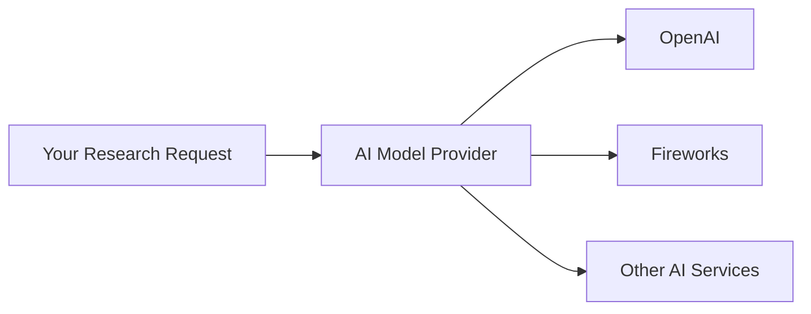
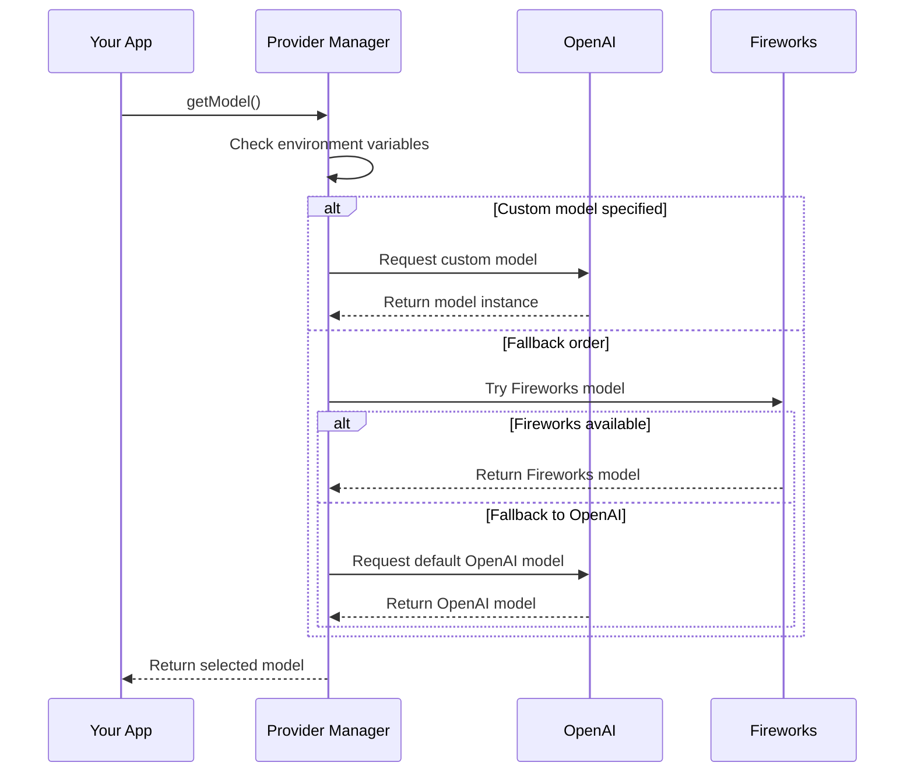

# Chapter 4: AI Model Providers

In [Text Splitting](03_text_splitting_.md), we learned how large documents are broken into manageable chunks. Now, we need something that can actually process those chunks and extract meaningful information. This is where AI Model Providers come in!

## What Are AI Model Providers?

Imagine your smartphone can connect to different cellular networks (Verizon, AT&T, T-Mobile). You don't worry about which network you're on - you just make calls, and your phone handles all the connection details. 

AI Model Providers work the same way in our research system:



The AI Model Provider is like a universal adapter that connects your research questions to whichever AI service is available or most appropriate, using a consistent interface regardless of which service is actually doing the work.

## Why Do We Need This?

Let's say you're building a research tool and initially use OpenAI's GPT-4. What happens if:
- GPT-4 is temporarily unavailable?
- You want to try a different model that might work better for certain topics?
- A new, more powerful AI model is released?

Without the AI Model Provider abstraction, you'd need to rewrite large portions of your code. With it, you just change a configuration setting!

## How to Use AI Model Providers

Using an AI model through our provider is refreshingly simple:

```typescript
import { getModel } from './ai/providers';

// Get the currently configured AI model
const model = getModel();

// Use the model to answer a question
const response = await model.invoke({
  messages: [{ role: 'user', content: 'What is deep learning?' }]
});
```

This code gets whatever AI model is currently configured (which could be from OpenAI, Fireworks, or another provider) and uses it to answer a question. Your code doesn't need to know which specific service is being used!

## Key Features of Our AI Model Provider

### 1. Model Selection

The system automatically selects which AI model to use based on:

```typescript
// Example .env file configuration
OPENAI_KEY=your-openai-api-key
FIREWORKS_KEY=your-fireworks-api-key
CUSTOM_MODEL=gpt-4
```

Just by changing these environment variables, you can switch which AI service is used without changing any code.

### 2. Token Management

AI models have limits on how much text they can process at once (their "context window"). The provider keeps track of these limits:

```typescript
// Checking if text will fit in the model's context window
const willFit = isWithinTokenLimit(myText, 128000);
if (!willFit) {
  // Use text splitting to break it down
}
```

This works with [Text Splitting](03_text_splitting_.md) to handle documents of any size.

### 3. Error Handling

Different AI services have different error patterns. The provider normalizes these:

```typescript
try {
  const result = await model.invoke({...});
} catch (error) {
  // Provider converts various error types to a standard format
  if (error.type === 'RateLimitError') {
    // Handle rate limiting
  }
}
```

This saves you from writing different error handling code for each AI service.

## Under the Hood: How It Works

When you call `getModel()`, here's what happens:



The provider checks what's available and follows a fallback strategy to ensure your app always gets a working AI model.

## Implementation Details

Let's look at the main components:

### Provider Setup

```typescript
// Set up connections to different AI services
const openai = process.env.OPENAI_KEY
  ? createOpenAI({ apiKey: process.env.OPENAI_KEY })
  : undefined;

const fireworks = process.env.FIREWORKS_KEY
  ? createFireworks({ apiKey: process.env.FIREWORKS_KEY })
  : undefined;
```

This code creates connections to AI services only if their API keys are provided in environment variables.

### Model Configuration

```typescript
// Configure specific models from each provider
const o3MiniModel = openai?.('o3-mini', {
  reasoningEffort: 'medium',
  structuredOutputs: true,
});

const deepSeekModel = fireworks?.(
  'accounts/fireworks/models/deepseek-r1'
);
```

This sets up specific models from each provider with appropriate settings.

### Model Selection Logic

```typescript
export function getModel() {
  if (customModel) {
    return customModel;
  }

  const model = deepSeekModel ?? o3MiniModel;
  if (!model) {
    throw new Error('No model found');
  }

  return model;
}
```

This function follows a simple priority order: use a custom model if specified, then try Fireworks, then fall back to OpenAI.

### Token Limiting

AI models have maximum context sizes. Our provider includes token management:

```typescript
export function trimPrompt(prompt, contextSize = 128000) {
  // Count tokens in the prompt
  const tokenCount = countTokens(prompt);
  
  // If within limits, return as is
  if (tokenCount <= contextSize) {
    return prompt;
  }
  
  // If too large, trim it down
  return truncateToFit(prompt, contextSize);
}
```

This ensures we never send a prompt that's too large for the model to handle.

## Real-World Example: Research Process

Let's see how this works in the [Deep Research Process](02_deep_research_process_.md):

1. When generating search queries for a research topic:

```typescript
// The research process doesn't need to know which AI model
// it's using - it just requests one through the provider
const model = getModel();

const searchQueries = await model.invoke({
  messages: [
    { role: 'system', content: 'Generate search queries for this topic' },
    { role: 'user', content: 'Benefits of meditation' }
  ]
});
```

2. When analyzing search results:

```typescript
// We use the same model abstraction for analysis
const learnings = await model.invoke({
  messages: [
    { role: 'system', content: 'Extract key facts from this content' },
    { role: 'user', content: websiteContent }
  ]
});
```

The same provider abstraction is used throughout the research process, making the code much cleaner and more flexible.

## Practical Benefits

This abstraction provides several important benefits:

1. **Flexibility**: Switch between different AI services by changing environment variables
2. **Reliability**: If one service is down, automatically fall back to another
3. **Future-proofing**: When new AI models are released, you can use them without rewriting your code
4. **Cost optimization**: Use powerful (expensive) models only when needed

## Beyond the Basics: Advanced Features

Our AI Model Provider also handles:

- **Structured outputs**: Getting results in specific formats
- **Reasoning extraction**: Capturing the AI's reasoning process
- **Middleware**: Processing inputs and outputs automatically

These features help ensure consistent, high-quality results from various AI models.

## Conclusion

The AI Model Provider is like a universal translator between your research system and the world of AI models. It handles the complex details of different AI services, context windows, and error patterns, giving you a simple, consistent interface to work with.

By understanding this abstraction, you now know how our system can seamlessly use different AI technologies without having to change its core logic - just like how you can switch cellular networks on your phone without needing to relearn how to make calls.

In the next chapter, [Firecrawl Integration](05_firecrawl_integration_.md), we'll explore how the system actually searches the web to gather information for research.

---

Generated by [AI Codebase Knowledge Builder](https://github.com/The-Pocket/Tutorial-Codebase-Knowledge)