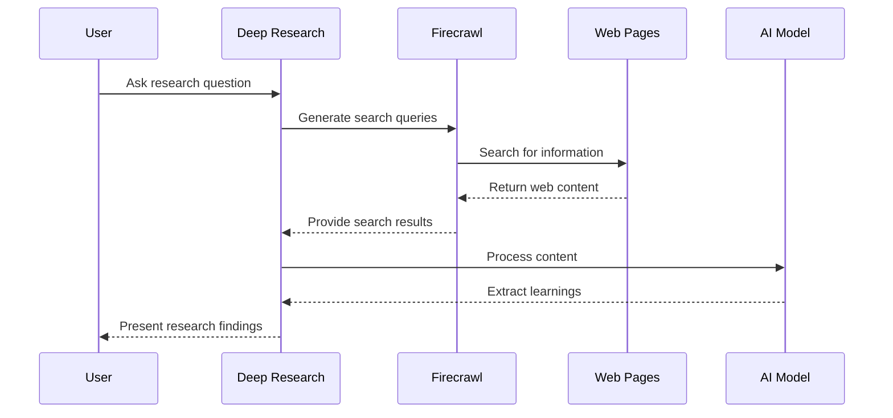
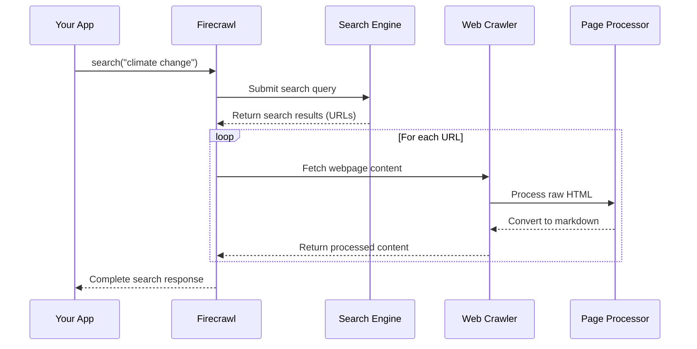

# Chapter 5: Firecrawl Integration

In [Chapter 4: AI Model Providers](04_ai_model_providers_.md), we explored how our system interfaces with various AI models. Now, let's discover how we actually gather the information these models will process. Enter Firecrawl - our web research assistant!

## What is Firecrawl and Why Do We Need It?

Imagine you're writing a research paper on renewable energy. You could spend hours manually searching Google, clicking through websites, copying useful information, and organizing it. That's tedious and time-consuming!

Firecrawl does all of this automatically. It's like having a librarian who:
- Takes your research question
- Searches the web for relevant information
- Retrieves the content from those websites
- Delivers it back to you in a clean, usable format

In the `deep-research` project, Firecrawl is our bridge to the internet's vast knowledge.

## Setting Up Firecrawl

Let's start by setting up Firecrawl in our project:

```typescript
import FirecrawlApp from '@mendable/firecrawl-js';

// Initialize Firecrawl with API key
const firecrawl = new FirecrawlApp({
  apiKey: process.env.FIRECRAWL_KEY ?? '',
  apiUrl: process.env.FIRECRAWL_BASE_URL,
});
```

This code creates a new Firecrawl connection using your API key stored in environment variables. Think of it as getting a library card that gives you access to all the resources.

## Searching the Web with Firecrawl

Now that we have Firecrawl set up, let's use it to search the web:

```typescript
// Search for information about climate change
const result = await firecrawl.search("impacts of climate change", {
  timeout: 15000,  // 15 seconds maximum waiting time
  limit: 5,        // Get up to 5 results
  scrapeOptions: { formats: ['markdown'] }
});
```

This code asks Firecrawl to search for "impacts of climate change," wait up to 15 seconds for results, return up to 5 webpages, and convert them to markdown format for easier processing.

## Understanding the Search Results

When Firecrawl completes a search, it returns results in a structured format:

```typescript
// Example of accessing search results
const firstResult = result.data[0];
console.log("Page title:", firstResult.title);
console.log("URL:", firstResult.url);
console.log("Content:", firstResult.markdown);
```

The search results include useful information like the webpage title, URL, and the actual content (converted to markdown format). This makes it easy to process the information further.

## Using Firecrawl in the Research Process

Let's see how Firecrawl fits into our [Deep Research Process](02_deep_research_process_.md):



This diagram shows how Firecrawl bridges the gap between your research questions and the vast information available on the web.

## A Simple Example: Researching Meditation Benefits

Let's walk through a complete example of how Firecrawl helps with research:

```typescript
// Research query
const query = "health benefits of meditation";

// Search the web with Firecrawl
const searchResults = await firecrawl.search(query, {
  timeout: 15000,
  limit: 5,
  scrapeOptions: { formats: ['markdown'] }
});

// Extract content from results
const contents = searchResults.data
  .map(item => item.markdown)
  .filter(content => content);
```

This code searches for information about meditation benefits and collects all the markdown content from the results. Now we have web information ready for analysis!

## Advanced Features: Controlling the Search

Firecrawl lets you control your search more precisely:

```typescript
// More advanced search with additional options
const result = await firecrawl.search("beginners guide to yoga", {
  timeout: 20000,
  limit: 10,
  scrapeOptions: { 
    formats: ['markdown'],
    selector: 'article'  // Only get content from <article> tags
  }
});
```

These options let you focus your search to get exactly the information you need. For example, the `selector` option helps target specific parts of webpages, which is useful for extracting just the main content and avoiding ads or navigation menus.

## Under the Hood: How Firecrawl Works

When you call `firecrawl.search()`, a series of steps happen behind the scenes:



This process involves:
1. Submitting your query to search engines
2. Getting a list of relevant URLs
3. Visiting each webpage to fetch its content
4. Processing the HTML into clean, usable text
5. Returning everything in a structured format

## Integration with Text Splitting

Remember [Text Splitting](03_text_splitting_.md) from the previous chapter? Firecrawl works hand-in-hand with it:

```typescript
import { RecursiveCharacterTextSplitter } from './text-splitter';

// Get content from Firecrawl
const content = searchResults.data[0].markdown;

// Content might be too large for AI models, so we split it
const splitter = new RecursiveCharacterTextSplitter({
  chunkSize: 1000,
  chunkOverlap: 200
});

// Split the content into manageable chunks
const chunks = splitter.splitText(content);
```

Firecrawl provides the content, and Text Splitting breaks it down into pieces that our [AI Model Providers](04_ai_model_providers_.md) can process effectively.

## Handling Real-World Challenges

Web research comes with challenges, and Firecrawl helps address them:

### 1. Timeout Handling

```typescript
try {
  const result = await firecrawl.search("complex topic", {
    timeout: 10000
  });
} catch (e) {
  if (e.message.includes('Timeout')) {
    console.log("Search took too long, trying a simpler query...");
    // Try alternative approach
  }
}
```

This code gracefully handles situations where a search takes too long.

### 2. Multiple Search Queries

For comprehensive research, we often need multiple searches:

```typescript
// Run multiple searches in parallel for broader coverage
const queries = ["meditation benefits mental", "meditation physical health"];
const results = await Promise.all(
  queries.map(query => firecrawl.search(query, { limit: 3 }))
);
```

By running multiple targeted searches, we can gather more diverse information on our topic.

## Practical Example: The Complete Research Flow

Let's see how Firecrawl fits into a complete research process:

```typescript
// 1. Generate search queries based on user question
const serpQueries = await generateSerpQueries({
  query: "Benefits of meditation",
  numQueries: 3
});

// 2. Use Firecrawl to search for each query
const searchResults = await Promise.all(
  serpQueries.map(serpQuery => 
    firecrawl.search(serpQuery.query, {
      timeout: 15000,
      limit: 5,
      scrapeOptions: { formats: ['markdown'] }
    })
  )
);

// 3. Process the results to extract learnings
// (Continued in next steps...)
```

This code shows the first part of a research workflow, where we:
1. Generate specific search queries from a general question
2. Use Firecrawl to gather information for each query
3. Prepare to process the results into useful learnings

## Conclusion

Firecrawl is the explorer in our research team - venturing out into the vast web to bring back relevant information. By automating the process of searching and extracting content, it allows our research system to access up-to-date information on any topic.

Without Firecrawl, our research would be limited to pre-existing knowledge. With it, the system can tap into the constantly updating pool of human knowledge available online.

In the next chapter, [Research Feedback Loop](06_research_feedback_loop_.md), we'll explore how the system uses what it learns to ask better follow-up questions, creating a cycle of increasingly focused and relevant research.

---

Generated by [AI Codebase Knowledge Builder](https://github.com/The-Pocket/Tutorial-Codebase-Knowledge)