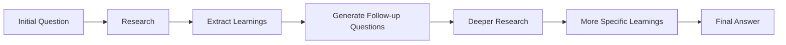
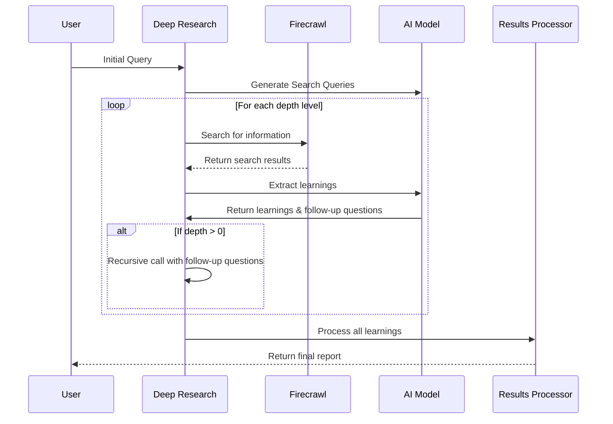
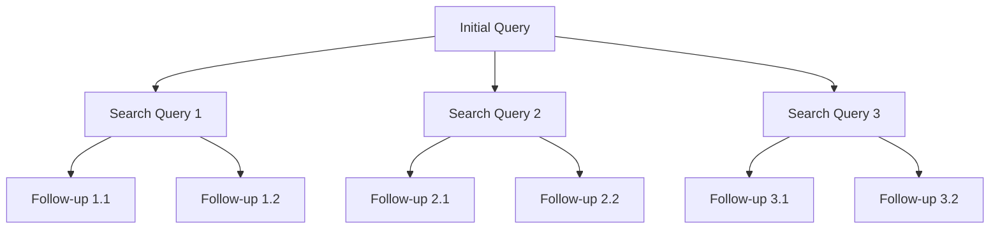

# Chapter 6: Research Feedback Loop

In [Chapter 5: Firecrawl Integration](05_firecrawl_integration_.md), we learned how our system gathers information from the web. Now, let's explore an essential concept that takes our research from good to great: the Research Feedback Loop.

## What is a Research Feedback Loop?

Imagine you're talking with a really smart friend about solar energy. You ask a basic question, and after they answer, you realize you can ask a more specific follow-up question. This conversation naturally flows deeper as each answer leads to better questions.

The Research Feedback Loop works the same way:

1. You ask an initial question
2. The system researches and finds information
3. Based on what it learns, it generates new, more specific questions
4. It researches these new questions, going deeper into the topic
5. The cycle repeats, creating increasingly focused research

This is like a spiral that starts wide and gets tighter as it dives deeper into a topic.

## Why Do We Need a Feedback Loop?

Without a feedback loop, research is one-dimensional:

```
Question → Research → Answer
```

With a feedback loop, research becomes a rich, multi-dimensional exploration:

```
Question → Research → Learnings → Better Questions → Deeper Research → More Specific Learnings → Even Better Questions → Final Answer
```

This creates three major benefits:

1. **Depth**: You explore topics much more thoroughly
2. **Precision**: Your research becomes increasingly targeted
3. **Comprehensiveness**: You cover multiple aspects of complex topics

## How the Feedback Loop Works

Let's see a simple diagram of how the feedback loop operates:



For example, if your initial question is "Tell me about renewable energy," the loop might look like:

1. **Initial Research**: General information about renewable energy types
2. **Follow-up Questions**: "How does solar panel efficiency compare to wind turbines?"
3. **Deeper Research**: Specific efficiency metrics and comparison data
4. **More Follow-ups**: "What factors affect solar panel degradation over time?"
5. **Even Deeper Research**: Detailed information about solar panel materials and longevity

## Using the Research Feedback Loop

The feedback loop is built into the `deepResearch` function we've seen in previous chapters. Let's look at the simplest way to use it:

```typescript
const result = await deepResearch({
  query: "Benefits of meditation",
  breadth: 3,
  depth: 2
});
```

In this code:
- `query` is your initial research question
- `breadth` controls how many different aspects to explore (3 in this case)
- `depth` controls how many rounds of follow-up questions to pursue (2 in this case)

These parameters let you control how wide and deep the research spiral goes.

## Two Types of Feedback Loops

The deep-research project actually implements two kinds of feedback loops:

### 1. Self-directed Feedback Loop

This happens automatically within the `deepResearch` function. The system generates its own follow-up questions based on what it learns:

```typescript
// Inside the deepResearch function
const newLearnings = await processSerpResult({
  query: serpQuery.query,
  result
});

// Generate follow-up questions
const nextQuery = `
  Previous research goal: ${serpQuery.researchGoal}
  Follow-up research directions: ${newLearnings.followUpQuestions.join('\n')}
`;
```

This code extracts learnings from search results, then creates follow-up questions for the next round of research.

### 2. User-directed Feedback Loop

This happens at the beginning of the research process, asking the user clarifying questions:

```typescript
// Generate follow-up questions for the user
const followUpQuestions = await generateFeedback({
  query: initialQuery
});

// Ask the user each question
for (const question of followUpQuestions) {
  const answer = await askQuestion(`\n${question}\nYour answer: `);
  answers.push(answer);
}
```

This code asks the user follow-up questions to better understand their research needs before diving in.

## A Real Example: Researching Meditation

Let's walk through a complete example of how the research feedback loop works when researching meditation benefits:

1. **Initial Query**: "Benefits of meditation"

2. **System Generates Search Queries**:
   - "Scientific research on meditation health benefits"
   - "Mental health improvements from regular meditation"
   - "Physical effects of meditation on the body"

3. **After Researching These Topics, It Learns**:
   - "Meditation reduces cortisol levels by approximately 20% in regular practitioners"
   - "8-week mindfulness programs show improved sleep quality in clinical studies"
   - "Regular meditation is linked to increased gray matter density in the brain"

4. **Based on These Learnings, It Generates Follow-up Questions**:
   - "How does meditation affect cortisol levels and stress response?"
   - "Which meditation techniques are most effective for improving sleep?"
   - "What brain regions show structural changes after long-term meditation?"

5. **Second Round of Research**:
   - Researches these more specific questions
   - Gathers even more specific information
   - Uses all collected information to create the final report

## Under the Hood: How the Feedback Loop Works

Let's take a closer look at the actual implementation:



This diagram shows how the feedback loop recursively calls itself, going deeper with each iteration.

## Code Implementation Details

The heart of the Research Feedback Loop is in the recursive structure of the `deepResearch` function. Let's examine the key parts:

```typescript
export async function deepResearch({
  query,
  breadth,
  depth,
  learnings = [],
  visitedUrls = []
}) {
  // Generate search queries based on initial query
  const serpQueries = await generateSerpQueries({
    query,
    numQueries: breadth
  });
  
  // For each query, search and process results...
  // ...
  
  // The recursive part - make a deeper call
  if (newDepth > 0) {
    return deepResearch({
      query: nextQuery,  // based on follow-up questions
      breadth: newBreadth,
      depth: newDepth - 1,
      learnings: allLearnings,
      visitedUrls: allUrls
    });
  }
}
```

The magic happens in that `if (newDepth > 0)` section - that's where the function calls itself with new questions based on what it just learned. This creates the iterative refinement loop.

## Generating Follow-up Questions

The system generates follow-up questions in two ways:

1. **For the initial user interaction** (in `feedback.ts`):

```typescript
export async function generateFeedback({
  query,
  numQuestions = 3,
}) {
  const userFeedback = await generateObject({
    model: getModel(),
    prompt: `Given this query, ask follow up questions: <query>${query}</query>`,
    schema: z.object({
      questions: z.array(z.string())
    }),
  });

  return userFeedback.object.questions;
}
```

This function asks the AI model to generate clarifying questions based on the user's initial query.

2. **During the research process** (in `deep-research.ts`):

```typescript
const newLearnings = await processSerpResult({
  query: serpQuery.query,
  result,
  numFollowUpQuestions: newBreadth,
});
```

The `processSerpResult` function not only extracts learnings but also generates follow-up questions based on those learnings.

## Controlling the Feedback Loop

You can control the feedback loop with two key parameters:

1. **Breadth**: How many different aspects to explore at each level
   - Higher breadth (5-10): Explores many aspects but less deeply
   - Lower breadth (2-3): Focuses on fewer aspects but can go deeper

2. **Depth**: How many rounds of follow-up questions to pursue
   - Higher depth (3-5): Creates a deep, detailed investigation
   - Lower depth (1-2): Creates a broader but less detailed overview

## Practical Example: Finding the Right Balance

Let's examine how different breadth and depth values affect research:

```
Topic: "Climate change solutions"

Low Breadth (2), Low Depth (1):
- Initial: "Climate change solutions"
- Level 1: "Renewable energy technologies", "Carbon capture methods"
- Result: Basic overview of two main solution categories

High Breadth (5), Low Depth (1):
- Initial: "Climate change solutions"
- Level 1: "Renewable energy", "Carbon capture", "Policy approaches", 
           "Individual actions", "Geoengineering"
- Result: Broader coverage but still relatively basic information

Low Breadth (2), High Depth (3):
- Initial: "Climate change solutions"
- Level 1: "Renewable energy", "Carbon capture"
- Level 2: "Solar vs wind efficiency", "Direct air capture technologies"
- Level 3: "Perovskite solar cell advancements", "Amine-based carbon capture"
- Result: Very detailed information but only on two solution categories

High Breadth (5), High Depth (3):
- [Too complex to show entirely]
- Result: Comprehensive and detailed, but requires more processing time
```

## Visualizing the Recursive Structure

The recursive nature of the feedback loop creates a tree-like structure:



This structure allows the system to explore multiple paths of inquiry simultaneously, creating a comprehensive research experience.

## When to Use the Research Feedback Loop

The feedback loop is most valuable when:

1. Researching complex topics with many interconnected aspects
2. Starting with a broad query that needs refinement
3. Needing a comprehensive understanding rather than a quick answer
4. Exploring topics where the best follow-up questions aren't obvious

## Conclusion

The Research Feedback Loop transforms our system from a simple question-answering tool into a sophisticated research assistant. By mimicking the natural way human researchers refine their questions based on what they learn, it creates increasingly specific and relevant research with each iteration.

This iterative approach ensures that even broad, vague initial questions can turn into precise, detailed investigations. The feedback loop is what lets our system adapt to the unique contours of each research topic, rather than following a rigid, predetermined path.

In the next chapter, [System Prompting](07_system_prompting_.md), we'll explore how carefully crafted prompts guide the AI models that power our research system, ensuring they generate high-quality search queries, extract relevant information, and produce useful follow-up questions.

---

Generated by [AI Codebase Knowledge Builder](https://github.com/The-Pocket/Tutorial-Codebase-Knowledge)