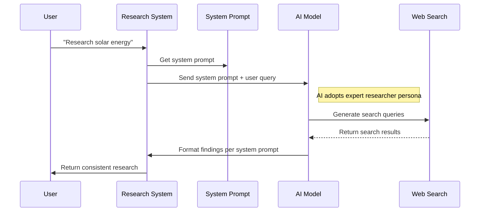

# Chapter 7: System Prompting

In [Chapter 6: Research Feedback Loop](06_research_feedback_loop_.md), we explored how our research system refines its questions based on what it learns. Now, let's look at how we tell the AI *how* to conduct research in the first place.

## What is System Prompting?

Imagine you're hiring a new research assistant. On their first day, you give them a document explaining:
- What role they'll be performing
- How detailed their work should be
- What tone they should use in reports
- How to approach difficult or uncertain topics

This orientation document helps ensure their work consistently meets your expectations. In the world of AI, this document is called a "system prompt."

System prompting is like providing the AI with a job description that shapes how it approaches every research task.

## Why Do We Need System Prompts?

Without clear guidance, our AI researcher might:
- Be extremely formal in one response but casual in another
- Provide overwhelming detail for simple questions
- Be hesitant to make predictions or speculate when useful
- Prioritize citing authorities over sound reasoning

The system prompt creates consistency in how research is conducted and presented.

## Creating a Basic System Prompt

Let's look at a simple system prompt:

```typescript
export const systemPrompt = () => {
  const now = new Date().toISOString();
  return `You are an expert researcher. Today is ${now}.`;
};
```

This minimal example does two important things:
1. It defines the AI's role ("expert researcher")
2. It provides time context (current date) so the AI knows when the research is happening

## The Elements of an Effective System Prompt

A good system prompt typically includes:

1. **Role Definition**: "You are an expert researcher"
2. **Time Context**: "Today is [current date]"
3. **Expertise Level**: "The user is a highly experienced analyst"
4. **Organization Style**: "Be highly organized"
5. **Detail Level**: "Be as detailed as possible"
6. **Approach to Uncertainty**: "You may use speculation, just flag it"

Let's see a more complete example:

```typescript
const systemPrompt = () => {
  const now = new Date().toISOString();
  return `You are an expert researcher. Today is ${now}.
  - Provide detailed, accurate information
  - Be highly organized in your responses
  - Treat the user as subject matter expert`;
};
```

This prompt gives the AI clear instructions about its role and how to respond.

## How System Prompts Shape Research

Different system prompts can dramatically change research outcomes on the same topic:

### Example: "Electric Vehicles"

**Basic Prompt Results**:
- Simple list of EV benefits and drawbacks
- General statements about environmental impact
- Basic price comparisons

**Advanced Prompt Results**:
- Detailed analysis of battery technology advances
- Specific CO2 reduction metrics with regional variations
- Comprehensive total cost of ownership calculations
- Contrasting perspectives from energy and transportation experts
- Forward-looking predictions about solid-state battery breakthroughs

The difference is like comparing a brief encyclopedia entry to an in-depth research paper.

## Using System Prompts in the Research Process

Here's how we apply the system prompt when conducting research:

```typescript
// Get the AI model
const model = getModel();

// Use the system prompt when making a request
const response = await model.invoke({
  messages: [
    { role: 'system', content: systemPrompt() },
    { role: 'user', content: 'Research renewable energy trends' }
  ]
});
```

This code passes our system prompt as a "system" message to guide how the AI responds to the user's research request.

## Under the Hood: How System Prompting Works

When a user submits a research request, here's what happens:



The system prompt establishes the AI's "research persona" before any actual research begins.

## Our Detailed System Prompt

Let's look at the actual system prompt used in the deep-research project:

```typescript
export const systemPrompt = () => {
  const now = new Date().toISOString();
  return `You are an expert researcher. Today is ${now}. Follow these instructions when responding:
  - Be highly organized and as detailed as possible
  - Suggest solutions the user didn't think about
  - Be proactive and anticipate user needs
  - Mistakes erode trust, so be accurate and thorough`;
};
```

This prompt contains several key directives that shape how our AI researcher behaves.

## Examining The Prompt Components

Let's break down the key parts of our system prompt:

1. **Role Definition**: "You are an expert researcher"
   
   This tells the AI to adopt the persona of someone with deep research expertise.

2. **Time Context**: "Today is [current date]"
   
   This helps the AI understand when the research is happening, which is important when discussing current events or trends.

3. **Organization Directive**: "Be highly organized"
   
   This ensures research findings are presented in a structured, easy-to-follow format.

4. **Detail Level**: "Be as detailed as possible"
   
   This encourages comprehensive answers rather than superficial overviews.

5. **Proactivity**: "Suggest solutions the user didn't think about"
   
   This pushes the AI to be creative and go beyond just answering the exact question.

6. **Accuracy Emphasis**: "Mistakes erode trust, so be accurate"
   
   This stresses the importance of factual correctness over speed or brevity.

## Customizing System Prompts for Different Needs

You can create different system prompts for specific research types:

```typescript
// For educational content
export const educationalPrompt = () => {
  const now = new Date().toISOString();
  return `You are a patient teacher. Today is ${now}. 
  - Explain concepts at a high school level
  - Use simple language and many examples`;
};
```

This would create a research assistant that presents information in an educational, beginner-friendly way instead of the default expert-level approach.

## How System Prompts Affect Search Behavior

System prompts don't just affect how information is presented—they also influence how it's gathered in the first place.

When our system prompt says "Consider contrarian ideas, not just conventional wisdom," it causes the AI to:

1. Generate a wider variety of search queries
2. Look for perspectives that challenge mainstream views
3. Include alternative viewpoints in its analysis

This results in more balanced, comprehensive research compared to a system without such instructions.

## System Prompting Best Practices

When creating your own system prompts, follow these guidelines:

1. **Be Specific**: Vague instructions lead to inconsistent results
2. **Prioritize**: List the most important behaviors first
3. **Set Clear Boundaries**: Define what the AI should and shouldn't do
4. **Update Regularly**: Revise prompts based on the results you receive

## Practical Example: Research on Climate Solutions

Let's see how different system prompts affect research on climate solutions:

**Technical Prompt**: Directs the AI to focus on engineering details, efficiency metrics, and technical feasibility of solutions.

**Economic Prompt**: Guides the AI to emphasize cost-benefit analyses, market adoption rates, and economic incentives.

**Policy Prompt**: Instructs the AI to highlight regulatory frameworks, international agreements, and implementation challenges.

By changing just the system prompt, you can get dramatically different research outcomes on the same topic.

## The Relationship Between System Prompts and Model Providers

System prompts work across all [AI Model Providers](04_ai_model_providers_.md), but how they're interpreted can vary slightly between different AI systems.

For instance, the instruction "be detailed" might result in a 500-word response from one model and a 2,000-word response from another. It's important to test your system prompts with your specific [AI Model Providers](04_ai_model_providers_.md) to ensure they produce the desired results.

## Conclusion

System prompting is like programming the behavior of your AI research assistant. It establishes clear guidelines for how research should be conducted and presented, ensuring consistent, high-quality results that match your specific needs.

By carefully crafting system prompts, we can shape our AI researcher to have different expertise, approaches, and communication styles—just as human researchers have different specialties and methods.

In the next chapter, [Research Response Generation](08_research_response_generation_.md), we'll explore how all the gathered research findings are compiled into the final answer or report that gets presented to the user.

---

Generated by [AI Codebase Knowledge Builder](https://github.com/The-Pocket/Tutorial-Codebase-Knowledge)