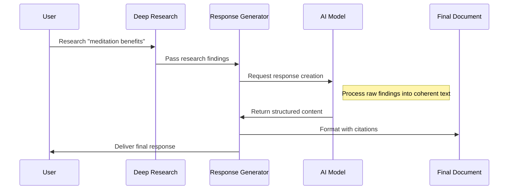

# Chapter 8: Research Response Generation

In [Chapter 7: System Prompting](07_system_prompting_.md), we learned how to guide our AI assistant's behavior. Now, let's explore how all the collected research information gets transformed into the final results that users actually see.

## What is Research Response Generation?

Imagine you hired an assistant to research a topic for you. They've spent hours collecting information, taking notes, and organizing their findings. Now comes an important question: how should they present all this information to you?

Research Response Generation is like the final step of cooking a meal. You've gathered all the ingredients (the research data), followed a recipe (the research process), and now you need to plate the dish (generate the response) in a way that's appetizing and useful to your guests.

## Two Types of Research Responses

The deep-research system can generate two types of responses:

1. **Comprehensive Reports**: Detailed documents with thorough explanations, organized sections, and cited sources
2. **Concise Answers**: Brief, direct responses to specific questions

Think of it like this:
- A report is like a newspaper article that covers a topic in-depth
- A concise answer is like a quick text message that gives you just what you need to know

## When to Use Each Response Type

Here's a simple guide for choosing the right response format:

```
Question: "What is climate change?"
Best format: Comprehensive Report (Topic is broad and educational)

Question: "What was the average global temperature increase in 2022?"
Best format: Concise Answer (Question asks for a specific fact)
```

## Generating a Comprehensive Report

Let's look at how to generate a comprehensive report:

```typescript
// After conducting research with deepResearch()
const report = await writeFinalReport({
  prompt: "Benefits of meditation",
  learnings: researchResults.learnings,
  visitedUrls: researchResults.visitedUrls
});
```

This code takes your original research question, all the learnings collected during research, and the websites that were visited, then transforms them into a structured report.

## Generating a Concise Answer

For direct answers to specific questions:

```typescript
// After conducting research with deepResearch()
const answer = await writeFinalAnswer({
  prompt: "How tall is Mount Everest?",
  learnings: researchResults.learnings
});
```

This generates a brief, focused answer using all the research findings but without all the extra context and citations.

## What's Inside a Comprehensive Report?

A comprehensive report typically includes:

1. **Introduction**: An overview of the topic and key findings
2. **Main Content**: Organized sections exploring different aspects of the topic
3. **Conclusion**: A summary of the most important points
4. **Sources**: A list of all websites referenced during research

Here's a snippet of what a report on meditation might look like:

```markdown
# Benefits of Meditation

## Introduction
Meditation is an ancient practice that has gained significant 
scientific attention in recent years. Research shows it offers
numerous benefits for both mental and physical health.

## Mental Health Benefits
Studies indicate regular meditation practice reduces anxiety by 
approximately 60% in participants with anxiety disorders...

## Physical Health Benefits
...

## Sources
- https://www.health.harvard.edu/meditation
- https://www.nih.gov/meditation-research
```

## How Response Generation Works Under the Hood

When you request a report or answer, a series of steps happen behind the scenes:



## Implementation Details for Reports

Let's look at the actual implementation of the report generation function:

```typescript
export async function writeFinalReport({
  prompt,
  learnings,
  visitedUrls,
}) {
  // Format learnings as structured data
  const learningsString = learnings
    .map(learning => `<learning>\n${learning}\n</learning>`)
    .join('\n');
```

This code takes each learning point and wraps it in XML-like tags to help the AI understand the structure of the data.

Next, we ask the AI to generate the report:

```typescript
  const res = await generateObject({
    model: getModel(),
    system: systemPrompt(),
    prompt: `Given the prompt "${prompt}", write a detailed report 
    using these learnings: ${learningsString}`,
    schema: z.object({
      reportMarkdown: z.string()
    })
  });
```

This sends all the research findings to our AI model and asks it to create a comprehensive report in Markdown format.

Finally, we add the sources to the report:

```typescript
  // Add sources section to the report
  const urlsSection = `\n\n## Sources\n\n${visitedUrls
    .map(url => `- ${url}`)
    .join('\n')}`;
  return res.object.reportMarkdown + urlsSection;
}
```

This appends a list of all sources (websites) that were consulted during the research process.

## Implementation Details for Concise Answers

The process for generating concise answers is similar but with different instructions:

```typescript
export async function writeFinalAnswer({
  prompt,
  learnings,
}) {
  // Format learnings as before
  const learningsString = learnings
    .map(learning => `<learning>\n${learning}\n</learning>`)
    .join('\n');
```

But then we give different directions to the AI:

```typescript
  const res = await generateObject({
    model: getModel(),
    system: systemPrompt(),
    prompt: `Answer this question concisely: "${prompt}"
    Based on these learnings: ${learningsString}
    Keep it short - just the answer without explanation.`,
    schema: z.object({
      exactAnswer: z.string()
    })
  });

  return res.object.exactAnswer;
}
```

The key difference is that we explicitly ask for a concise answer rather than a detailed report, and we define a schema that expects just the answer with no additional formatting.

## The Magic of Response Generation

The real power of response generation comes from how it transforms fragmented research findings into a coherent, unified response. Let's see a concrete example:

**Original Research Findings (Fragments):**
```
- A 2020 study showed meditation reduced cortisol by 23% in participants
- Mindfulness practices improved focus in 78% of students
- Brain scans reveal increased gray matter in hippocampus after 8 weeks
- Mayo Clinic recommends 15-30 minutes of meditation daily
```

**Generated Response (Unified):**
```
Research shows meditation provides significant benefits. A 2020 study found 
it reduces cortisol levels by 23%, while 78% of students experienced improved 
focus through mindfulness practices. Brain imaging reveals increased gray 
matter in the hippocampus after 8 weeks of regular meditation. Health 
authorities like the Mayo Clinic recommend 15-30 minutes of daily practice 
for optimal results.
```

The system has taken disconnected facts and woven them into a coherent narrative.

## Behind the Scenes: Data Organization

Before the final response is generated, the system organizes research data by:

1. **Removing duplicates**: Eliminating redundant information
2. **Grouping related findings**: Clustering information on similar subtopics
3. **Prioritizing key facts**: Identifying the most important discoveries
4. **Validating information**: Cross-checking facts between multiple sources

This organization happens automatically as part of the [Research Feedback Loop](06_research_feedback_loop_.md) and [Deep Research Process](02_deep_research_process_.md).

## Common Challenges and Solutions

### Challenge 1: Contradictory Information

Sometimes research findings contain contradictory information. The response generator handles this by:
- Acknowledging different perspectives
- Noting which findings have more supporting evidence
- Indicating when there's scientific disagreement on a topic

### Challenge 2: Information Gaps

When there are gaps in the research findings, the system will:
- Focus on what is known with confidence
- Avoid speculation in reports unless specifically requested
- Note areas where more research might be needed

## Customizing Response Generation

You can customize how responses are generated by modifying the system prompt:

```typescript
// For a more technical report
const technicalSystemPrompt = () => {
  return `You are an expert technical writer.
  Include detailed data, technical terms, and metrics.
  Organize information by technical categories.`;
};
```

Different [System Prompting](07_system_prompting_.md) instructions will produce different styles of responses from the same underlying research data.

## Conclusion

Research Response Generation is the final, crucial step that transforms raw research data into valuable insights. Like a journalist who transforms interview notes into a compelling story, this process takes all the information gathered through the [Deep Research Process](02_deep_research_process_.md) and presents it in a way that directly addresses the user's needs.

Whether you need a comprehensive report with detailed findings and sources, or a concise answer to a specific question, the response generation system ensures that all the hard work of research results in clear, useful information.

You've now completed all chapters of the deep-research tutorial! With this knowledge, you understand how the entire system works - from user interfaces to research processes, and finally to generating useful responses that help people make better decisions through automated, AI-powered research.

---

Generated by [AI Codebase Knowledge Builder](https://github.com/The-Pocket/Tutorial-Codebase-Knowledge)