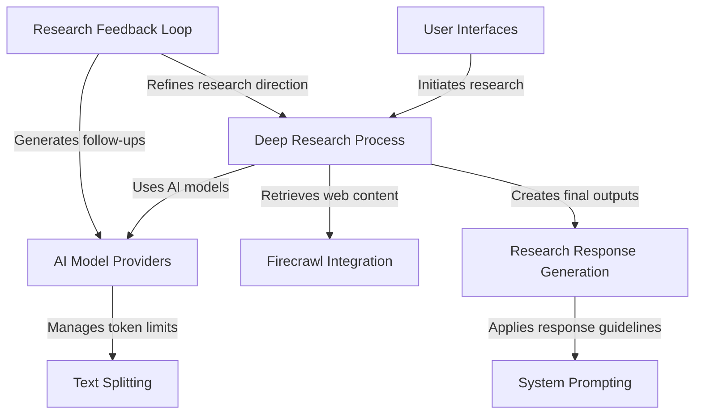

# Tutorial: deep-research

**Deep Research** is an AI-powered research assistant that **automates comprehensive web research**. It takes a user's question, *searches the web* for relevant information, learns from the results, and generates *follow-up questions* to dig deeper. This creates a **research feedback loop** that progressively refines the investigation. Finally, it compiles all findings into either a detailed report or a specific answer, depending on the user's needs.

**Source Repository:** [https://github.com/dzhng/deep-research.git](https://github.com/dzhng/deep-research.git)

## Chapters

1. [User Interfaces
](01_user_interfaces_.md)
2. [Deep Research Process
](02_deep_research_process_.md)
3. [Text Splitting
](03_text_splitting_.md)
4. [AI Model Providers
](04_ai_model_providers_.md)
5. [Firecrawl Integration
](05_firecrawl_integration_.md)
6. [Research Feedback Loop
](06_research_feedback_loop_.md)
7. [System Prompting
](07_system_prompting_.md)
8. [Research Response Generation
](08_research_response_generation_.md)

---

Generated by [AI Codebase Knowledge Builder](https://github.com/The-Pocket/Tutorial-Codebase-Knowledge)